# Assembly guide

How to assemble a l0destar v3.4 board by hand. The board has not been built yet in this
revision, so treat this as a guide based on the v3.3 build and the v3.4 design files; earlier v3.x
boards are close enough that most of it applies, but their test points and over-voltage
protection designators differ.

Before you start, have the [prerequisites](/assembly/prerequisites.html) to hand, decide which
interface you are building ([component selection](/assembly/component-selection.html)) and open
`hardware/l0destar_v3.4/l0destar.kicad_pcb` in KiCad so you can look up each part as you go.

!!! danger "Do not connect the Connect Kit yet"
    The Makerdiary Connect Kit is fitted last, and only after the board has passed the checks on
    the [board test](/assembly/board-test.html) page. If any of the 12V rails
    are shorted to 3.3V or any of the GPIO pins it will likely be permanently
    damaged.

## Board layout

The descriptions below assume the Molex connector S1J1 is on the left edge and the SMA connectors
are on the right, as in this render of v3.4:

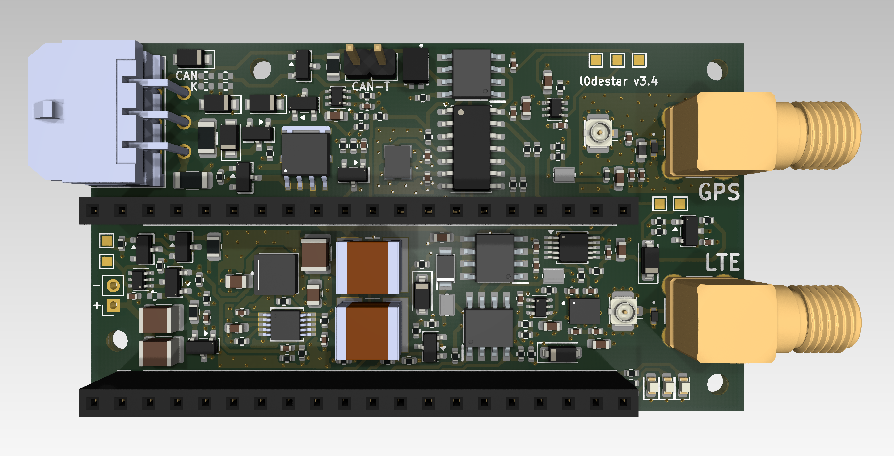

- **Top left**, next to the Molex connector: the four configuration pads S5R1-S5R4, marked `CAN`
  and `K` on the silkscreen. They select which interface the connector's two bus pins are routed
  to.
- **Top middle**: the 2-pin CAN termination header S9J1, marked `CAN-T`.
- **Bottom left**, beside the lower 20-pin header: the OVP bypass pad S5R5, the holes for the
  Connect Kit power lead, S1J4 (marked `+` and `-`), and the test points S12TP1 (`GND`) and S12TP2 (`4.2V`,
  the protected rail that feeds the Connect Kit).
- **Top right**: test points S12TP3 (`3.3V`), S12TP4 (`3.3V GPS`) and S12TP5 (`3.3V CAN`).
- **Right, between the SMA connectors**: test points S12TP6 (`3.3V K`) and S12TP7 (`12V K`).
- **Right edge**: the GPS (top) and LTE (bottom) u.FL and SMA connectors.
- The two 20-pin Connect Kit headers run horizontally across the middle and the bottom of the
  board.

This annotated photo is of a v3.3 board, which looks the same apart from three things: v3.3 fits
the buck under-voltage divider that is optional on v3.4, it has a MAX33041 CAN transceiver where
v3.4 specifies a TCAN3414DR, and it lacks the v3.4 test points.

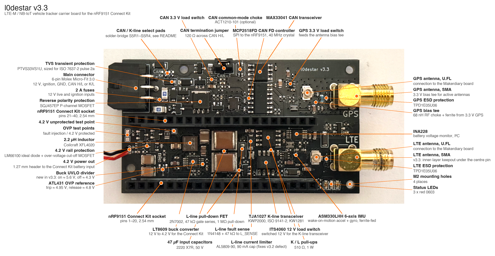

## General soldering process

There are several ways to solder SMD parts; this is the one the author finds easiest. Extra flux
is not needed - it helps little and leaves the board sticky and hard to clean.

1. Apply a very thin layer of solder paste to the pads. You probably need less than you think,
   but it does not matter much if you get it wrong.
2. Place the components with tweezers. The alignment does not need to be perfect at this point.
3. Apply hot air. The components self-align on the molten solder; nudge any that do not line up
   with tweezers.
4. Fine-pitch parts such as the LT8609A and the INA228 may end up with bridged pins. Remove the
   excess by holding the soldering iron tip against desoldering wick (MG #444) on the bridge very
   briefly - a second or two.

## Build sequence

### 1. Place the buck converter

Place the buck converter components - the S6 designators - first, and flow them into place. It is
important that the buck works and regulates correctly before anything else goes on: a fault here
can put the full input voltage on its output, which would destroy the Connect Kit.

Fit S6R4 as a 0402 0R jumper for the default build, or fit the optional enable divider (S6R4 1M,
S6R5 243K, S6R6 3.92M) if you want the buck to cut out below about 4.3V and restart above about
5.6V. The divider adds around 12µA of sleep current; see
[component selection](/assembly/component-selection.html#optional-parts).

Do **not** place the over-voltage protection stage yet - the S11 designators, including the
LM66100 ideal diode S11U1. It can also be damaged by high voltage.

### 2. Test the buck on its own

1. Solder temporary wires to a ground point (S12TP1 is convenient) and to the PP12VP net, for
   example the non-ground pad of the buck input capacitor S6C3.
2. Apply 12V, from a current-limited supply if you have one.
3. Measure the buck output on the PP4V2_UNPROTECTED net, at the non-ground pad of the output
   capacitor S6C5. It should read 4.2V.

If it reads 0V, or anything near the input voltage, stop and look for shorts or bad joints before
you continue. The protected rail test point S12TP2 reads 0V at this stage because the protection
stage is not populated yet. Remove the temporary wires afterwards.

### 3. Place the remaining SMD parts

Apply paste to the remaining pads, place the rest of the components and solder them, including the
S11 protection stage. If you are not building the CAN or K-wire interface, leave those parts off
entirely - the bill of materials lists which designators belong to each. On a CAN build without
the optional choke S9FL1, fit two 0402 0R resistors across its pads, otherwise CAN high and CAN low
are left open circuit.

### 4. Bridge the configuration pads

Bridge the pads in the top left corner for the interface you built, with solder or 0402 0R
resistors:

| Interface | S5R1 | S5R2 | S5R3 | S5R4 |
|-----------|------|------|------|------|
| None      | OPEN | OPEN | OPEN | OPEN |
| CAN bus   | CONNECT | OPEN | CONNECT | OPEN |
| K-wire    | OPEN | CONNECT | OPEN | CONNECT |

!!! danger "Never connect the CAN and K pads at the same time"
    Make sure the pads that should be open really are open.

Leave S5R5, next to S11U1 at the bottom left, **open**. It bypasses the over-voltage protection
and only exists for boards built without the S11 stage, which is not recommended.

### 5. Fit the Molex connector

With all the SMD parts in place, fit the through-hole parts in order of height, starting with the
Molex Micro-Fit connector S1J1.

### 6. Fit the power lead and the termination header

Next solder the bare end of the MX1.25 power lead into S1J4, with the wire that goes to the positive
pin of its plug in the `+` hole and the other in `-`. Work out which wire is which with a meter
before you solder - see the polarity warning under [final assembly](#final-assembly). On CAN
builds, also fit the 2-pin termination header S9J1. Only fit a shunt on S9J1 if the tracker is
going to be at the end of the CAN bus. A tracker
connected to a vehicle's OBD socket normally is not, because the vehicle's bus is already
terminated.

### 7. Fit the 20-pin headers

Hold the two 20-pin headers S1J2 and S1J3 in position with tape, solder a single pin on each row to
hold them, then remove the tape and solder the rest.

### 8. Fit the SMA connectors

Do not use hot air for the SMA connectors. Fit each connector and carefully solder its pins one at a
time with the soldering iron, using no more solder than a good joint needs: excess solder can run
down a pin and short the centre pin to ground. Solder the four ground pins first and the centre pin
last. The [board test](/assembly/board-test.html) checks each centre pin for a short to the
connector's outer casing.

### 9. Clean the board

Clean off paste and flux residue with isopropyl alcohol and foam swabs, inspect every joint under
magnification, and let the board dry completely before applying power - isopropyl alcohol is
highly flammable.

## Test before fitting the Connect Kit

Work through the unpowered checks and the first power-up on the
[board test](/assembly/board-test.html) page now, with the Connect Kit still off the board.

## Ensure the wiring harness is connected to the power supply or vehicle correctly

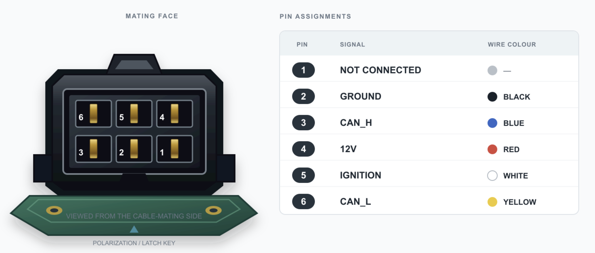

For testing the bare minimum is 12V and ground. The ignition signal is read by
the firmware to determine if the vehicle's ignition is on but this can be
disabled or overridden.

The CAN lines can be left unconnected for bench testing or tested with a
suitable CAN adapter such as a [CANable](https://link.amazon/B0dMC3cac). Note that for testing CAN on a bench the termination jumper must be set on the l0destar board and on the CANable interface and they must have a common ground (make sure the ground pin on the CANable is connected to the same ground wire as the l0destar board).

## Final assembly

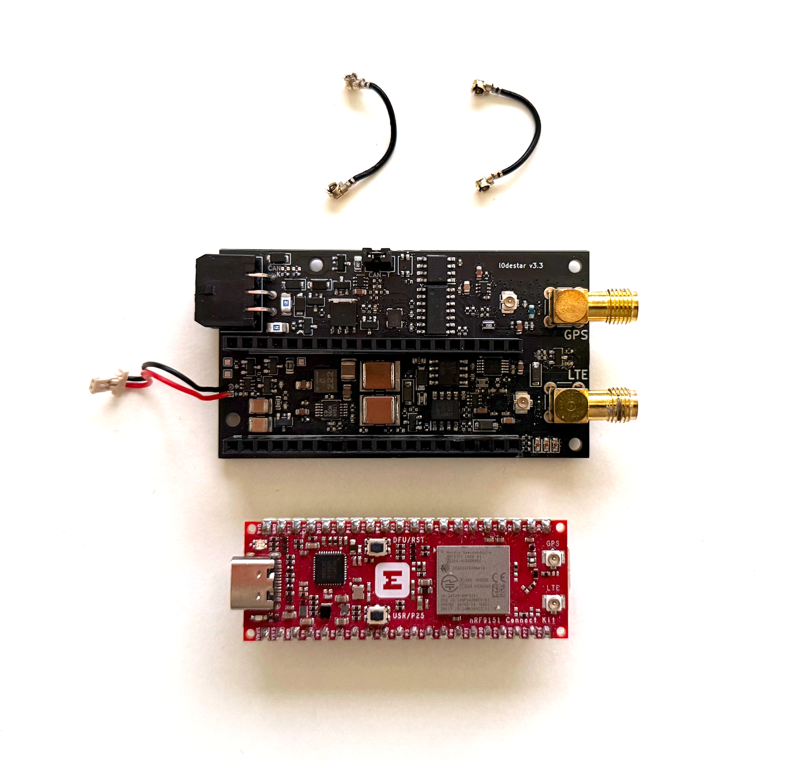

1. Connect the LTE u.FL cable to its connector

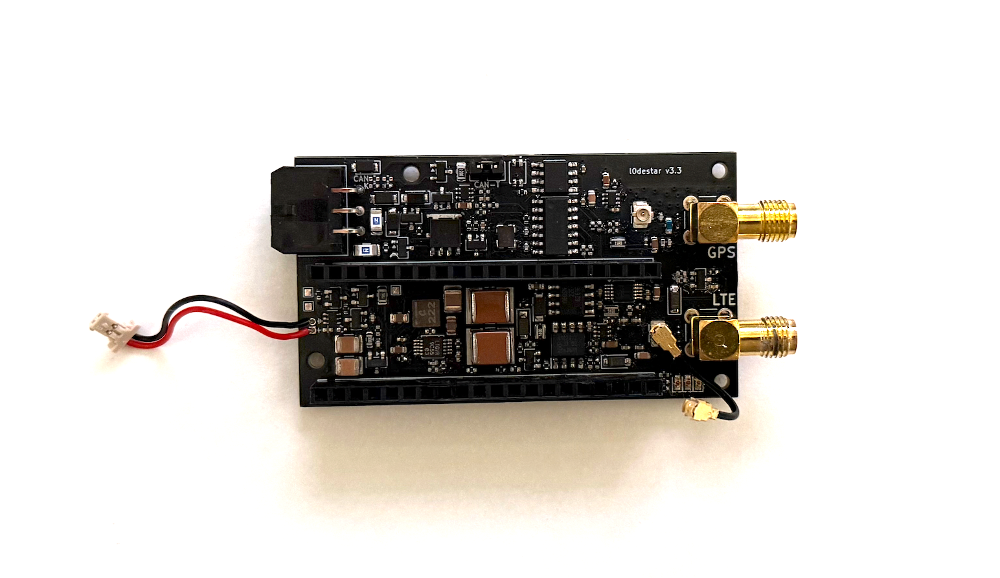

2. Insert the SIM card into the Makerdiary Connect Kit and connect its 2-pin
power connector

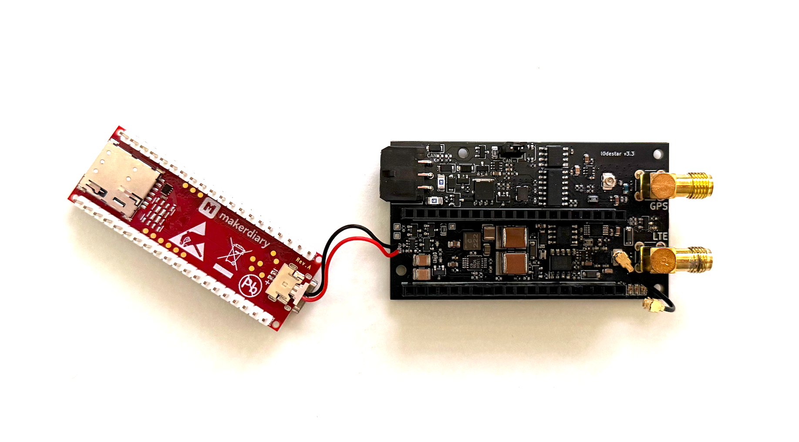

3. Seat the Connect Kit on the 20-pin header rows ensuring the power cable
underneath is tucked inside towards the centre without being snagged

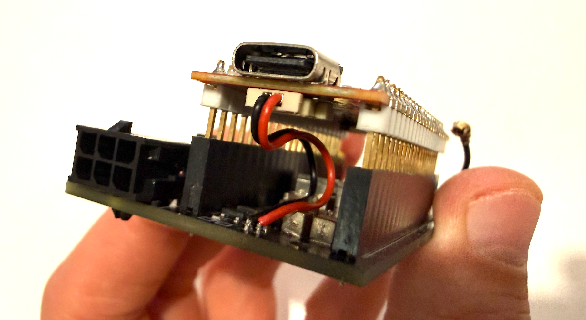

4. Attach the GPS side u.FL connector

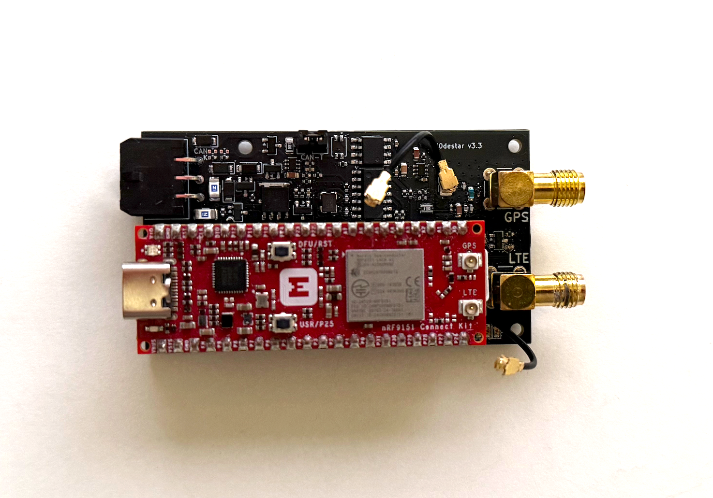

5. Connect both u.FL connectors to the Connect Kit

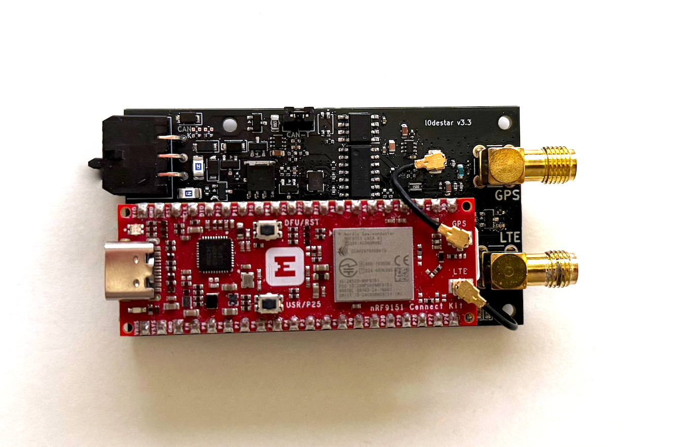

6. Connect the two SMA connectors to your antenna. The GPS port needs an **active** antenna - see
   the [antenna requirements](/reference/hardware.html#antenna).

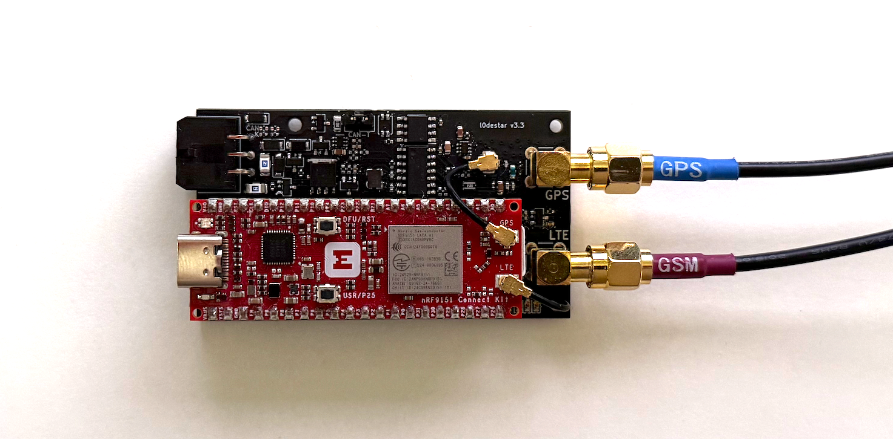

7. Connect the wiring harness

!!! danger "Check the power lead polarity"
    Getting the power lead the wrong way round puts the 4.2V rail across the Connect Kit's
    battery input backwards. Check the lead's wiring with a meter against the markings at both
    ends before you plug it in.

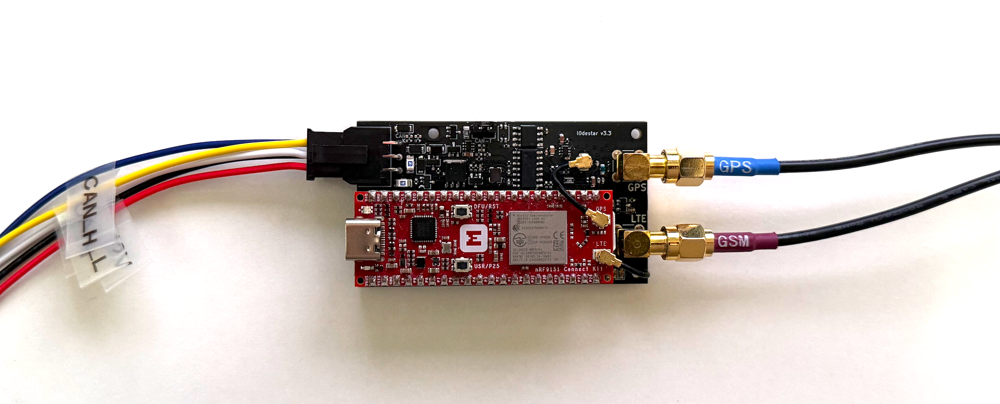

Apply power again from the supply with the current limited to 50mA. At any sign of a short, switch
off immediately. If the current does not pin at the limit, chances are the board is built
correctly. The remaining powered checks are on the [board test](/assembly/board-test.html) page.

## Enclosure

The 3D-printable enclosure in
[`hardware/enclosure/v3.3/`](https://github.com/m4rkw/l0destar/tree/master/hardware/enclosure/v3.3)
has a top and a bottom, in a variant with the l0destar logo embossed in the top and a plain one;
they are otherwise identical. It was designed for v3.2 and v3.3 boards, and the board outline has
not changed since v3.0.

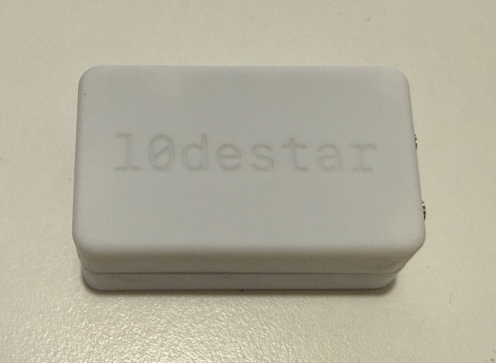

1. Print the top and bottom of the variant you want (`*_top.stl` and `*_bottom.stl`).
2. Press M2 heat-set inserts into the bosses with a soldering iron. Keep the iron square to the
   boss and let the insert sink under its own weight plus light pressure. Pushing too hard or too
   fast melts through the boss or leaves the insert tilted.
3. Fit the board and close the enclosure with M2 x 10mm screws. Do not over-tighten: the inserts
   will pull out of the plastic long before the screw strips.

The enclosure is a prototype. It has not been tested for mechanical strength, vibration, heat,
moisture ingress, UV exposure, flammability or vehicle temperature ranges, and the material you
print it in materially affects all of those.
