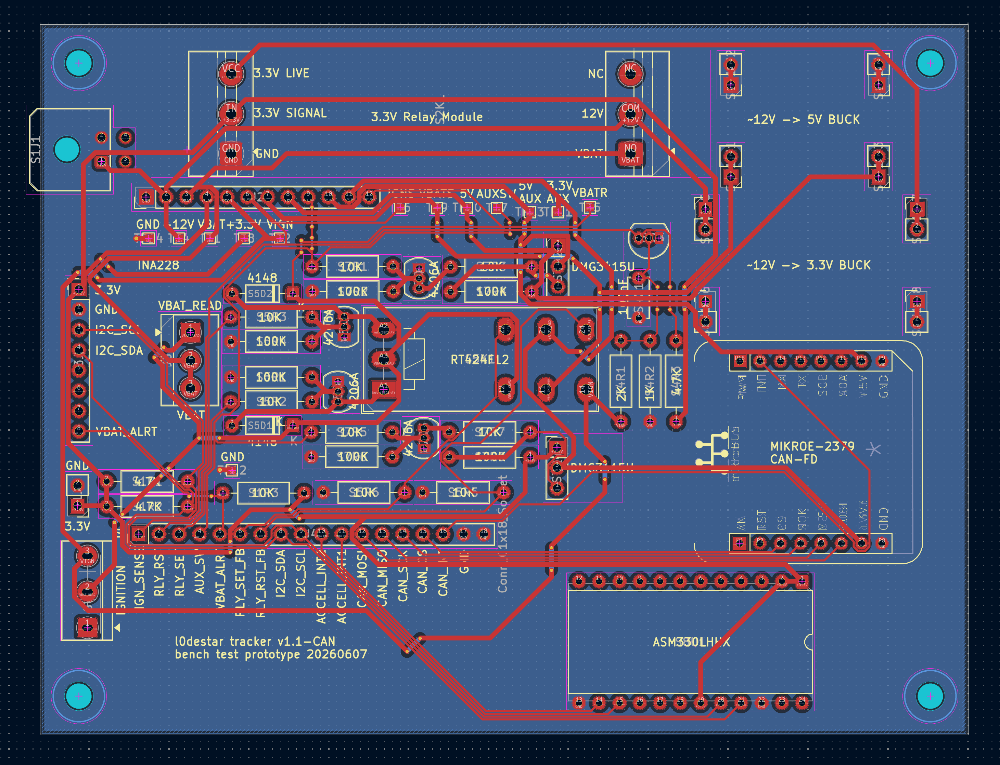
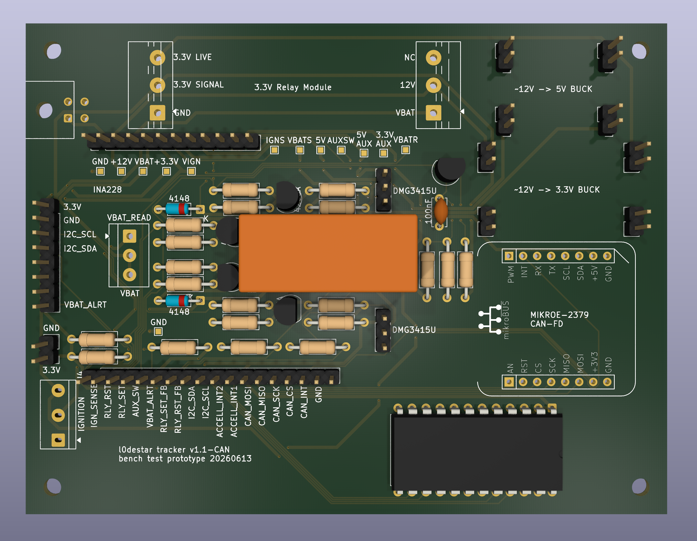

# l0destar v1.0 bench test unit - CAN version

## Overview

NOTE: THIS HAS NOT BEEN TESTED, USE AT YOUR OWN RISK

This is a bench test PCB designed for use with the Nordic nRF9151 Dev Kit. It
has all of the ancillary electronics with pin headers intended for connection to
the dev kit:

 - ~12v power input
 - 3.3V buck powering a 3V relay which gates the 12V supply to the rest of the
   board
 - All power rails (including 12v) gated by the presence of the 3.3v rail from
   the dev kit using a 3V relay (see below)
 - INA228 voltage monitoring
 - Manual switch to simulate the ignition signal
 - Relay power source switching
 - 5V buck converter for the ISO-9141
 - Auxillary power rails controlled by the AUX_SW signal
 - Accelerometer (pin headers to accept the STEVAL-MKI212V1 accelerometer eval
   board
 - MikroBUS headers wired for the MIKROE-2379 CAN-FD ClickBoard

## Power supply

The 12V input goes via an initial relay stage which gates power to the rest of
the board. The 3.3V rail from the DK must be present in order for everything on
the test board to power on. This is because having voltage on any of the GPIO
signal lines while the DK is powered off is not recomended by Nordic. This
configuration means that as soon as the 3.3V rail from the Nordic board goes off
the power is cut to the entire accessory board.

WARNING: logic voltage on the MIKROE-2379 should be set to 3.3v as 5v would
damage the nRF9151.

## Parts list

| Part                                                                                   | Quantity |
|----------------------------------------------------------------------------------------|----------|
| [3V relay](https://amzn.to/43xMQR2)                                                    | 1        |
| [3.3v buck converter](https://amzn.to/4fIUC1W)                                         | 1        |
| [RT424F12 12V bistable relay](https://amzn.to/4egbXN5)                                 | 1        |
| [STEVAL-MKI212V1 accelerometer eval board](https://www.st.com/en/evaluation-tools/steval-mki212v1.html) | 1 |
| [MIKROE-2379](https://amzn.to/4emx1BS)                                                 | 1        |
| [INA228 breakout](https://amzn.to/4efyaed)                                             | 1        |
| [5V buck converter](https://amzn.to/4uwe5Gy)                                           | 1        |
| [5mm switch](https://amzn.to/3S40cCg)                                                  | 1        |
| [Pin headers](https://amzn.to/3Qm8qoH)                                                 | Various  |
| [4.7K resistor](https://amzn.to/4gc8ZvK)                                               | 2        |
| [10K resistor](https://amzn.to/4gc8ZvK)                                                | 9        |
| [56K resistor](https://amzn.to/4gc8ZvK)                                                | 2        |
| [100K resistor](https://amzn.to/4gc8ZvK)                                               | 7        |
| [MOSFET - ZVN4206A](https://amzn.to/3S775mb)                                           | 4        |
| [MOSFET - DMG3415U](https://amzn.to/4uvGYCY)                                           | 2        |
| [SOT-23 adapter](https://amzn.to/4fIxoc5)                                              | 2        |
| [100nF ceramic capacitor](https://amzn.to/4xpB60v)                                     | 1        |
| [Diode - 1N4148](https://amzn.to/4vPo4bi)                                              | 2        |
| [Molex 43045-0400 4-pin receptacle](https://uk.farnell.com/molex/43045-0400/conn-r-a-hdr-4pos-2row-3mm/dp/9733019) | 1 |

## Tools and accessories

- [Dupont connectors and pins](https://amzn.to/444K71B)
- [Crimp tool for Dupont terminals](https://amzn.to/4xraxZ0)
- [Ribbon cable](https://amzn.to/3PXOW9R)
- [Klein 2100-5 scissors](https://amzn.to/4vEJpnA)
- [PCB header pins](https://amzn.to/43xhjPk)

## Notes

- I mounted the DMG3415Us on SOT-23 adapters but there's no reason you need to
  if you'd rather surface mount them
- The breakouts can either be soldered directly or mounted on PCB pin headers, I
  would suggest the latter for ease of re-use
- Any buck converters with stable output will work. The 3.3V one is necessary
  to drive the relay coils because they draw over 100mA and I wasn't comfortable
  putting that load on the Nordic VDDIO rail comfortable putting that load on
  the Nordic VDDIO rail. I positioned the 2pin connector footprints for the
  modules I bought, if you buy different ones you'll need to adjust them
- I used a 4-pin Molex receptable because it's what I had to hand but only two
  of the pins are needed
- Never plug or unplug anything into the Nordic dev board while anything is
  powered (I killed at least one dev board this way)
- This PCB has not been tested or validated at all yet, I would strongly
  recommend carefully testing it (ideally with an oscilloscope) before
  connecting it to the dev board

