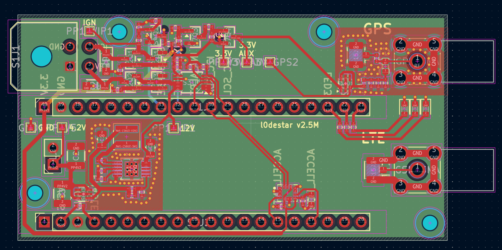
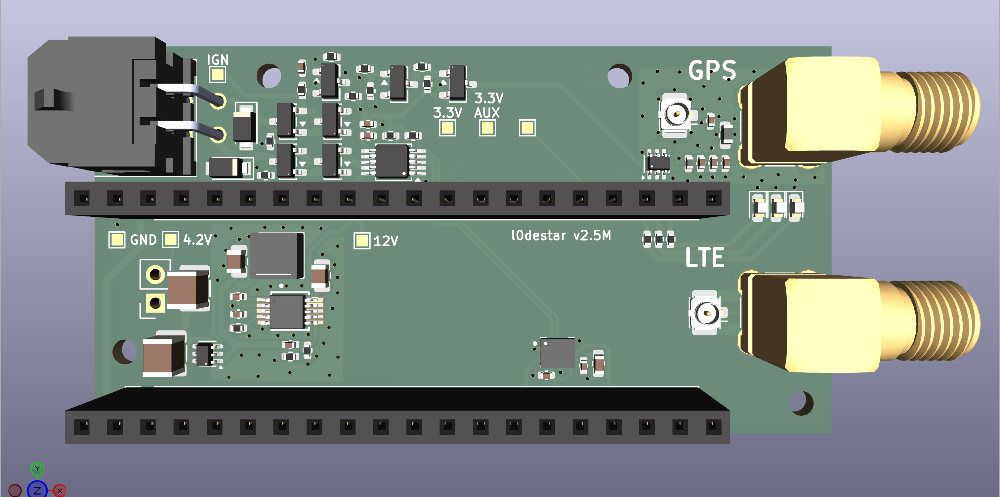
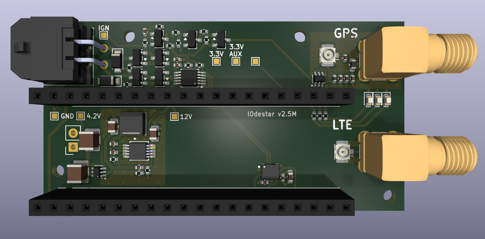
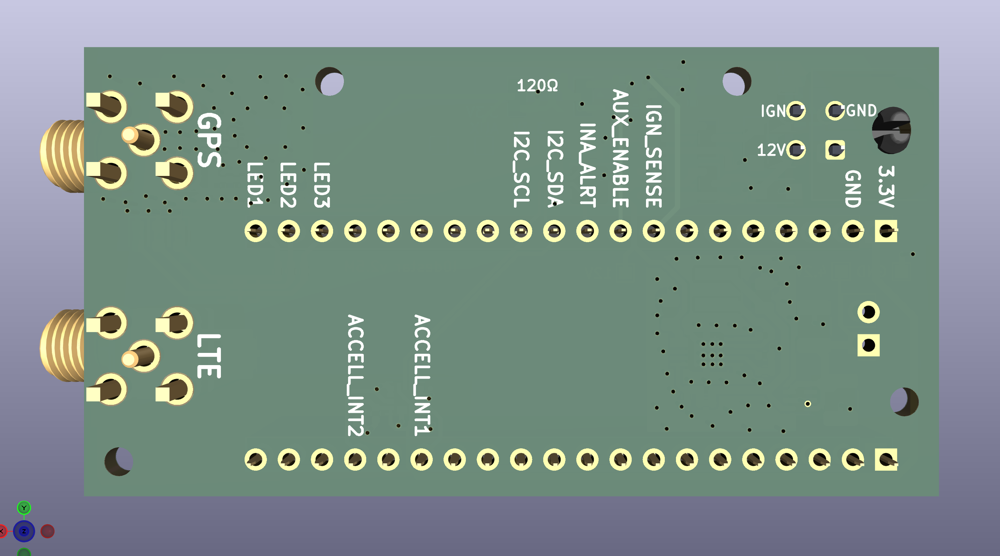
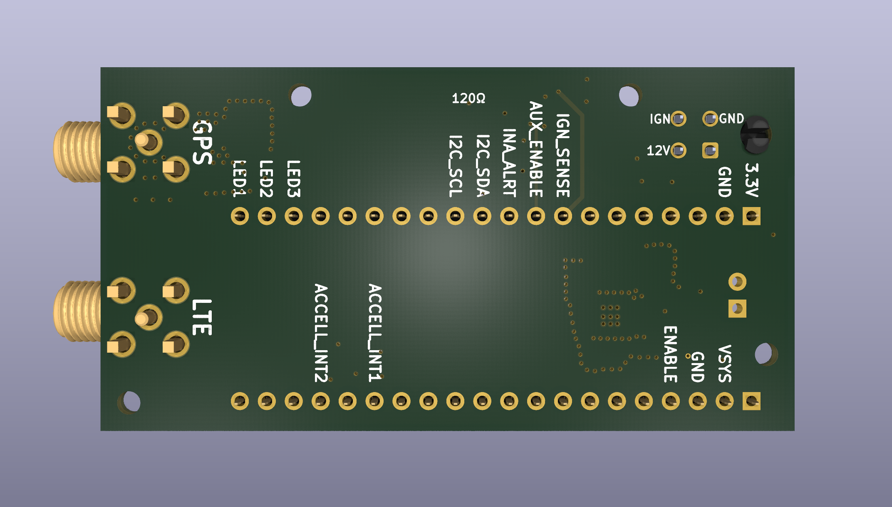

# l0destar v2.5 micro

## Overview

**NOTE: THIS HAS NOT YET BEEN TESTED, USE AT YOUR OWN RISK**

- This is a prototype l0destar vehicle tracker PCB designed to be
  hand-solderable (hot air required)
- It makes use of the [Makerdiary nRF9151 Connect Kit](https://makerdiary.com/products/nrf9151-connectkit) to provide the LTE and GPS
functions
- Component vias are dogleg-routed deliberately in order to keep the PCB costs
as low as possible
- The RF trace width is calculated using a standard 4-layer stackup at JLPCB,
  different fabrication processes may require adjustment

## Test status

| Item | Test | Result | Notes |
|---------|------|--------|-------|
| Input stage | 12V input reverse polarity | NOT TESTED | |
| Input stage | 12V ignition input reverse polarity | NOT TESTED | |
| INA228 | Voltage reading function | NOT TESTED |
| Ignition presence | Ignition sense 3.3v signal | NOT TESTED | |
| LT8609 | 4.2V output | NOT TESTED | |
| Auxillary 3.3V rail | Switches on enable signal | NOT TESTED | |
| Accelerometer | Operates while awake | NOT TESTED | |
| Accelerometer | Wake on motion | NOT TESTED | |
| GPS antenna bias tee | Obtains GPS signal | NOT TESTED | |
| Board | Quiescent current | NOT TESTED | Estimated at around 370 µA |

## Features

 - 12V live and 12V ignition inputs with TVS and reverse polarity protection
 - Ignition presence sensing
 - INA228 voltage reading
 - High efficiency buck converter
 - Auxillary 3.3V rail for the GPS antenna bias tee
 - ASM330LHHXG1TR 6-axis IMU gyro/accelerometer
 - USB-C can be connected and disconnected for programming without any power
   disruption

## Changes from the v1.1 mini prototype

 - Dramatically smaller PCB footprint
 - Switched to a 4-layer stackup for simpler routing (especially useful on the
   other two variants that have CAN and ISO-9141 circuits)
 - Components were resized from a default of 0805 to a new default of 0402 and
   only bumped to 0603 or 0805 where necessary for specification
 - The large aluminium polymer caps were removed
 - The buck output cap was replaced with 2x 1210 ceramic 220uF caps for
   dramatically lower ESR
 - Power consumption while asleep was optimised significantly with the estimated
   quiscent draw in sleep mode with the accelerometer armed at around 370 µA
 - The relay power control circuit was removed as the quiscent current is so low
   in sleep mode that it seems unnecessary. Anyone wanting to only power the
   unit when the ignition is on can just power the 12V rail directly from the
   ignition rail
 - More thought was given to the specifications of the components for automotive
   use and these are now indicated in the bill of materials
 - The input stage MOSFETs and TVS were tuned for smaller footprint and more
   appropriate specification for automotive use

## Power supply

The Connect Kit can be powered through VBUS which would be much simpler as it
can take 5V, but then you have to disconnect the power before connecting a USB
cable. Same for the Nordic dev board - they both explicitly say not to connect
powered USB and VBUS at the same time. Because the intention is to install this
in a vehicle for testing the pragmatic decision was taken to power it with a
4.2V buck feeding the battery connector. With this power connection we can
connect USB-C at any time to update the firmware without needing to disconnect
power.

## Bill of materials

| Item | Description | Specification | Example | Notes |
|------|-------------|---------------|---------|-------|
| MCU | MCU and GSM/GPS 40pin board | nRF9151 Connect Kit | [Makerdiary nRF9151 Connect Kit](https://makerdiary.com/products/nrf9151-connectkit) | |
| S1J1 | Molex Micro-fit 3.0 2x02 PCB connector | 43045-0400 | [43045-0400](https://uk.farnell.com/molex/43045-0400/conn-r-a-pcb-hdr-4pos-2row-3mm/dp/9733019) | | 
| S1J2 | Makerdiary header 1 | 20-pin 2.54mm header | [20-pin pcb header](https://amzn.to/44hTFGN) | |
| S1J3 | Makerdiary header 2 | 20-pin 2.54mm header | [20-pin pcb header](https://amzn.to/44hTFGN) | |
| S1R1 | I2C pull-up resistor | 0402 4.7K 1% | [MP003476](https://uk.farnell.com/multicomp-pro/mp003476/res-4k7-1-0-0625w-0402-thick-film/dp/3392645) | |
| S1R2 | I2C pull-up resistor | 0402 4.7K 1% | [MP003476](https://uk.farnell.com/multicomp-pro/mp003476/res-4k7-1-0-0625w-0402-thick-film/dp/3392645) | |
| S1R3 | 100K enable resistor | 0402 100K 1% | [MCPWR02FTEP1003A](https://uk.farnell.com/multicomp-pro/mcpwr02ftep1003a/res-100k-1-thick-film-0402/dp/4538624) | |
| S1C1 | 220uF buck output capacitor | 1210 220uF 6.3V 20% X5R | [GRM32ER60J227ME05K](https://uk.farnell.com/murata/grm32er60j227me05k/cap-220-f-6-3v-20-x5r-1210/dp/2671587) | Higher voltage/X7R spec is better if available |
| S1C2 | 220uF buck output capacitor | 1210 220uF 6.3V 20% X5R | [GRM32ER60J227ME05K](https://uk.farnell.com/murata/grm32er60j227me05k/cap-220-f-6-3v-20-x5r-1210/dp/2671587) | Higher voltage/X7R spec is better if available |
| S2Q1 | Reverse-polarity MOSFET | SQ2361 SOT-23 | [SQ2361ES-T1_GE3](https://uk.farnell.com/vishay/sq2361es-t1-ge3/mosfet-aec-q101-p-ch-60v-sot-23/dp/2889711) | |
| S2Q2 | Reverse-polarity MOSFET | SQ2361 SOT-23 | [SQ2361ES-T1_GE3](https://uk.farnell.com/vishay/sq2361es-t1-ge3/mosfet-aec-q101-p-ch-60v-sot-23/dp/2889711) | |
| S2D1 | 15V Zener diode | BZX84C15 | [BZX84C15](https://uk.farnell.com/multicomp-pro/bzx84c15/zener-diode-0-3w-15v-sot-23/dp/2675186) | |
| S2D2 | 400W TVS diode | PTVS33VS1UTR,115 SOD-123W | [PTVS33VS1UTR,115](https://uk.farnell.com/nexperia/ptvs33vs1utr-115/tvs-diode-aecq101-unidir-33v-400w/dp/3440137) | |
| S2D3 | 15V Zener diode | BZX84C15 | [BZX84C15](https://uk.farnell.com/multicomp-pro/bzx84c15/zener-diode-0-3w-15v-sot-23/dp/2675186) | |
| S2D4 | 400W TVS diode | PTVS33VS1UTR,115 SOD-123W | [PTVS33VS1UTR,115](https://uk.farnell.com/nexperia/ptvs33vs1utr-115/tvs-diode-aecq101-unidir-33v-400w/dp/3440137) | |
| S2R1 | Pulldown resistor | 0402 1% 1M | [ERJ2RKF1004X](https://uk.farnell.com/panasonic/erj2rkf1004x/res-1m-1-0-1w-0402-thick-film/dp/2302957) | |
| S2R2 | Pulldown resistor | 0402 1% 1M | [ERJ2RKF1004X](https://uk.farnell.com/panasonic/erj2rkf1004x/res-1m-1-0-1w-0402-thick-film/dp/2302957) | |
| S3U1 | INA228 voltage read IC | INA228 10-VSSOP | [INA228](https://www.aliexpress.com/item/1005008704299153.html) | |
| S3C1 | 1uF capacitor | 0402 >= 10V 10% X7R | [KAM05CR71A105KH](https://uk.farnell.com/kyocera-avx/kam05cr71a105kh/capacitor-mlcc-1uf-x7r-10v-0402/dp/4365709) | |
| S3C2 | 100nF capacitor | 0402 >= 25V 10% X7R | [MC0402B104K250CT](https://uk.farnell.com/multicomp-pro/mc0402b104k250ct/cap-0-1-f-25v-10-x7r-0402/dp/2320759) | |
| S4Q1 | Ignition sense MOSFET | 2N7002 SOT-23 | [2N7002](https://uk.farnell.com/multicomp-pro/2n7002/mosfet-n-ch-60v-0-115a-sot-23/dp/4295174) | |
| S4R1 | Ignition sense resistor | 0402 120K 1% | [RC0402FR-07120KL](https://uk.farnell.com/yageo/rc0402fr-07120kl/res-120k-1-0-063w-0402-thick-film/dp/9239480) | |
| S4R2 | Ignition sense resistor | 0402 47K 1% | [ERJ2RKF4702X](https://uk.farnell.com/panasonic/erj2rkf4702x/res-47k-1-0-1w-0402-thick-film/dp/2302806) | |
| S4R3 | Ignition sense resistor | 0402 56K 1% | [MCMR04X5602FTL](https://uk.farnell.com/multicomp-pro/mcmr04x5602ftl/res-56k-1-0-0625w-0402-ceramic/dp/2073131) | |
| S4C1 | 100nF capacitor | 0402 >= 25V 10% X7R | [MC0402B104K250CT](https://uk.farnell.com/multicomp-pro/mc0402b104k250ct/cap-0-1-f-25v-10-x7r-0402/dp/2320759) | |
| S6U1 | Buck converter | LT8609AIMSE MSOP-EP-10 | [LT8609AIMSE#PBF](https://uk.farnell.com/analog-devices/lt8609aimse-pbf/dc-dc-conv-sync-buck-2mhz-125deg/dp/4025049) | |
| S6U2 | Ideal diode | LM66100 | [LM66100](https://www.aliexpress.com/item/1005008565117953.html) | |
| S6L1 | Inductor | XFL4020-222ME | [XFL4020-222MEC](https://uk.farnell.com/coilcraft/xfl4020-222mec/inductor-2-2uh-8a-20-pwr-38mhz/dp/2289216) | |
| S6C1 | 100nF capacitor | 0402 >= 25V 10% X7R | [MC0402B104K250CT](https://uk.farnell.com/multicomp-pro/mc0402b104k250ct/cap-0-1-f-25v-10-x7r-0402/dp/2320759) | |
| S6C2 | 1uF capacitor | 0402 >= 10V 10% X7R | [KAM05CR71A105KH](https://uk.farnell.com/kyocera-avx/kam05cr71a105kh/capacitor-mlcc-1uf-x7r-10v-0402/dp/4365709) | |
| S6C3 | 4.7uF capacitor | 0805 >= 50V 10% X7R | [GRM21BZ71H475KE15K](https://uk.farnell.com/murata/grm21bz71h475ke15k/cap-4-7uf-50v-mlcc-0805/dp/3582887) | |
| S6C4 | 10pF capacitor | 0402 >= 25V 10% X7R | [C0402C100K5RACTU](https://uk.farnell.com/kemet/c0402c100k5ractu/cap-10pf-50v-10-x7r-0402/dp/2821254) | |
| S6C5 | 22uF capacitor | 0805 >= 10V 20% X7T | [GCM21BD71A226MEC4L](https://uk.farnell.com/murata/gcm21bd71a226mec4l/cap-mlcc-22uf-x7t-10v-0805/dp/4813843) | Higher voltage rating/X7R is better if available |
| S6R1 | Oscillator frequency resistor | 0402 18.2K 1% | [RC0402FR-0718K2L](https://uk.farnell.com/yageo/rc0402fr-0718k2l/res-18k2-1-0-0625w-0402-thick/dp/3495542) | 18.2K == 2MHz |
| S6R2 | Output voltage divider resistor | 0402 226K 1% | [MCMR04X2263FTL](https://uk.farnell.com/multicomp-pro/mcmr04x2263ftl/res-226k-1-0-0625w-0402-ceramic/dp/2072796) | VOUT == 0.782V x (1 + S6R3/S6R2) == 4.24V |
| S6R3 | Output voltage divider resistor | 0402 1M 1% | [ERJ2RKF1004X](https://uk.farnell.com/panasonic/erj2rkf1004x/res-1m-1-0-1w-0402-thick-film/dp/2302957) | VOUT == 0.782V x (1 + S6R3/S6R2) == 4.24V |
| S7Q1 | Aux power MOSFET | 2N7002 SOT-23 | [2N7002](https://uk.farnell.com/multicomp-pro/2n7002/mosfet-n-ch-60v-0-115a-sot-23/dp/4295174) | |
| S7Q2 | Aux power MOSFET | DMG3415U SOT-23 | [DMG3415UQ-7](https://uk.farnell.com/diodes-inc/dmg3415uq-7/mosfet-p-ch-20v-4a-sot-23/dp/3943490) | |
| S7R1 | Aux power resistor | 0402 100K 1% | [MCPWR02FTEP1003A](https://uk.farnell.com/multicomp-pro/mcpwr02ftep1003a/res-100k-1-thick-film-0402/dp/4538624) | |
| S7R2 | Aux power resistor | 0402 1M 1% | [ERJ2RKF1004X](https://uk.farnell.com/panasonic/erj2rkf1004x/res-1m-1-0-1w-0402-thick-film/dp/2302957) | |
| S7R3 | Aux power resistor | 0402 100K 1% | [MCPWR02FTEP1003A](https://uk.farnell.com/multicomp-pro/mcpwr02ftep1003a/res-100k-1-thick-film-0402/dp/4538624) | |
| S7R4 | Aux power resistor | 0402 470K 1% | [ERJ2RKF4703X](https://uk.farnell.com/panasonic/erj2rkf4703x/res-470k-1-0-1w-0402-thick-film/dp/2302916) | |
| S8U1 | ASM330LHHXTR accelerometer | ASM330LHHXTR | [ASM330LHHXTR](https://estore.st.com/en/products/mems-and-sensors/inemo-inertial-modules/asm330lhhx.html) | |
| S8C1 | 100nF capacitor | 0402 >= 25V 10% X7R | [MC0402B104K250CT](https://uk.farnell.com/multicomp-pro/mc0402b104k250ct/cap-0-1-f-25v-10-x7r-0402/dp/2320759) | |
| S8C2 | 10uF capacitor | 0603 >= 6.3V 20% X7T | [GRT188D71A106ME13D](https://uk.farnell.com/murata/grt188d71a106me13d/cap-mlcc-10uf-x7t-10v-0603/dp/4335734) | Higher voltage/X7R is better if available |
| S8C3 | 100nF capacitor | 0402 >= 25V 10% X7R | [MC0402B104K250CT](https://uk.farnell.com/multicomp-pro/mc0402b104k250ct/cap-0-1-f-25v-10-x7r-0402/dp/2320759) | |
| S13R1 | LED resistor | 0402 1K 1% | [CRCW04021K00FKED](https://uk.farnell.com/vishay/crcw04021k00fked/res-1k-1-0-063w-0402-thick-film/dp/1469662) | |
| S13R2 | LED resistor | 0402 1K 1% | [CRCW04021K00FKED](https://uk.farnell.com/vishay/crcw04021k00fked/res-1k-1-0-063w-0402-thick-film/dp/1469662) | |
| S13R3 | LED resistor | 0402 1K 1% | [CRCW04021K00FKED](https://uk.farnell.com/vishay/crcw04021k00fked/res-1k-1-0-063w-0402-thick-film/dp/1469662) | |
| S13D1 | Status LED | 0603 | [MP001249](https://uk.farnell.com/multicomp-pro/mp001249/led-red-385mcd-629nm-0603/dp/3265380) | |
| S13D2 | Status LED | 0603 | [MP001249](https://uk.farnell.com/multicomp-pro/mp001249/led-red-385mcd-629nm-0603/dp/3265380) | |
| S13D3 | Status LED | 0603 | [MP001249](https://uk.farnell.com/multicomp-pro/mp001249/led-red-385mcd-629nm-0603/dp/3265380) | |
| S15J1 | u.FL PCB connector | 50 ohm | [U.FL-R-SMT(01)](https://uk.farnell.com/hirose-hrs/u-fl-r-smt-01/rf-coaxial-u-fl-straight-jack/dp/3908021) | |
| S15J2 | SMA PCB connector | 50 ohm | [SMA-J-P-H-RA-TH1](https://uk.farnell.com/samtec/sma-j-p-h-ra-th1/rf-coaxial-sma-jack-50-ohm-pcb/dp/2856817) | |
| S15J3 | u.FL PCB connector | 50 ohm | [U.FL-R-SMT(01)](https://uk.farnell.com/hirose-hrs/u-fl-r-smt-01/rf-coaxial-u-fl-straight-jack/dp/3908021) | |
| S15J4 | SMA PCB connector | 50 ohm | [SMA-J-P-H-RA-TH1](https://uk.farnell.com/samtec/sma-j-p-h-ra-th1/rf-coaxial-sma-jack-50-ohm-pcb/dp/2856817) | |
| S15U1 | Ideal diode | LM66100 | [LM66100](https://www.aliexpress.com/item/1005008565117953.html) | |
| S15FB1 | Ferrite bead | 600 ohm | [BLM15PX601SZ1D](https://uk.farnell.com/murata/blm15px601sz1d/ferrite-bead-0-9a-0-23ohm-0402/dp/3678458) | |
| S15L1 | RF inductor | 0603 47-100 nH, SRF > 2GHz | [LQW18AN68NJ00D](https://uk.farnell.com/murata/lqw18an68nj00d/inductor-68nh-2-2ghz-0-34a-0603/dp/3471533) | |
| S15C1 | 100pF RF capacitor | 0402 >= 25V 1% C0G / NP0 | [AC0402FRNPO9BN101](https://uk.farnell.com/yageo/ac0402frnpo9bn101/cap-100pf-50v-mlcc-0402/dp/4166091) | |
| S15C2 | 100pF RF capacitor | 0402 >= 25V 1% C0G / NP0 | [AC0402FRNPO9BN101](https://uk.farnell.com/yageo/ac0402frnpo9bn101/cap-100pf-50v-mlcc-0402/dp/4166091) | |
| S15C3 | 10nF RF capacitor | 0402 >= 25V 5% C0G / NP0 | [GRM1555CYA103JE01D](https://uk.farnell.com/murata/grm1555cya103je01d/cap-mlcc-0-01uf-c0g-np0-35v-0402/dp/4792250) | |
| S15C4 | 1uF RF capacitor | 0402 >= 25V 10% X7R | [KAM05CR71A105KH](https://uk.farnell.com/kyocera-avx/kam05cr71a105kh/capacitor-mlcc-1uf-x7r-10v-0402/dp/4365709) | |
| - | u.FL cable - LTE | 50 ohm 35mm | [U.FL-2LPHF6-04N1TV-A-35](https://uk.farnell.com/hirose-hrs/u-fl-2lphf6-04n1tv-a-35/cbl-assy-u-fl-r-a-plug-r-a-plug/dp/4294251) | |
| - | u.FL cable - GPS | 50 ohm 35mm | [U.FL-2LPHF6-04N1TV-A-35](https://uk.farnell.com/hirose-hrs/u-fl-2lphf6-04n1tv-a-35/cbl-assy-u-fl-r-a-plug-r-a-plug/dp/4294251) | |

## Parts list

| Item | Quantity | Specification | Example | Notes |
|------|----------|---------------|---------|-------|
| MCU and GSM/GPS 40pin board | 1 | nRF9151 Connect Kit | [Makerdiary nRF9151 Connect Kit](https://makerdiary.com/products/nrf9151-connectkit) | |
| Molex Micro-fit 3.0 2x02 PCB connector | 1 | 43045-0400 | [43045-0400](https://uk.farnell.com/molex/43045-0400/conn-r-a-pcb-hdr-4pos-2row-3mm/dp/9733019) | | 
| 20pin header | 2 | 20-pin 2.54mm header | [20-pin pcb header](https://amzn.to/44hTFGN) | |
| 1K 0402 resistor | 3 | 0402 1K 1% | [CRCW04021K00FKED](https://uk.farnell.com/vishay/crcw04021k00fked/res-1k-1-0-063w-0402-thick-film/dp/1469662) | |
| 4.7K 0402 resistor | 2 | 0402 4.7K 1% | [MP003476](https://uk.farnell.com/multicomp-pro/mp003476/res-4k7-1-0-0625w-0402-thick-film/dp/3392645) | |
| 18.2K 0402 resistor | 1 | 0402 18.2K 1% | [RC0402FR-0718K2L](https://uk.farnell.com/yageo/rc0402fr-0718k2l/res-18k2-1-0-0625w-0402-thick/dp/3495542) | 18.2K == 2MHz |
| 47K 0402 resistor | 1 | 0402 47K 1% | [ERJ2RKF4702X](https://uk.farnell.com/panasonic/erj2rkf4702x/res-47k-1-0-1w-0402-thick-film/dp/2302806) | |
| 56K 0402 resistor | 1 | 0402 56K 1% | [MCMR04X5602FTL](https://uk.farnell.com/multicomp-pro/mcmr04x5602ftl/res-56k-1-0-0625w-0402-ceramic/dp/2073131) | |
| 100K 0402 resistor | 3 | 0402 100K 1% | [MCPWR02FTEP1003A](https://uk.farnell.com/multicomp-pro/mcpwr02ftep1003a/res-100k-1-thick-film-0402/dp/4538624) | |
| 120K 0402 resistor | 1 | 0402 120K 1% | [RC0402FR-07120KL](https://uk.farnell.com/yageo/rc0402fr-07120kl/res-120k-1-0-063w-0402-thick-film/dp/9239480) | |
| 226K 0402 resistor | 1 | 0402 226K 1% | [MCMR04X2263FTL](https://uk.farnell.com/multicomp-pro/mcmr04x2263ftl/res-226k-1-0-0625w-0402-ceramic/dp/2072796) | VOUT == 0.782V x (1 + S6R3/S6R2) == 4.24V |
| 470K 0402 resistor | 1 | 0402 470K 1% | [ERJ2RKF4703X](https://uk.farnell.com/panasonic/erj2rkf4703x/res-470k-1-0-1w-0402-thick-film/dp/2302916) | |
| 1M 0402 resistor | 3 | 0402 1M 1% | [ERJ2RKF1004X](https://uk.farnell.com/panasonic/erj2rkf1004x/res-1m-1-0-1w-0402-thick-film/dp/2302957) | |
| 10pF 0402 capacitor | 1 | 0402 >= 25V 10% X7R | [C0402C100K5RACTU](https://uk.farnell.com/kemet/c0402c100k5ractu/cap-10pf-50v-10-x7r-0402/dp/2821254) | |
| 100pF 0402 RF capacitor | 2 | 0402 >= 25V 1% C0G / NP0 | [AC0402FRNPO9BN101](https://uk.farnell.com/yageo/ac0402frnpo9bn101/cap-100pf-50v-mlcc-0402/dp/4166091) | |
| 10nF 0402 RF capacitor | 1 | 0402 >= 25V 5% C0G / NP0 | [GRM1555CYA103JE01D](https://uk.farnell.com/murata/grm1555cya103je01d/cap-mlcc-0-01uf-c0g-np0-35v-0402/dp/4792250) | |
| 100nF 0402 capacitor | 5 | 0402 >= 25V 10% X7R | [MC0402B104K250CT](https://uk.farnell.com/multicomp-pro/mc0402b104k250ct/cap-0-1-f-25v-10-x7r-0402/dp/2320759) | |
| 1uF 0402 capacitor | 3 | 0402 >= 10V 10% X7R | [KAM05CR71A105KH](https://uk.farnell.com/kyocera-avx/kam05cr71a105kh/capacitor-mlcc-1uf-x7r-10v-0402/dp/4365709) | |
| 4.7uF 0805 capacitor | 1 | 0805 >= 50V 10% X7R | [GRM21BZ71H475KE15K](https://uk.farnell.com/murata/grm21bz71h475ke15k/cap-4-7uf-50v-mlcc-0805/dp/3582887) | |
| 10uF 0603 capacitor | 0603 >= 6.3V 20% X7T | [GRT188D71A106ME13D](https://uk.farnell.com/murata/grt188d71a106me13d/cap-mlcc-10uf-x7t-10v-0603/dp/4335734) | Higher voltage/X7R is better if available |
| 22uF 0805 capacitor | 1 | 0805 >= 10V 20% X7T | [GCM21BD71A226MEC4L](https://uk.farnell.com/murata/gcm21bd71a226mec4l/cap-mlcc-22uf-x7t-10v-0805/dp/4813843) | Higher voltage rating/X7R is better if available |
| 220uF 1210 capacitor | 2 | 1210 6.3V 20% X5R | [GRM32ER60J227ME05K](https://uk.farnell.com/murata/grm32er60j227me05k/cap-220-f-6-3v-20-x5r-1210/dp/2671587) | Higher voltage/X7R spec is better if available |
| MOSFET | 2 | SQ2361 SOT-23 | [SQ2361ES-T1_GE3](https://uk.farnell.com/vishay/sq2361es-t1-ge3/mosfet-aec-q101-p-ch-60v-sot-23/dp/2889711) | |
| MOSFET | 2 | 2N7002 SOT-23 | [2N7002](https://uk.farnell.com/multicomp-pro/2n7002/mosfet-n-ch-60v-0-115a-sot-23/dp/4295174) | |
| MOSFET | 1 | DMG3415U SOT-23 | [DMG3415UQ-7](https://uk.farnell.com/diodes-inc/dmg3415uq-7/mosfet-p-ch-20v-4a-sot-23/dp/3943490) | |
| 15V Zener diode | 2 | BZX84C15 | [BZX84C15](https://uk.farnell.com/multicomp-pro/bzx84c15/zener-diode-0-3w-15v-sot-23/dp/2675186) | |
| 400W TVS diode | 2 | PTVS33VS1UTR,115 SOD-123W | [PTVS33VS1UTR,115](https://uk.farnell.com/nexperia/ptvs33vs1utr-115/tvs-diode-aecq101-unidir-33v-400w/dp/3440137) | |
| Ideal diode | 2 | LM66100 | [LM66100](https://www.aliexpress.com/item/1005008565117953.html) | |
| INA228 voltage read IC | 1 | INA228 10-VSSOP | [INA228](https://www.aliexpress.com/item/1005008704299153.html) | |
| Buck converter | 1 | LT8609AIMSE MSOP-EP-10 | [LT8609AIMSE#PBF](https://uk.farnell.com/analog-devices/lt8609aimse-pbf/dc-dc-conv-sync-buck-2mhz-125deg/dp/4025049) | |
| Inductor | 1 | XFL4020-222ME | [XFL4020-222MEC](https://uk.farnell.com/coilcraft/xfl4020-222mec/inductor-2-2uh-8a-20-pwr-38mhz/dp/2289216) | |
| ASM330LHHXTR accelerometer | 1 | ASM330LHHXTR | [ASM330LHHXTR](https://estore.st.com/en/products/mems-and-sensors/inemo-inertial-modules/asm330lhhx.html) | |
| 0603 LED | 3 | 0603 | [MP001249](https://uk.farnell.com/multicomp-pro/mp001249/led-red-385mcd-629nm-0603/dp/3265380) | |
| Ferrite bead | 1 | 600 ohm | [BLM15PX601SZ1D](https://uk.farnell.com/murata/blm15px601sz1d/ferrite-bead-0-9a-0-23ohm-0402/dp/3678458) | |
| RF inductor | 1 | 0603 47-100 nH, SRF > 2GHz | [LQW18AN68NJ00D](https://uk.farnell.com/murata/lqw18an68nj00d/inductor-68nh-2-2ghz-0-34a-0603/dp/3471533) | |
| u.FL PCB connector | 2 | 50 ohm | [U.FL-R-SMT(01)](https://uk.farnell.com/hirose-hrs/u-fl-r-smt-01/rf-coaxial-u-fl-straight-jack/dp/3908021) | |
| SMA PCB connector | 2 | 50 ohm | [SMA-J-P-H-RA-TH1](https://uk.farnell.com/samtec/sma-j-p-h-ra-th1/rf-coaxial-sma-jack-50-ohm-pcb/dp/2856817) | |
| u.FL cable - GPS | 2 | 50 ohm 35mm | [U.FL-2LPHF6-04N1TV-A-35](https://uk.farnell.com/hirose-hrs/u-fl-2lphf6-04n1tv-a-35/cbl-assy-u-fl-r-a-plug-r-a-plug/dp/4294251) | |

## Images

