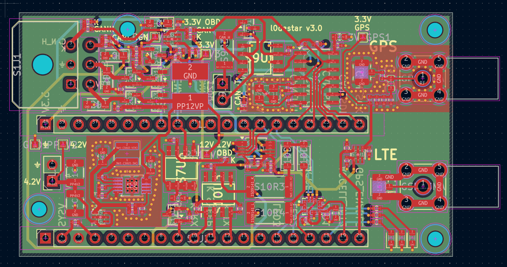
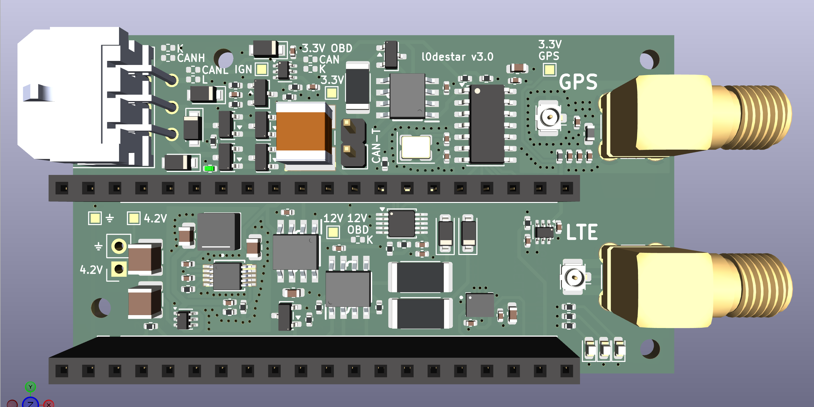
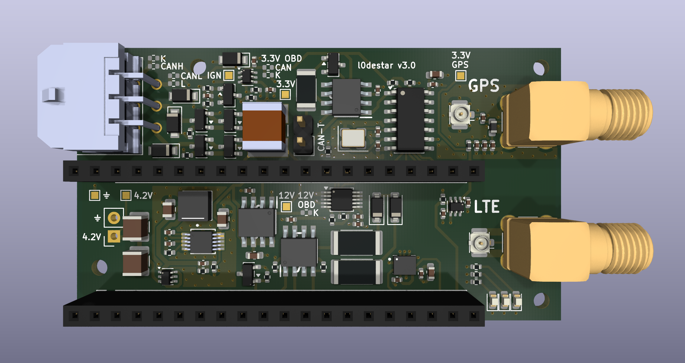
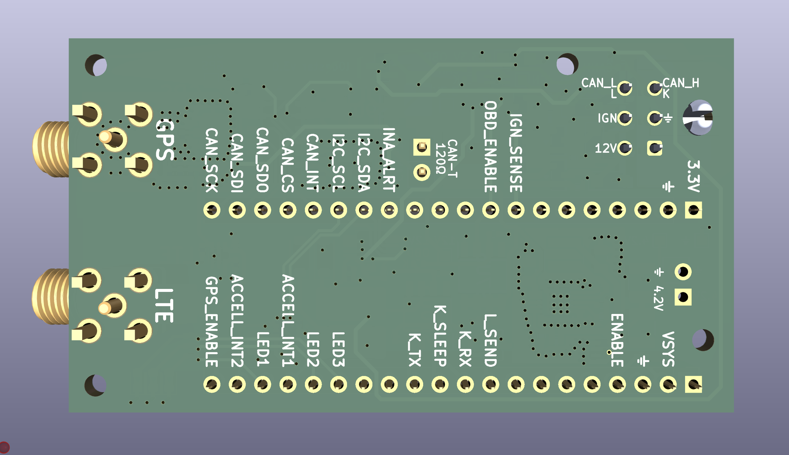
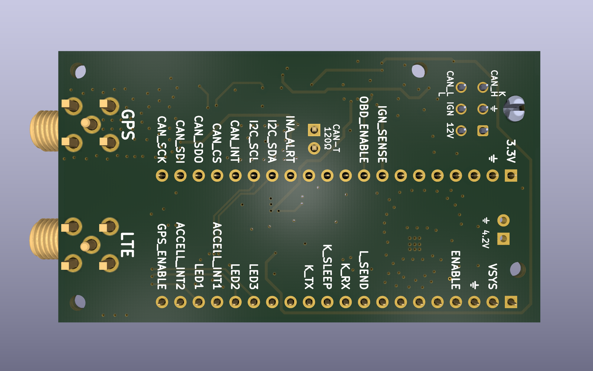

# l0destar v3.0

## Overview

**NOTE: THIS HAS NOT YET BEEN TESTED, USE AT YOUR OWN RISK**

- This is a prototype l0destar vehicle tracker PCB designed to be
  hand-solderable (hot air required)
- It makes use of the [Makerdiary nRF9151 Connect Kit](https://makerdiary.com/products/nrf9151-connectkit) to provide the LTE and GPS
functions
- Component vias are dogleg-routed deliberately in order to keep the PCB costs
as low as possible
- The RF trace width is calculated using a standard 4-layer stackup at JLCPCB,
  different fabrication processes may require adjustment

The CAN and K-line versions have been consolidated in version 3.0. There is now
a single PCB which can be configured for either CAN or K-line operation. The
components for each of these circuits are optional, both can be included or
excluded. The external connector pins and OBD power rails can be configured for
either CAN or K-line by shorting the jumper pads on the board.

Several significant improvements have been made, including the removal of the 5V
power rail and its associated buck converter.

## Test status

| Item | Test | Result | Notes |
|---------|------|--------|-------|
| Input stage | 12V input reverse polarity | NOT TESTED | |
| Input stage | 12V ignition input reverse polarity | NOT TESTED | |
| INA228 | Voltage reading function | NOT TESTED |
| Ignition presence | Ignition sense 3.3v signal | NOT TESTED | |
| LT8609#1 | 4.2V output | NOT TESTED | |
| GPS auxillary 3.3V rail | Switches on enable signal | NOT TESTED | |
| OBD auxillary 3.3V rail | Switches on OBD-enable signal | NOT TESTED | |
| OBD Auxillary 12V rail | Switches on OBD-enable signal | NOT TESTED | |
| Accelerometer | Operates while awake | NOT TESTED | |
| Accelerometer | Wake on motion | NOT TESTED | |
| GPS antenna bias tee | Obtains GPS signal | NOT TESTED | |
| ISO-9141 | K-wire connectivity | NOT TESTED | |
| ISO-9141 | L-line pulldown | NOT TESTED | |
| CAN | Connectivity | NOT TESTED | |
| CAN standby via XSTBY signal | Low standby current | NOT TESTED | |
| Board | Quiescent current | NOT TESTED | Estimated at around 370 µA |

## Features

 - 12V live and 12V ignition inputs with TVS and reverse polarity protection
 - Ignition presence sensing
 - INA228 voltage reading
 - High efficiency buck converter
 - Auxillary 3.3V rail for the GPS antenna bias tee
 - ASM330LHHXG1TR 6-axis IMU gyro/accelerometer
 - USB-C can be connected and disconnected for programming without any power
   disruption
 - Optional CAN interface
 - Optional ISO-9141 (K-line) interface with L and K connections for full functionality
 - CAN/ISO-9141 switchable via jumper pads

## Changes from v2.6

 - Both CAN and ISO-9141 (K-line) circuits are included on a single PCB, either
   one, none or both can be populated
 - Switch between CAN/ISO-9141 functionality by shorting jumper pads on the
   board with solder bridges. These config pads also double as test points for
   the power rails, saving board space
 - S2R2 increased to 10M for slightly reduced quiescent power draw
 - S4R2 increased to 100K for better resiliency of ignition sensing with low
   system voltage
 - Auxillary power MOSFETs and several ideal diodes swapped out for load switches to
   simplify the system and reduce board footprint
 - OBD power rails are switched separately from the GPS power rail to reduce
   power consumption when engine-off telemetry wakes occur
 - The L9637D was swapped out for a TJA1027T, dramatically simplifying the
   circuit. This eliminates the need for a separate 5V buck converter and the
   level shifter, saving quite a bit of board space
 - CAN transceiver swapped out for MAX33041EASA+ for more robust protection
   against transients
 - Pulldown added to the STBY pin in order to set normal mode by default rather
   than the state be floating

## Power supply

The Connect Kit can be powered through VBUS which would be much simpler as it
can take 5V, but then you have to disconnect the power before connecting a USB
cable. Same for the Nordic dev board - they both explicitly say not to connect
powered USB and VBUS at the same time. Because the intention is to install this
in a vehicle for testing the pragmatic decision was taken to power it with a
4.2V buck feeding the battery connector. With this power connection we can
connect USB-C at any time to update the firmware without needing to disconnect
power.

## Board configuration

See below for parts required for either CAN bus or ISO-9141 (K-line). Both sets
of components can be populated for future use but only one set can be in use at
any given time.

The table below shows which jumper pads should be connected for each of these
modes. **It's critical that only one system is enabled at the same time, if you
short both CAN and K-line pads at the same time unpredictable behaviour may
occur **

Connect the pads as required by bridging them with solder or placing a 0R
resistor. **Make sure the pads that should be unconnected are not connected.**

| Interface | S1R4 | S1R5 | S1R6 | S1R7 | S1R8 | S1R9 | S1R10 |
|-----------|------|------|------|------|------|------|-------|
| None      | OPEN | OPEN | OPEN | OPEN | OPEN | OPEN | OPEN |
| CAN bus   | CONNECT | OPEN | CONNECT | OPEN | CONNECT | OPEN | OPEN |
| K-line    | OPEN | CONNECT | OPEN | CONNECT | OPEN | CONNECT | CONNECT |

## Notes

 - All caps on the 12V rails must be >= 50V in order to handle transients
 - MCP2518FD with PP3V3\_CAN off - abs max on all I/O is VDD + 0.3V. Firmware
   must drive CAN\_SCK/SDI/CS low or tri-state them before dropping OBD_ENABLE,
   or the nRF backfeeds the dead rail through the clamp diodes. Additionally,
   CAN\_INT's pull-up (S9R2) is on the switched rail, so CAN\_INT floats when
   the domain is off — enable the nRF internal pulldown on that input
 - Indicated voltages and tolerances are the minimum, I generally always buy the
   tightest tolerances and highest voltages possible of everything as it's just
   simpler for managing inventory. Because of this, several of the "example"
   links will be to the parts I bought which might be tighter tolerance or
   higher voltage rating than the indicated minimum spec

## Bill of materials - required

| Item | Description | Specification | Example | Notes |
|------|-------------|---------------|---------|-------|
| MCU | MCU and GSM/GPS 40pin board | nRF9151 Connect Kit | [Makerdiary nRF9151 Connect Kit](https://makerdiary.com/products/nrf9151-connectkit) | |
| S1J1 | Molex Micro-fit 3.0 2x03 PCB connector | 43045-0600 | [43045-0600](https://uk.farnell.com/molex/43045-0600/conn-r-a-pcb-hdr-6pos-2row-3mm/dp/1012252) | |
| S1J2 | Makerdiary header 1 | 20-pin 2.54mm header | [20-pin pcb header](https://amzn.to/44hTFGN) | |
| S1J3 | Makerdiary header 2 | 20-pin 2.54mm header | [20-pin pcb header](https://amzn.to/44hTFGN) | |
| S1R1 | I2C pull-up resistor | 0402 4.7K 5% | [MP003476](https://uk.farnell.com/multicomp-pro/mp003476/res-4k7-1-0-0625w-0402-thick-film/dp/3392645) | |
| S1R2 | I2C pull-up resistor | 0402 4.7K 5% | [MP003476](https://uk.farnell.com/multicomp-pro/mp003476/res-4k7-1-0-0625w-0402-thick-film/dp/3392645) | |
| S1R3 | 100K enable resistor | 0402 100K 5% | [MCPWR02FTEP1003A](https://uk.farnell.com/multicomp-pro/mcpwr02ftep1003a/res-100k-1-thick-film-0402/dp/4538624) | |
| S1R11 | 100K pulldown resistor | 0402 100K 5% | [MCPWR02FTEP1003A](https://uk.farnell.com/multicomp-pro/mcpwr02ftep1003a/res-100k-1-thick-film-0402/dp/4538624) | |
| S1R12 | 100K pulldown resistor | 0402 100K 5% | [MCPWR02FTEP1003A](https://uk.farnell.com/multicomp-pro/mcpwr02ftep1003a/res-100k-1-thick-film-0402/dp/4538624) | |
| S1C1 | 220uF buck output capacitor | 1210 220uF 6.3V 20% X5R | [GRM32ER60J227ME05K](https://uk.farnell.com/murata/grm32er60j227me05k/cap-220-f-6-3v-20-x5r-1210/dp/2671587) | Higher voltage/X7R spec is better if available |
| S1C2 | 220uF buck output capacitor | 1210 220uF 6.3V 20% X5R | [GRM32ER60J227ME05K](https://uk.farnell.com/murata/grm32er60j227me05k/cap-220-f-6-3v-20-x5r-1210/dp/2671587) | Higher voltage/X7R spec is better if available |
| S2Q1 | Reverse-polarity MOSFET | SQ2361 SOT-23 | [SQ2361ES-T1_GE3](https://uk.farnell.com/vishay/sq2361es-t1-ge3/mosfet-aec-q101-p-ch-60v-sot-23/dp/2889711) | |
| S2Q2 | Reverse-polarity MOSFET | SQ2361 SOT-23 | [SQ2361ES-T1_GE3](https://uk.farnell.com/vishay/sq2361es-t1-ge3/mosfet-aec-q101-p-ch-60v-sot-23/dp/2889711) | |
| S2D1 | 15V Zener diode | BZX84C15 | [BZX84C15](https://uk.farnell.com/multicomp-pro/bzx84c15/zener-diode-0-3w-15v-sot-23/dp/2675186) | |
| S2D2 | 400W TVS diode | PTVS33VS1UTR,115 SOD-123W | [PTVS33VS1UTR,115](https://uk.farnell.com/nexperia/ptvs33vs1utr-115/tvs-diode-aecq101-unidir-33v-400w/dp/3440137) | |
| S2D3 | 15V Zener diode | BZX84C15 | [BZX84C15](https://uk.farnell.com/multicomp-pro/bzx84c15/zener-diode-0-3w-15v-sot-23/dp/2675186) | |
| S2D4 | 400W TVS diode | PTVS33VS1UTR,115 SOD-123W | [PTVS33VS1UTR,115](https://uk.farnell.com/nexperia/ptvs33vs1utr-115/tvs-diode-aecq101-unidir-33v-400w/dp/3440137) | |
| S2R1 | Pulldown resistor | 0402 5% 1M | [ERJ2RKF1004X](https://uk.farnell.com/panasonic/erj2rkf1004x/res-1m-1-0-1w-0402-thick-film/dp/2302957) | |
| S2R2 | Pulldown resistor | 0402 5% 10M | [RK73H1ETTP1005F](https://uk.farnell.com/koa/rk73h1ettp1005f/res-10m-1-0-1w-0402/dp/3538659) | |
| S2C1 | 47uF input capacitor | 2220 >= 50V 20% X7R | [CKG57NX7R1H476M500JH](https://uk.farnell.com/tdk/ckg57nx7r1h476m500jh/cap-stacked-47uf-50v-mlcc-2220/dp/3816888) | |
| S3U1 | INA228 voltage read IC | INA228 10-VSSOP | [INA228](https://www.aliexpress.com/item/1005008704299153.html) | |
| S3C1 | 1uF capacitor | 0402 >= 10V 10% X7R | [KAM05CR71A105KH](https://uk.farnell.com/kyocera-avx/kam05cr71a105kh/capacitor-mlcc-1uf-x7r-10v-0402/dp/4365709) | |
| S3C2 | 100nF capacitor | 0402 >= 25V 10% X7R | [MC0402B104K250CT](https://uk.farnell.com/multicomp-pro/mc0402b104k250ct/cap-0-1-f-25v-10-x7r-0402/dp/2320759) | |
| S4Q1 | Ignition sense MOSFET | 2N7002 SOT-23 | [2N7002](https://uk.farnell.com/multicomp-pro/2n7002/mosfet-n-ch-60v-0-115a-sot-23/dp/4295174) | |
| S4R1 | Ignition sense resistor | 0402 120K 5% | [RC0402FR-07120KL](https://uk.farnell.com/yageo/rc0402fr-07120kl/res-120k-1-0-063w-0402-thick-film/dp/9239480) | |
| S4R2 | Ignition sense resistor | 0402 100K 5% | [MCPWR02FTEP1003A](https://uk.farnell.com/multicomp-pro/mcpwr02ftep1003a/res-100k-1-thick-film-0402/dp/4538624) | |
| S4R3 | Ignition sense resistor | 0402 56K 5% | [MCMR04X5602FTL](https://uk.farnell.com/multicomp-pro/mcmr04x5602ftl/res-56k-1-0-0625w-0402-ceramic/dp/2073131) | |
| S4C1 | 100nF capacitor | 0402 >= 50V 10% X7R | [MCASU105SB7104KFNA01](https://uk.farnell.com/taiyo-yuden/mcasu105sb7104kfna01/capacitor-mlcc-0-1uf-50v-x7r-0402/dp/4666632) | |
| S6U1 | Buck converter | LT8609AIMSE MSOP-EP-10 | [LT8609AIMSE#PBF](https://uk.farnell.com/analog-devices/lt8609aimse-pbf/dc-dc-conv-sync-buck-2mhz-125deg/dp/4025049) | |
| S6U2 | Ideal diode | LM66100 | [LM66100](https://www.aliexpress.com/item/1005008565117953.html) | |
| S6L1 | Inductor | XFL4020-222ME | [XFL4020-222MEC](https://uk.farnell.com/coilcraft/xfl4020-222mec/inductor-2-2uh-8a-20-pwr-38mhz/dp/2289216) | |
| S6C1 | 100nF capacitor | 0402 >= 25V 10% X7R | [MC0402B104K250CT](https://uk.farnell.com/multicomp-pro/mc0402b104k250ct/cap-0-1-f-25v-10-x7r-0402/dp/2320759) | |
| S6C2 | 1uF capacitor | 0402 >= 10V 10% X7R | [KAM05CR71A105KH](https://uk.farnell.com/kyocera-avx/kam05cr71a105kh/capacitor-mlcc-1uf-x7r-10v-0402/dp/4365709) | |
| S6C3 | 4.7uF capacitor | 0805 >= 50V 10% X7R | [GRM21BZ71H475KE15K](https://uk.farnell.com/murata/grm21bz71h475ke15k/cap-4-7uf-50v-mlcc-0805/dp/3582887) | |
| S6C4 | 10pF capacitor | 0402 >= 10V 10% X7R | [C0402C100K5RACTU](https://uk.farnell.com/kemet/c0402c100k5ractu/cap-10pf-50v-10-x7r-0402/dp/2821254) | |
| S6C5 | 22uF capacitor | 0805 >= 10V 20% X7T | [GCM21BD71A226MEC4L](https://uk.farnell.com/murata/gcm21bd71a226mec4l/cap-mlcc-22uf-x7t-10v-0805/dp/4813843) | Higher voltage rating/X7R is better if available |
| S6R1 | Oscillator frequency resistor | 0402 18.2K 1% | [RC0402FR-0718K2L](https://uk.farnell.com/yageo/rc0402fr-0718k2l/res-18k2-1-0-0625w-0402-thick/dp/3495542) | 18.2K == 2MHz |
| S6R2 | Output voltage divider resistor | 0402 226K 1% | [MCMR04X2263FTL](https://uk.farnell.com/multicomp-pro/mcmr04x2263ftl/res-226k-1-0-0625w-0402-ceramic/dp/2072796) | VOUT == 0.782V x (1 + S6R3/S6R2) == 4.24V |
| S6R3 | Output voltage divider resistor | 0402 1M 1% | [ERJ2RKF1004X](https://uk.farnell.com/panasonic/erj2rkf1004x/res-1m-1-0-1w-0402-thick-film/dp/2302957) | VOUT == 0.782V x (1 + S6R3/S6R2) == 4.24V |
| S7U1 | Reverse-blocking load switch | Active high 3.3v load switch with reverse blocking | [SiP32431DR3](https://uk.farnell.com/vishay/sip32431dr3-t1ge3/ic-load-switch-1-1v-5-5v-1a-sc70/dp/2361509) | |
| S7C1 | 1uF capacitor | 0402 >= 10V 10% X7R | [KAM05CR71A105KH](https://uk.farnell.com/kyocera-avx/kam05cr71a105kh/capacitor-mlcc-1uf-x7r-10v-0402/dp/4365709) | |
| S7C2 | 100nF capacitor | 0402 >= 25V 10% X7R | [MC0402B104K250CT](https://uk.farnell.com/multicomp-pro/mc0402b104k250ct/cap-0-1-f-25v-10-x7r-0402/dp/2320759) | |
| S8U1 | ASM330LHHXTR accelerometer | ASM330LHHXTR | [ASM330LHHXTR](https://estore.st.com/en/products/mems-and-sensors/inemo-inertial-modules/asm330lhhx.html) | |
| S8C1 | 100nF capacitor | 0402 >= 25V 10% X7R | [MC0402B104K250CT](https://uk.farnell.com/multicomp-pro/mc0402b104k250ct/cap-0-1-f-25v-10-x7r-0402/dp/2320759) | |
| S8C2 | 10uF capacitor | 0603 >= 6.3V 20% X7T | [GRT188D71A106ME13D](https://uk.farnell.com/murata/grt188d71a106me13d/cap-mlcc-10uf-x7t-10v-0603/dp/4335734) | Higher voltage/X7R is better if available |
| S8C3 | 100nF capacitor | 0402 >= 25V 10% X7R | [MC0402B104K250CT](https://uk.farnell.com/multicomp-pro/mc0402b104k250ct/cap-0-1-f-25v-10-x7r-0402/dp/2320759) | |
| S13R1 | LED resistor | 0402 1K 5% | [CRCW04021K00FKED](https://uk.farnell.com/vishay/crcw04021k00fked/res-1k-1-0-063w-0402-thick-film/dp/1469662) | |
| S13R2 | LED resistor | 0402 1K 5% | [CRCW04021K00FKED](https://uk.farnell.com/vishay/crcw04021k00fked/res-1k-1-0-063w-0402-thick-film/dp/1469662) | |
| S13R3 | LED resistor | 0402 1K 5% | [CRCW04021K00FKED](https://uk.farnell.com/vishay/crcw04021k00fked/res-1k-1-0-063w-0402-thick-film/dp/1469662) | |
| S13D1 | Status LED | 0603 | [MP001249](https://uk.farnell.com/multicomp-pro/mp001249/led-red-385mcd-629nm-0603/dp/3265380) | |
| S13D2 | Status LED | 0603 | [MP001249](https://uk.farnell.com/multicomp-pro/mp001249/led-red-385mcd-629nm-0603/dp/3265380) | |
| S13D3 | Status LED | 0603 | [MP001249](https://uk.farnell.com/multicomp-pro/mp001249/led-red-385mcd-629nm-0603/dp/3265380) | |
| S15J1 | u.FL PCB connector | 50 ohm | [U.FL-R-SMT(01)](https://uk.farnell.com/hirose-hrs/u-fl-r-smt-01/rf-coaxial-u-fl-straight-jack/dp/3908021) | |
| S15J2 | SMA PCB connector | 50 ohm | [SMA-J-P-H-RA-TH1](https://uk.farnell.com/samtec/sma-j-p-h-ra-th1/rf-coaxial-sma-jack-50-ohm-pcb/dp/2856817) | |
| S15J3 | u.FL PCB connector | 50 ohm | [U.FL-R-SMT(01)](https://uk.farnell.com/hirose-hrs/u-fl-r-smt-01/rf-coaxial-u-fl-straight-jack/dp/3908021) | |
| S15J4 | SMA PCB connector | 50 ohm | [SMA-J-P-H-RA-TH1](https://uk.farnell.com/samtec/sma-j-p-h-ra-th1/rf-coaxial-sma-jack-50-ohm-pcb/dp/2856817) | |
| S15FB1 | Ferrite bead | 600 ohm | [BLM15PX601SZ1D](https://uk.farnell.com/murata/blm15px601sz1d/ferrite-bead-0-9a-0-23ohm-0402/dp/3678458) | |
| S15L1 | RF inductor | 0603 47-100 nH, SRF > 2GHz | [LQW18AN68NJ00D](https://uk.farnell.com/murata/lqw18an68nj00d/inductor-68nh-2-2ghz-0-34a-0603/dp/3471533) | |
| S15C1 | 100pF RF capacitor | 0402 >= 10V 5% C0G / NP0 | [AC0402FRNPO9BN101](https://uk.farnell.com/yageo/ac0402frnpo9bn101/cap-100pf-50v-mlcc-0402/dp/4166091) | |
| S15C2 | 100pF RF capacitor | 0402 >= 10V 5% C0G / NP0 | [AC0402FRNPO9BN101](https://uk.farnell.com/yageo/ac0402frnpo9bn101/cap-100pf-50v-mlcc-0402/dp/4166091) | |
| S15C3 | 10nF RF capacitor | 0402 >= 10V 10% C0G / NP0 | [GRM1555CYA103JE01D](https://uk.farnell.com/murata/grm1555cya103je01d/cap-mlcc-0-01uf-c0g-np0-35v-0402/dp/4792250) | |
| S15C4 | 1uF RF capacitor | 0402 >= 10V 10% X7R | [KAM05CR71A105KH](https://uk.farnell.com/kyocera-avx/kam05cr71a105kh/capacitor-mlcc-1uf-x7r-10v-0402/dp/4365709) | |
| - | u.FL cable - LTE | 50 ohm 35mm | [U.FL-2LPHF6-04N1TV-A-35](https://uk.farnell.com/hirose-hrs/u-fl-2lphf6-04n1tv-a-35/cbl-assy-u-fl-r-a-plug-r-a-plug/dp/4294251) | |
| - | u.FL cable - GPS | 50 ohm 35mm | [U.FL-2LPHF6-04N1TV-A-35](https://uk.farnell.com/hirose-hrs/u-fl-2lphf6-04n1tv-a-35/cbl-assy-u-fl-r-a-plug-r-a-plug/dp/4294251) | |
| - | JST power cable | Ultra-thin MX1.25 51146 | [10PCS MX1.25 51146 Cable](https://www.aliexpress.com/item/4000586964114.html) | |

## Bill of materials - required if either CAN or K-line is configured

This enables the 3.3v OBD power rail. These can be omited if neither OBD interface is used.

| Item | Description | Specification | Example | Notes |
|------|-------------|---------------|---------|-------|
| S7U2 | Reverse-blocking load switch | Active high 3.3v load switch with reverse blocking | [SiP32431DR3](https://uk.farnell.com/vishay/sip32431dr3-t1ge3/ic-load-switch-1-1v-5-5v-1a-sc70/dp/2361509) | |
| S7C3 | 1uF RF capacitor | 0402 >= 10V 10% X7R | [KAM05CR71A105KH](https://uk.farnell.com/kyocera-avx/kam05cr71a105kh/capacitor-mlcc-1uf-x7r-10v-0402/dp/4365709) | |
| S7C4 | 100nF capacitor | 0402 >= 25V 10% X7R | [MC0402B104K250CT](https://uk.farnell.com/multicomp-pro/mc0402b104k250ct/cap-0-1-f-25v-10-x7r-0402/dp/2320759) | |

## Bill of materials - CAN bus parts

Can be omited if CAN is not required.

| Item | Description | Specification | Example | Notes |
|------|-------------|---------------|---------|-------|
| S9U1 | MAX33041EASA+ CAN transceiver | MAX33041EASA+ | [MAX33041EASA+](https://uk.farnell.com/analog-devices/max33041easa/can-transceiver-aecq100-40-to/dp/3807529) | |
| S9U2 | MCP2518FD CAN controller | MCP2518FD | [MCP2518FD](https://uk.farnell.com/microchip/mcp2518fdt-h-sl/can-controller-aec-q100-40to125deg/dp/3796957) | |
| S9D1 | CAN protector | NUP2105L | [NUP2105L](https://uk.farnell.com/diotec/nup2105l/tvs-diode-bidir-44v-sot-23-350w/dp/4574509) | |
| S9C1 | 100nF capacitor | 0402 >= 10V 10% X7R | [MC0402B104K250CT](https://uk.farnell.com/multicomp-pro/mc0402b104k250ct/cap-0-1-f-25v-10-x7r-0402/dp/2320759) | |
| S9C2 | 27pF capacitor | 0402 >= 10V 5% C0G / NP0 | [GCM1555C1H270FA16D](https://uk.farnell.com/murata/gcm1555c1h270fa16d/cap-aec-q200-27pf-50v-mlcc-0402/dp/3581175) | |
| S9C3 | 27pF capacitor | 0402 >= 10V 5% C0G / NP0 | [GCM1555C1H270FA16D](https://uk.farnell.com/murata/gcm1555c1h270fa16d/cap-aec-q200-27pf-50v-mlcc-0402/dp/3581175) | |
| S9C4 | 100nF capacitor | 0402 >= 10V 10% X7R | [MC0402B104K250CT](https://uk.farnell.com/multicomp-pro/mc0402b104k250ct/cap-0-1-f-25v-10-x7r-0402/dp/2320759) | |
| S9C5 | 10uF capacitor | 0603 >= 10V 20% X7R | [GRT188D71A106ME13D](https://uk.farnell.com/murata/grt188d71a106me13d/cap-mlcc-10uf-x7t-10v-0603/dp/4335734) | |
| S9Y1 | 40MHz crystal | ABM8G-40.000MHZ-18-D2Y-T | [ABM8G-40.000MHZ-18-D2Y-T](https://uk.farnell.com/abracon/abm8g-40-000mhz-18-d2y-t/crystal-40mhz-18pf-3-2mm-x-2-5mm/dp/3819752) | |
| S9R1 | 10K 0402 resistor | 0402 10K 5% | [CRCW040210K0FKED](https://uk.farnell.com/vishay/crcw040210k0fked/res-10k-1-0-063w-0402-thick-film/dp/1469669) | |
| S9R2 | 10K 0402 resistor | 0402 10K 5% | [CRCW040210K0FKED](https://uk.farnell.com/vishay/crcw040210k0fked/res-10k-1-0-063w-0402-thick-film/dp/1469669) | |
| S9R3 | 120R 2010 resistor | 2010 120R 5% | [RC2010JK-07120RL](https://uk.farnell.com/yageo/rc2010jk-07120rl/res-120r-5-0-75w-2010-thick-film/dp/3496395) | |
| S9R4 | 10K 0402 resistor | 0402 10K 5% | [CRCW040210K0FKED](https://uk.farnell.com/vishay/crcw040210k0fked/res-10k-1-0-063w-0402-thick-film/dp/1469669) | |
| S9J1 | 2-pin 2.54mm header | 2-pin 2.54mm header | [68001-402HLF](https://uk.farnell.com/amphenol-communications-solutions/68001-402hlf/conn-header-2pos-1row-2-54mm-th/dp/3881905) | |

## Bill of materials - K-line / ISO-9141 parts

Can be omited if K-line/ISO-9141 is not required

| Item | Description | Specification | Example | Notes |
|------|-------------|---------------|---------|-------|
| S7U3 | 12V load switch | Active high 12v load switch | [ITS4060SSJNXUMA1](https://uk.farnell.com/infineon/its4060ssjnxuma1/power-load-sw-aec-q100-13-5v-soic/dp/2710048) | |
| S7C5 | 1nF capacitor | 0402 >= 50V 10% X7R | [0402B102K500CT](https://uk.farnell.com/multicomp-pro/0402b102k500ct/cap-1000pf-50v-10-x7r-0402/dp/2496767) | |
| S7C6 | 220nF capacitor | 0603 >= 50V 10% X7R | [GRM188R71H224KAC4D](https://uk.farnell.com/murata/grm188r71h224kac4d/cap-0-22-f-50v-10-x7r-0603/dp/2688525) | |
| S10U1 | Line transceiver | TJA1027T\_20,118 | [TJA1027T\_20,118](https://uk.farnell.com/nxp/tja1027t-20-118/lin-transceiver-20kbaud-18v-soic/dp/2400570) | |
| S10Q1 | MOSFET | 2N7002 SOT-23 | [2N7002](https://uk.farnell.com/multicomp-pro/2n7002/mosfet-n-ch-60v-0-115a-sot-23/dp/4295174) | |
| S10D1 | 1N4148W diode | 1N4148W | [1N4148W-E3-08](https://uk.farnell.com/vishay/1n4148w-e3-08/diode-switching-100v-sod-123/dp/2433353) | |
| S10D2 | 400W TVS diode | PTVS33VS1UTR,115 SOD-123W | [PTVS33VS1UTR,115](https://uk.farnell.com/nexperia/ptvs33vs1utr-115/tvs-diode-aecq101-unidir-33v-400w/dp/3440137) | |
| S10D3 | 1N4148W diode | 1N4148W | [1N4148W-E3-08](https://uk.farnell.com/vishay/1n4148w-e3-08/diode-switching-100v-sod-123/dp/2433353) | |
| S10D4 | 400W TVS diode | PTVS33VS1UTR,115 SOD-123W | [PTVS33VS1UTR,115](https://uk.farnell.com/nexperia/ptvs33vs1utr-115/tvs-diode-aecq101-unidir-33v-400w/dp/3440137) | |
| S10R1 | 10K 0402 resistor | 0402 10K 5% | [CRCW040210K0FKED](https://uk.farnell.com/vishay/crcw040210k0fked/res-10k-1-0-063w-0402-thick-film/dp/1469669) | |
| S10R2 | 10K 0402 resistor | 0402 10K 5% | [CRCW040210K0FKED](https://uk.farnell.com/vishay/crcw040210k0fked/res-10k-1-0-063w-0402-thick-film/dp/1469669) | |
| S10R3 | 510R 2512 resistor | 2512 510R 5% 2W | [3521510RFT](https://uk.farnell.com/cgs-te-connectivity/3521510rft/res-510r-1-2w-2512/dp/2117495) | |
| S10R4 | 510R 2512 resistor | 2512 510R 5% 2W | [3521510RFT](https://uk.farnell.com/cgs-te-connectivity/3521510rft/res-510r-1-2w-2512/dp/2117495) | |
| S10R5 | 10K 0402 resistor | 0402 10K 5% | [CRCW040210K0FKED](https://uk.farnell.com/vishay/crcw040210k0fked/res-10k-1-0-063w-0402-thick-film/dp/1469669) | |
| S10C1 | 100nF capacitor | 0402 >= 50V 10% X7R | [MCASU105SB7104KFNA01](https://uk.farnell.com/taiyo-yuden/mcasu105sb7104kfna01/capacitor-mlcc-0-1uf-50v-x7r-0402/dp/4666632) | |

## Parts list

| Build | Item | Quantity | Specification | Example | Notes |
|-------|------|----------|---------------|---------|-------|
| All | MCU and GSM/GPS 40pin board | 1 | nRF9151 Connect Kit | [Makerdiary nRF9151 Connect Kit](https://makerdiary.com/products/nrf9151-connectkit) | |
| All | Molex Micro-fit 3.0 2x03 PCB connector | 1 | 43045-0600 | [43045-0600](https://uk.farnell.com/molex/43045-0600/conn-r-a-pcb-hdr-6pos-2row-3mm/dp/1012252) | |
| All | 20-pin 2.54mm header | 2 | 20-pin 2.54mm header | [20-pin pcb header](https://amzn.to/44hTFGN) | |
| All | 1K 0402 resistor | 3 | 0402 1K 5% | [CRCW04021K00FKED](https://uk.farnell.com/vishay/crcw04021k00fked/res-1k-1-0-063w-0402-thick-film/dp/1469662) | |
| All | 4.7K 0402 resistor | 2 | 0402 4.7K 5% | [MP003476](https://uk.farnell.com/multicomp-pro/mp003476/res-4k7-1-0-0625w-0402-thick-film/dp/3392645) | |
| All | 18.2K 0402 resistor | 1 | 0402 18.2K 1% | [RC0402FR-0718K2L](https://uk.farnell.com/yageo/rc0402fr-0718k2l/res-18k2-1-0-0625w-0402-thick/dp/3495542) | 18.2K == 2MHz |
| All | 56K 0402 resistor | 1 | 0402 56K 1% | [MCMR04X5602FTL](https://uk.farnell.com/multicomp-pro/mcmr04x5602ftl/res-56k-1-0-0625w-0402-ceramic/dp/2073131) | |
| All | 100K 0402 resistor | 4 | 0402 100K 5% | [MCPWR02FTEP1003A](https://uk.farnell.com/multicomp-pro/mcpwr02ftep1003a/res-100k-1-thick-film-0402/dp/4538624) | |
| All | 120K 0402 resistor | 1 | 0402 120K 1% | [RC0402FR-07120KL](https://uk.farnell.com/yageo/rc0402fr-07120kl/res-120k-1-0-063w-0402-thick-film/dp/9239480) | |
| All | 226K 0402 resistor | 1 | 0402 226K 1% | [MCMR04X2263FTL](https://uk.farnell.com/multicomp-pro/mcmr04x2263ftl/res-226k-1-0-0625w-0402-ceramic/dp/2072796) | VOUT == 0.782V x (1 + S6R3/S6R2) == 4.24V |
| All | 1M 0402 resistor | 2 | 0402 1% 1M | [ERJ2RKF1004X](https://uk.farnell.com/panasonic/erj2rkf1004x/res-1m-1-0-1w-0402-thick-film/dp/2302957) | |
| All | 10M 0402 resistor | 1 | 0402 1% 1M | [RK73H1ETTP1005F](https://uk.farnell.com/koa/rk73h1ettp1005f/res-10m-1-0-1w-0402/dp/3538659) | |
| All | 10pF 0402 capacitor | 1 | 0402 >= 25V 10% X7R | [C0402C100K5RACTU](https://uk.farnell.com/kemet/c0402c100k5ractu/cap-10pf-50v-10-x7r-0402/dp/2821254) | |
| All | 100nF 25V 0402 capacitor | 5 | 0402 >= 25V 10% X7R | [MC0402B104K250CT](https://uk.farnell.com/multicomp-pro/mc0402b104k250ct/cap-0-1-f-25v-10-x7r-0402/dp/2320759) | |
| All | 100nF 50V 0402 capacitor | 1 | 0402 >= 50V 10% X7R | [MCASU105SB7104KFNA01](https://uk.farnell.com/taiyo-yuden/mcasu105sb7104kfna01/capacitor-mlcc-0-1uf-50v-x7r-0402/dp/4666632) | |
| All | 1uF 0402 10V capacitor | 5 | 0402 >= 10V 10% X7R | [KAM05CR71A105KH](https://uk.farnell.com/kyocera-avx/kam05cr71a105kh/capacitor-mlcc-1uf-x7r-10v-0402/dp/4365709) | |
| All | 4.7uF 0805 capacitor | 1 | 0805 >= 50V 10% X7R | [GRM21BZ71H475KE15K](https://uk.farnell.com/murata/grm21bz71h475ke15k/cap-4-7uf-50v-mlcc-0805/dp/3582887) | |
| All | 10uF 0603 capacitor | 1 | 0603 >= 6.3V 20% X7T | [GRT188D71A106ME13D](https://uk.farnell.com/murata/grt188d71a106me13d/cap-mlcc-10uf-x7t-10v-0603/dp/4335734) | Higher voltage/X7R is better if available |
| All | 22uF 0805 capacitor | 1 | 0805 >= 10V 20% X7T | [GCM21BD71A226MEC4L](https://uk.farnell.com/murata/gcm21bd71a226mec4l/cap-mlcc-22uf-x7t-10v-0805/dp/4813843) | Higher voltage rating/X7R is better if available |
| All | 47uF 2220 capacitor | 1 | 2220 >= 50V 20% X7R | [CKG57NX7R1H476M500JH](https://uk.farnell.com/tdk/ckg57nx7r1h476m500jh/cap-stacked-47uf-50v-mlcc-2220/dp/3816888) | |
| All | 220uF 1210 capacitor | 2 | 1210 220uF 6.3V 20% X5R | [GRM32ER60J227ME05K](https://uk.farnell.com/murata/grm32er60j227me05k/cap-220-f-6-3v-20-x5r-1210/dp/2671587) | Higher voltage/X7R spec is better if available |
| All | MOSFET | 2 | SQ2361 SOT-23 | [SQ2361ES-T1_GE3](https://uk.farnell.com/vishay/sq2361es-t1-ge3/mosfet-aec-q101-p-ch-60v-sot-23/dp/2889711) | |
| All | MOSFET | 1 | 2N7002 SOT-23 | [2N7002](https://uk.farnell.com/multicomp-pro/2n7002/mosfet-n-ch-60v-0-115a-sot-23/dp/4295174) | |
| All | 15V Zener diode | 2 | BZX84C15 | [BZX84C15](https://uk.farnell.com/multicomp-pro/bzx84c15/zener-diode-0-3w-15v-sot-23/dp/2675186) | |
| All | 400W TVS diode | 2 | PTVS33VS1UTR,115 SOD-123W | [PTVS33VS1UTR,115](https://uk.farnell.com/nexperia/ptvs33vs1utr-115/tvs-diode-aecq101-unidir-33v-400w/dp/3440137) | |
| All | 3.3v ideal diode | 1 | LM66100 | [LM66100](https://www.aliexpress.com/item/1005008565117953.html) | |
| All | INA228 voltage read IC | 1 | INA228 10-VSSOP | [INA228](https://www.aliexpress.com/item/1005008704299153.html) | |
| All | Buck converter | 1 | LT8609AIMSE MSOP-EP-10 | [LT8609AIMSE#PBF](https://uk.farnell.com/analog-devices/lt8609aimse-pbf/dc-dc-conv-sync-buck-2mhz-125deg/dp/4025049) | |
| All | Inductor | 1 | XFL4020-222ME | [XFL4020-222MEC](https://uk.farnell.com/coilcraft/xfl4020-222mec/inductor-2-2uh-8a-20-pwr-38mhz/dp/2289216) | |
| All | Reverse-blocking load switch | 1 | Active high 3.3v load switch with reverse blocking | [SiP32431DR3](https://uk.farnell.com/vishay/sip32431dr3-t1ge3/ic-load-switch-1-1v-5-5v-1a-sc70/dp/2361509) | |
| All | ASM330LHHXTR accelerometer | 1 | ASM330LHHXTR | [ASM330LHHXTR](https://estore.st.com/en/products/mems-and-sensors/inemo-inertial-modules/asm330lhhx.html) | |
| All | LED | 3 | 0603, low power | [MP001249](https://uk.farnell.com/multicomp-pro/mp001249/led-red-385mcd-629nm-0603/dp/3265380) | |
| All | u.FL PCB connector | 2 | 50 ohm | [U.FL-R-SMT(01)](https://uk.farnell.com/hirose-hrs/u-fl-r-smt-01/rf-coaxial-u-fl-straight-jack/dp/3908021) | |
| All | SMA PCB connector | 2 | 50 ohm | [SMA-J-P-H-RA-TH1](https://uk.farnell.com/samtec/sma-j-p-h-ra-th1/rf-coaxial-sma-jack-50-ohm-pcb/dp/2856817) | |
| All | Ferrite bead | 1 | 600 ohm | [BLM15PX601SZ1D](https://uk.farnell.com/murata/blm15px601sz1d/ferrite-bead-0-9a-0-23ohm-0402/dp/3678458) | |
| All | RF inductor | 1 | 0603 47-100 nH, SRF > 2GHz | [LQW18AN68NJ00D](https://uk.farnell.com/murata/lqw18an68nj00d/inductor-68nh-2-2ghz-0-34a-0603/dp/3471533) | |
| All | 100pF RF capacitor | 2 | 0402 >= 25V 5% C0G / NP0 | [AC0402FRNPO9BN101](https://uk.farnell.com/yageo/ac0402frnpo9bn101/cap-100pf-50v-mlcc-0402/dp/4166091) | |
| All | 10nF RF capacitor | 1 | 0402 >= 25V 10% C0G / NP0 | [GRM1555CYA103JE01D](https://uk.farnell.com/murata/grm1555cya103je01d/cap-mlcc-0-01uf-c0g-np0-35v-0402/dp/4792250) | |
| All | u.FL cable - LTE | 2 | 50 ohm 35mm | [U.FL-2LPHF6-04N1TV-A-35](https://uk.farnell.com/hirose-hrs/u-fl-2lphf6-04n1tv-a-35/cbl-assy-u-fl-r-a-plug-r-a-plug/dp/4294251) | |
| All | JST power cable | 1 | Ultra-thin MX1.25 51146 | [10PCS MX1.25 51146 Cable](https://www.aliexpress.com/item/4000586964114.html) | |
| CAN/ISO-9141 | Reverse-blocking load switch | 1 | Active high 3.3v load switch with reverse blocking | [SiP32431DR3](https://uk.farnell.com/vishay/sip32431dr3-t1ge3/ic-load-switch-1-1v-5-5v-1a-sc70/dp/2361509) | |
| CAN/ISO-9141 | 1uF 0402 capacitor | 1 | 0402 >= 10V 10% X7R | [KAM05CR71A105KH](https://uk.farnell.com/kyocera-avx/kam05cr71a105kh/capacitor-mlcc-1uf-x7r-10v-0402/dp/4365709) | |
| CAN/ISO-9141 | 100nF 0402 capacitor | 1 | 0402 >= 25V 10% X7R | [MC0402B104K250CT](https://uk.farnell.com/multicomp-pro/mc0402b104k250ct/cap-0-1-f-25v-10-x7r-0402/dp/2320759) | |
| CAN | MAX33041EASA+ CAN transceiver | 1 | MAX33041EASA+ | [MAX33041EASA+](https://uk.farnell.com/analog-devices/max33041easa/can-transceiver-aecq100-40-to/dp/3807529) | |
| CAN | MCP2518FD CAN controller | 1 | MCP2518FD | [MCP2518FD](https://uk.farnell.com/microchip/mcp2518fdt-h-sl/can-controller-aec-q100-40to125deg/dp/3796957) | |
| CAN | CAN protector | 1 | NUP2105L | [NUP2105L](https://uk.farnell.com/diotec/nup2105l/tvs-diode-bidir-44v-sot-23-350w/dp/4574509) | |
| CAN | 100nF capacitor | 2 | 0402 >= 25V 10% X7R | [MC0402B104K250CT](https://uk.farnell.com/multicomp-pro/mc0402b104k250ct/cap-0-1-f-25v-10-x7r-0402/dp/2320759) | |
| CAN | 27pF capacitor | 2 | 0402 >= 25V 5% C0G / NP0 | [GCM1555C1H270FA16D](https://uk.farnell.com/murata/gcm1555c1h270fa16d/cap-aec-q200-27pf-50v-mlcc-0402/dp/3581175) | |
| CAN | 10uF capacitor | 1 | 0603 >= 10V 20% X7R | [GRT188D71A106ME13D](https://uk.farnell.com/murata/grt188d71a106me13d/cap-mlcc-10uf-x7t-10v-0603/dp/4335734) | |
| CAN | 40MHz crystal | 1 | ABM8G-40.000MHZ-18-D2Y-T | [ABM8G-40.000MHZ-18-D2Y-T](https://uk.farnell.com/abracon/abm8g-40-000mhz-18-d2y-t/crystal-40mhz-18pf-3-2mm-x-2-5mm/dp/3819752) | |
| CAN | 120R 2010 resistor | 1 | 2010 120R 5% | [RC2010JK-07120RL](https://uk.farnell.com/yageo/rc2010jk-07120rl/res-120r-5-0-75w-2010-thick-film/dp/3496395) | |
| CAN | 10K 0402 resistor | 3 | 0402 10K 5% | [CRCW040210K0FKED](https://uk.farnell.com/vishay/crcw040210k0fked/res-10k-1-0-063w-0402-thick-film/dp/1469669) | |
| ISO-9141 | 12V load switch | 1 | Active high 12v load switch | [ITS4060SSJNXUMA1](https://uk.farnell.com/infineon/its4060ssjnxuma1/power-load-sw-aec-q100-13-5v-soic/dp/2710048) | |
| ISO-9141 | 1nF capacitor | 1 | 0402 >= 50V 10% X7R | [0402B102K500CT](https://uk.farnell.com/multicomp-pro/0402b102k500ct/cap-1000pf-50v-10-x7r-0402/dp/2496767) | |
| ISO-9141 | 220nF capacitor | 1 | 0603 >= 50V 10% X7R | [GRM188R71H224KAC4D](https://uk.farnell.com/murata/grm188r71h224kac4d/cap-0-22-f-50v-10-x7r-0603/dp/2688525) | |
| ISO-9141 | 100nF capacitor | 1 | 0402 >= 50V 10% X7R | [MCASU105SB7104KFNA01](https://uk.farnell.com/taiyo-yuden/mcasu105sb7104kfna01/capacitor-mlcc-0-1uf-50v-x7r-0402/dp/4666632) | |
| ISO-9141 | Line transceiver | 1 | TJA1027T\_20,118 | [TJA1027T\_20,118](https://uk.farnell.com/nxp/tja1027t-20-118/lin-transceiver-20kbaud-18v-soic/dp/2400570) | |
| ISO-9141 | MOSFET | 1 | 2N7002 SOT-23 | [2N7002](https://uk.farnell.com/multicomp-pro/2n7002/mosfet-n-ch-60v-0-115a-sot-23/dp/4295174) | |
| ISO-9141 | 1N4148W diode | 2 | 1N4148W | [1N4148W-E3-08](https://uk.farnell.com/vishay/1n4148w-e3-08/diode-switching-100v-sod-123/dp/2433353) | |
| ISO-9141 | 400W TVS diode | 2 | PTVS33VS1UTR,115 SOD-123W | [PTVS33VS1UTR,115](https://uk.farnell.com/nexperia/ptvs33vs1utr-115/tvs-diode-aecq101-unidir-33v-400w/dp/3440137) | |
| ISO-9141 | 10K 0402 resistor | 3 | 0402 10K 5% | [CRCW040210K0FKED](https://uk.farnell.com/vishay/crcw040210k0fked/res-10k-1-0-063w-0402-thick-film/dp/1469669) | |
| ISO-9141 | 510R 2512 resistor | 2 | 2512 510R 1% 2W | [3521510RFT](https://uk.farnell.com/cgs-te-connectivity/3521510rft/res-510r-1-2w-2512/dp/2117495) | |

## Images

