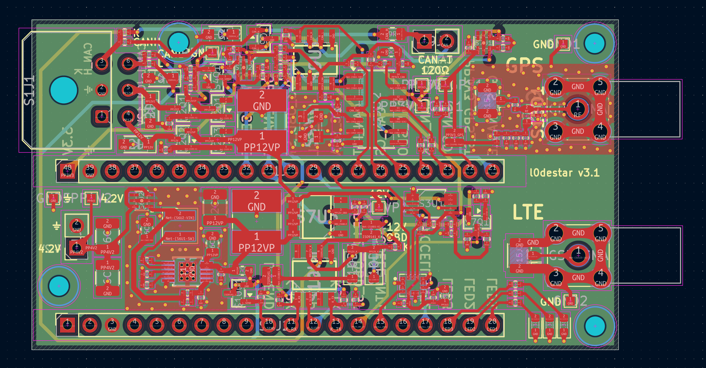
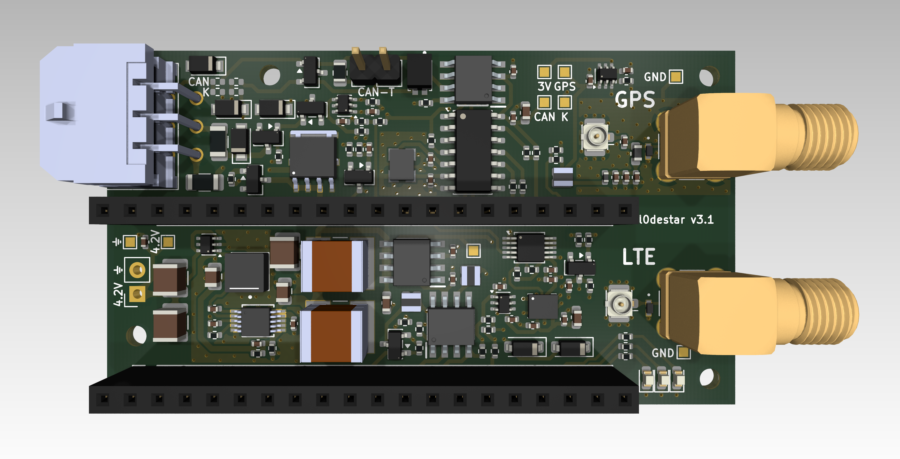
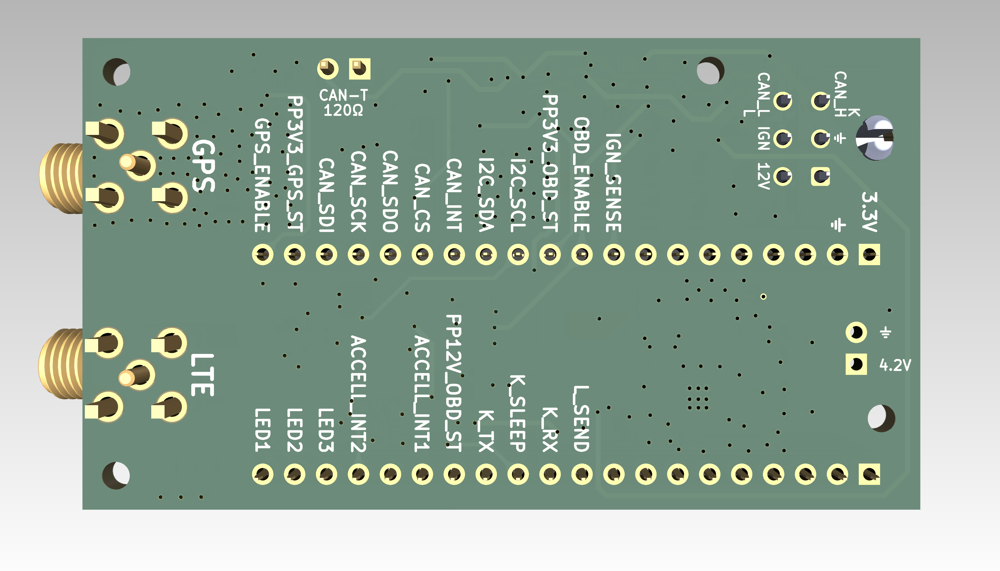
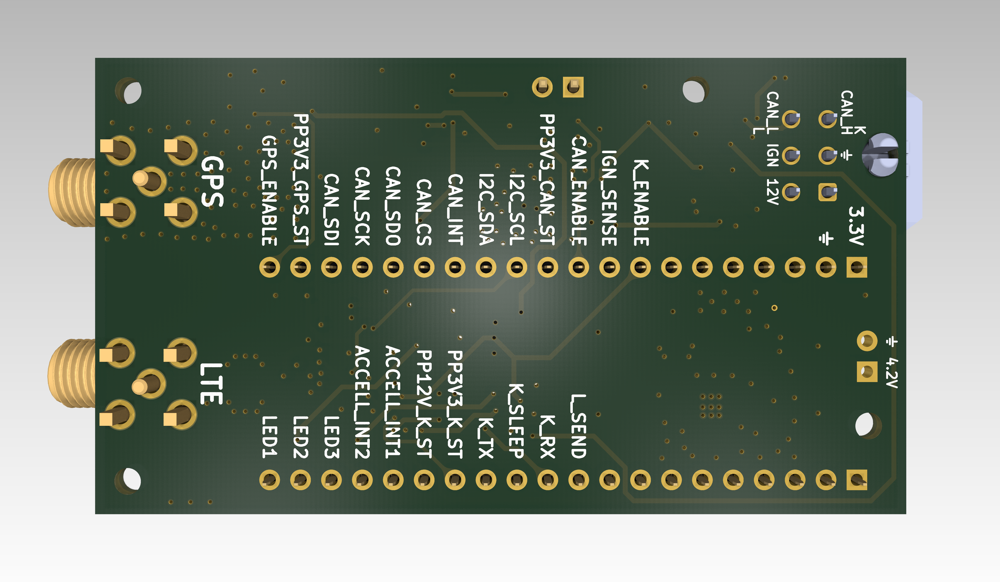

# l0destar v3.1

## Overview

**NOTE: THIS HAS NOT YET BEEN TESTED, USE AT YOUR OWN RISK**

- This is a prototype l0destar vehicle tracker PCB designed to be
  hand-solderable (hot air required)
- It makes use of the [Makerdiary nRF9151 Connect Kit](https://makerdiary.com/products/nrf9151-connectkit) to provide the LTE and GPS
functions
- Component vias are dogleg-routed deliberately in order to keep the PCB costs
as low as possible
- The RF trace width is calculated using a standard 4-layer stackup at JLCPCB,
  different fabrication processes may require adjustment

## Disclaimer

This is a prototype, not a product. Nothing here is validated or certified,
the parts lists are examples rather than a verified BOM, and any test results
recorded below are my own unverified bench observations - repeat the testing
yourself rather than taking them on trust.

**Before building or installing anything from this repository, read the
[full disclaimer](../../DISCLAIMER.md).**

## New features

- Improved handling of automotive transients
- Auxillary rail fault detection
- Same physical footprint and mounting holes as v3.0
- Many other small improvements

See below for a full change summary.

## Test status

| Item | Test | Result | Notes |
|---------|------|--------|-------|
| Input stage | 12V input reverse polarity | NOT TESTED | |
| Input stage | 12V ignition input reverse polarity | NOT TESTED | |
| INA228 | Voltage reading function | NOT TESTED |
| Ignition presence | Ignition sense 3.3v signal | NOT TESTED | |
| LT8609#1 | 4.2V output | NOT TESTED | |
| GPS auxillary 3.3V rail | Switches on enable signal | NOT TESTED | |
| CAN auxillary 3.3V rail | Switches on CAN-enable signal | NOT TESTED | |
| K-line auxillary 3.3V rail | Switches on K-enable signal | NOT TESTED | |
| K-line auxillary 12V rail | Switches on K-enable signal | NOT TESTED | |
| Accelerometer | Operates while awake | NOT TESTED | |
| Accelerometer | Wake on motion | NOT TESTED | |
| GPS antenna bias tee | Obtains GPS signal | NOT TESTED | |
| ISO-9141 | K-wire connectivity | NOT TESTED | |
| ISO-9141 | L-line pulldown | NOT TESTED | |
| CAN | Connectivity | NOT TESTED | |
| CAN standby via XSTBY signal | Low standby current | NOT TESTED | |
| Board | Quiescent current | NOT TESTED | Estimated at around 120 µA |

## Features

 - 12V live and 12V ignition inputs with TVS and reverse polarity protection
 - Enhanced input protection sized for pulse 2a at the ISO 7637-2:2011 maximum
 - Onboard 2A fusing
 - ESD protection at the external antenna connectors
 - Ignition presence sensing
 - INA228 voltage reading
 - High efficiency buck converter
 - Auxillary 3.3V rail for the GPS antenna bias tee
 - ASM330LHHXTR 6-axis IMU gyro/accelerometer
 - USB-C can be connected and disconnected for programming without any power
   disruption
 - Optional CAN interface
 - Optional ISO-9141 (K-line) interface with L and K connections for full functionality
 - CAN/ISO-9141 switchable via jumper pads
 - Auxillary rail sensing/fault detection

## Changes from v3.0

- Input protection (the biggest functional change). v3.0 had a single 47µF
  bulk cap; v3.1 has two 47µF plus the 10µF soft-termination helper, sized for
  pulse 2a at the ISO 7637-2:2011 maximum.

- Module rail bulk relocated and re-specced. v3.0 carried 2 × 220µF 10V X5R
  near the module connector; v3.1 deletes those in favour of 2 × 47µF 10V X7R
  plus 100 nF directly on the buck input. Less capacitance but a better
  dielectric, and it sits where the regulator wants it.

- Added auxillary power rail sensing, enabling fault detection. If aux power
  rails don't enable for some reason this can now be detected in firmware.

- Added missing pulldown on the K-line transceiver sleep pin.

- Downsized and swapped parts. The ISO-9141 K/L series resistors went from
  2512 2W to 0508 1W, saving board space. On CAN: the crystal changed from
  Abracon ABM8G to ECS-400-18-33 for availability reasons, the termination
  resistor shrank 2010 to 0805 and v3.1 adds series damping on the SPI lines
  (2 × 220R) and 1K on chip select.

- Antenna feed hardened. v3.1 adds a TPD1E05U06 ESD diode on each of the GSM
  and GPS RF paths
  and a 15R 1W feed resistor, retunes the DC-block from 100 pF to 47 pF, and
  upgrades the ferrite bead's current rating from 100 mA to 500 mA.

## Power supply

The Connect Kit can be powered through VBUS which would be much simpler as it
can take 5V, but then you have to disconnect the power before connecting a USB
cable. Same for the Nordic dev board - they both explicitly say not to connect
powered USB and VBUS at the same time. Because the intention is to install this
in a vehicle for testing the pragmatic decision was taken to power it with a
4.2V buck feeding the battery connector. With this power connection we can
connect USB-C at any time to update the firmware without needing to disconnect
power.

## Board configuration

See below for parts required for either CAN bus or ISO-9141 (K-line). Both sets
of components can be populated for future use but only one set can be in use at
any given time.

The table below shows which jumper pads should be connected for each of these
modes. **It's critical that only one system is enabled at the same time, if you
short both CAN and K-line pads at the same time unpredictable behaviour may
occur **

Connect the pads as required by bridging them with solder or placing a 0R
resistor. **Make sure the pads that should be unconnected are not connected.**

| Interface | S5R1 | S5R2 | S5R3 | S5R4 |
|-----------|------|------|------|------|
| None      | OPEN | OPEN | OPEN | OPEN |
| CAN bus   | CONNECT | OPEN | CONNECT | OPEN |
| K-line    | OPEN | CONNECT | OPEN | CONNECT |

The pads only route the two vehicle bus lines (S1J1 pin 3 and pin 6) to one
interface or the other. Unlike v3.0 there are no rail-selection pads: CAN and
K-line each have their own load switch, so PP3V3\_CAN, PP3V3\_K and PP12V\_K
are generated directly and only the enabled interface is ever powered.

## Notes

 - All caps on the 12V rails must be >= 50V in order to handle transients
 - MCP2518FD with PP3V3\_CAN off - abs max on all I/O is VDD + 0.3V. Firmware
   must drive CAN\_SCK/SDI/CS low or tri-state them before dropping
   CAN\_ENABLE, or the nRF backfeeds the dead rail through the clamp diodes.
   Additionally, CAN\_CS and CAN\_INT have their pull-ups (S9R1, S9R2) on the
   switched rail, so both float when the domain is off - enable the nRF
   internal pulldown on those pins
 - K-line side, now its own domain - K\_ENABLE gates PP3V3\_K and PP12V\_K
   together. Both K\_TX and K\_SLEEP land on the TJA1027T, which is supplied
   from PP12V\_K (VBAT, pin 7), so driving either high with the rail down
   backfeeds it through the transceiver's ESD clamps. K\_TX and K\_RX also
   carry 10K pull-ups (S10R2, S10R1) to PP3V3\_K, which float when that rail
   is down. Firmware must take the TJA1027T to sleep (K\_SLEEP low) and then
   park K\_TX/K\_RX/K\_SLEEP before dropping K\_ENABLE
 - L\_SEND is not on a switched rail - it gates a 2N7002 (S10Q1) with a 10K
   pulldown (S10R5) to ground, so it is safe to drive at any time. K\_SLEEP
   likewise now has a 100K pulldown (S10R6), so the transceiver stays asleep
   while the nRF is in reset or the pin is parked
 - Indicated voltages and tolerances are the minimum, I generally always buy the
   tightest tolerances and highest voltages possible of everything as it's just
   simpler for managing inventory. Because of this, several of the "example"
   links will be to the parts I bought which might be tighter tolerance or
   higher voltage rating than the indicated minimum spec

## Bill of materials - required

| Item | Description | Specification | Example | Notes |
|------|-------------|---------------|---------|-------|
| MCU | MCU and GSM/GPS 40pin board | nRF9151 Connect Kit | [Makerdiary nRF9151 Connect Kit](https://makerdiary.com/products/nrf9151-connectkit) | |
| S1J1 | Molex Micro-fit 3.0 2x03 PCB connector | 43045-0600 | [43045-0600](https://uk.farnell.com/molex/43045-0600/conn-r-a-pcb-hdr-6pos-2row-3mm/dp/1012252) | |
| S1J2 | Makerdiary header 1 | 20-pin 2.54mm header | [20-pin pcb header](https://amzn.to/44hTFGN) | |
| S1J3 | Makerdiary header 2 | 20-pin 2.54mm header | [20-pin pcb header](https://amzn.to/44hTFGN) | |
| S1R1 | I2C pull-up resistor | 0402 4.7K 5% | [MP003476](https://uk.farnell.com/multicomp-pro/mp003476/res-4k7-1-0-0625w-0402-thick-film/dp/3392645) | |
| S1R2 | I2C pull-up resistor | 0402 4.7K 5% | [MP003476](https://uk.farnell.com/multicomp-pro/mp003476/res-4k7-1-0-0625w-0402-thick-film/dp/3392645) | |
| S1R3 | 100K pulldown resistor | 0402 100K 5% | [MCPWR02FTEP1003A](https://uk.farnell.com/multicomp-pro/mcpwr02ftep1003a/res-100k-1-thick-film-0402/dp/4538624) | |
| S1R4 | 100K pulldown resistor | 0402 100K 5% | [MCPWR02FTEP1003A](https://uk.farnell.com/multicomp-pro/mcpwr02ftep1003a/res-100k-1-thick-film-0402/dp/4538624) | |
| S1R5 | 100K pulldown resistor | 0402 100K 5% | [MCPWR02FTEP1003A](https://uk.farnell.com/multicomp-pro/mcpwr02ftep1003a/res-100k-1-thick-film-0402/dp/4538624) | |
| S1C1 | 100nF capacitor | 0402 >= 10V 10% X7R | [MC0402B104K250CT](https://uk.farnell.com/multicomp-pro/mc0402b104k250ct/cap-0-1-f-25v-10-x7r-0402/dp/2320759) | |
| S2F1 | 2A fuse | 1206 2A slow blow | [0407002.WRA](https://www.digikey.co.uk/en/products/detail/littelfuse-inc/0407002-WRA/14640147) | |
| S2F2 | 2A fuse | 1206 2A slow blow | [0407002.WRA](https://www.digikey.co.uk/en/products/detail/littelfuse-inc/0407002-WRA/14640147) | |
| S2Q1 | Reverse-polarity MOSFET | SQ2361 SOT-23 | [SQ2361ES-T1_GE3](https://uk.farnell.com/vishay/sq2361es-t1-ge3/mosfet-aec-q101-p-ch-60v-sot-23/dp/2889711) | |
| S2Q2 | Reverse-polarity MOSFET | SQJ457EP-T1_BE3 | [SQJ457EP-T1-GE3](https://www.digikey.co.uk/en/products/detail/vishay-siliconix/SQJ457EP-T1-GE3/6708894) | |
| S2D1 | 15V Zener diode | BZX84C15 | [BZX84C15](https://uk.farnell.com/multicomp-pro/bzx84c15/zener-diode-0-3w-15v-sot-23/dp/2675186) | |
| S2D2 | 400W TVS diode | PTVS33VS1UTR,115 SOD-123W | [PTVS33VS1UTR,115](https://uk.farnell.com/nexperia/ptvs33vs1utr-115/tvs-diode-aecq101-unidir-33v-400w/dp/3440137) | |
| S2D3 | 15V Zener diode | BZX84C15 | [BZX84C15](https://uk.farnell.com/multicomp-pro/bzx84c15/zener-diode-0-3w-15v-sot-23/dp/2675186) | |
| S2D4 | 400W TVS diode | PTVS33VS1UTR,115 SOD-123W | [PTVS33VS1UTR,115](https://uk.farnell.com/nexperia/ptvs33vs1utr-115/tvs-diode-aecq101-unidir-33v-400w/dp/3440137) | |
| S2R1 | Pulldown resistor | 0402 1M 5% | [ERJ2RKF1004X](https://uk.farnell.com/panasonic/erj2rkf1004x/res-1m-1-0-1w-0402-thick-film/dp/2302957) | |
| S2R2 | Pulldown resistor | 0402 100K 5% | [MCPWR02FTEP1003A](https://uk.farnell.com/multicomp-pro/mcpwr02ftep1003a/res-100k-1-thick-film-0402/dp/4538624) | |
| S2C1 | 47uF input capacitor | 2220 >= 50V 20% X7R | [CKG57NX7R1H476M500JH](https://uk.farnell.com/tdk/ckg57nx7r1h476m500jh/cap-stacked-47uf-50v-mlcc-2220/dp/3816888) | |
| S2C2 | 47uF input capacitor | 2220 >= 50V 20% X7R | [CKG57NX7R1H476M500JH](https://uk.farnell.com/tdk/ckg57nx7r1h476m500jh/cap-stacked-47uf-50v-mlcc-2220/dp/3816888) | |
| S2C3 | 10uF input capacitor | 1210 >= 50V 10% X7R SOFT TERMINATION | [MCJCU32MLB7106KPPDT1](https://uk.farnell.com/taiyo-yuden/mcjcu32mlb7106kppdt1/capacitor-mlcc-10uf-50v-x7r-1210/dp/4666637) | |
| S3U1 | INA228 voltage read IC | INA228 10-VSSOP | [INA228](https://www.aliexpress.com/item/1005008704299153.html) | |
| S3C1 | 1uF capacitor | 0402 >= 10V 10% X7R | [KAM05CR71A105KH](https://uk.farnell.com/kyocera-avx/kam05cr71a105kh/capacitor-mlcc-1uf-x7r-10v-0402/dp/4365709) | |
| S3C2 | 100nF capacitor | 0402 >= 25V 10% X7R | [MC0402B104K250CT](https://uk.farnell.com/multicomp-pro/mc0402b104k250ct/cap-0-1-f-25v-10-x7r-0402/dp/2320759) | |
| S4Q1 | Ignition sense MOSFET | 2N7002 SOT-23 | [2N7002](https://uk.farnell.com/multicomp-pro/2n7002/mosfet-n-ch-60v-0-115a-sot-23/dp/4295174) | |
| S4R1 | Ignition sense resistor | 0402 180K 5% | [MCWR04X1803FTL](https://uk.farnell.com/multicomp-pro/mcwr04x1803ftl/res-180k-1-0-0625w-thick-film/dp/2447116) | |
| S4R2 | Ignition sense resistor | 0402 56K 5% | [MCMR04X5602FTL](https://uk.farnell.com/multicomp-pro/mcmr04x5602ftl/res-56k-1-0-0625w-0402-ceramic/dp/2073131) | |
| S4R3 | Ignition sense resistor | 0402 56K 5% | [MCMR04X5602FTL](https://uk.farnell.com/multicomp-pro/mcmr04x5602ftl/res-56k-1-0-0625w-0402-ceramic/dp/2073131) | |
| S4C1 | 100nF capacitor | 0402 >= 50V 10% X7R | [MCASU105SB7104KFNA01](https://uk.farnell.com/taiyo-yuden/mcasu105sb7104kfna01/capacitor-mlcc-0-1uf-50v-x7r-0402/dp/4666632) | |
| S6U1 | Buck converter | LT8609AIMSE MSOP-EP-10 | [LT8609AIMSE#PBF](https://uk.farnell.com/analog-devices/lt8609aimse-pbf/dc-dc-conv-sync-buck-2mhz-125deg/dp/4025049) | |
| S6U2 | Ideal diode | LM66100 | [LM66100](https://www.aliexpress.com/item/1005008565117953.html) | |
| S6L1 | Inductor | XFL4020-222ME | [XFL4020-222MEC](https://uk.farnell.com/coilcraft/xfl4020-222mec/inductor-2-2uh-8a-20-pwr-38mhz/dp/2289216) | |
| S6C1 | 100nF capacitor | 0402 >= 25V 10% X7R | [MC0402B104K250CT](https://uk.farnell.com/multicomp-pro/mc0402b104k250ct/cap-0-1-f-25v-10-x7r-0402/dp/2320759) | |
| S6C2 | 1uF capacitor | 0402 >= 10V 10% X7R | [KAM05CR71A105KH](https://uk.farnell.com/kyocera-avx/kam05cr71a105kh/capacitor-mlcc-1uf-x7r-10v-0402/dp/4365709) | |
| S6C3 | 4.7uF capacitor | 0805 >= 50V 10% X7R | [GRM21BZ71H475KE15K](https://uk.farnell.com/murata/grm21bz71h475ke15k/cap-4-7uf-50v-mlcc-0805/dp/3582887) | |
| S6C4 | 10pF capacitor | 0402 >= 10V 10% C0G/NP0 | [C0402C100K5RACTU](https://uk.farnell.com/kemet/c0402c100k5ractu/cap-10pf-50v-10-x7r-0402/dp/2821254) | |
| S6C5 | 22uF capacitor | 0805 >= 10V 20% X7R | [GMC21X7R226M10NT](https://www.digikey.co.uk/en/products/detail/cal-chip-electronics-inc/GMC21X7R226M10NT/22461324) | |
| S6C6 | 47uF capacitor | 1210 >= 10V 20% X7R | [CL32B476MPJNNNE](https://uk.farnell.com/semco/cl32b476mpjnnne/cap-mlcc-47uf-10vdc-x7r-1210/dp/5109745) | |
| S6C7 | 47uF capacitor | 1210 >= 10V 20% X7R | [CL32B476MPJNNNE](https://uk.farnell.com/semco/cl32b476mpjnnne/cap-mlcc-47uf-10vdc-x7r-1210/dp/5109745) | |
| S6C8 | 100nF capacitor | 0402 >= 50V 10% X7R | [MCASU105SB7104KFNA01](https://uk.farnell.com/taiyo-yuden/mcasu105sb7104kfna01/capacitor-mlcc-0-1uf-50v-x7r-0402/dp/4666632) | |
| S6R1 | Oscillator frequency resistor | 0402 18.2K 1% | [RC0402FR-0718K2L](https://uk.farnell.com/yageo/rc0402fr-0718k2l/res-18k2-1-0-0625w-0402-thick/dp/3495542) | 18.2K == 2MHz |
| S6R2 | Output voltage divider resistor | 0402 226K 1% | [MCMR04X2263FTL](https://uk.farnell.com/multicomp-pro/mcmr04x2263ftl/res-226k-1-0-0625w-0402-ceramic/dp/2072796) | VOUT == 0.782V x (1 + S6R3/S6R2) == 4.24V |
| S6R3 | Output voltage divider resistor | 0402 1M 1% | [ERJ2RKF1004X](https://uk.farnell.com/panasonic/erj2rkf1004x/res-1m-1-0-1w-0402-thick-film/dp/2302957) | VOUT == 0.782V x (1 + S6R3/S6R2) == 4.24V |
| S7U1 | Reverse-blocking load switch | Active high 3.3v load switch with reverse blocking | [SiP32431DR3-T1GE3](https://uk.farnell.com/vishay/sip32431dr3-t1ge3/ic-load-switch-1-1v-5-5v-1a-sc70/dp/2361509) | |
| S7R1 | 100K resistor | 0402 100K 5% | [MCPWR02FTEP1003A](https://uk.farnell.com/multicomp-pro/mcpwr02ftep1003a/res-100k-1-thick-film-0402/dp/4538624) | |
| S7R2 | 1M resistor | 0402 1M 1% | [ERJ2RKF1004X](https://uk.farnell.com/panasonic/erj2rkf1004x/res-1m-1-0-1w-0402-thick-film/dp/2302957) | |
| S7C1 | 1uF capacitor | 0402 >= 10V 10% X7R | [KAM05CR71A105KH](https://uk.farnell.com/kyocera-avx/kam05cr71a105kh/capacitor-mlcc-1uf-x7r-10v-0402/dp/4365709) | |
| S7C2 | 100nF capacitor | 0402 >= 10V 10% X7R | [MC0402B104K250CT](https://uk.farnell.com/multicomp-pro/mc0402b104k250ct/cap-0-1-f-25v-10-x7r-0402/dp/2320759) | |
| S8U1 | ASM330LHHXTR accelerometer | ASM330LHHXTR | [ASM330LHHXTR](https://estore.st.com/en/products/mems-and-sensors/inemo-inertial-modules/asm330lhhx.html) | |
| S8C1 | 100nF capacitor | 0402 >= 25V 10% X7R | [MC0402B104K250CT](https://uk.farnell.com/multicomp-pro/mc0402b104k250ct/cap-0-1-f-25v-10-x7r-0402/dp/2320759) | |
| S8C2 | 10uF capacitor | 0603 >= 10V 20% X7R | [C1608X7R1A106M080AT](https://www.digikey.co.uk/en/products/detail/tdk/C1608X7R1A106M080AT/25595431?s=N4IgTCBcDaIMIEYBsAGAHADQOwCUEEEEUkBZdFfAFRAF0BfIA) | |
| S8C3 | 100nF capacitor | 0402 >= 25V 10% X7R | [MC0402B104K250CT](https://uk.farnell.com/multicomp-pro/mc0402b104k250ct/cap-0-1-f-25v-10-x7r-0402/dp/2320759) | |
| S13R1 | LED resistor | 0402 1K 5% | [CRCW04021K00FKED](https://uk.farnell.com/vishay/crcw04021k00fked/res-1k-1-0-063w-0402-thick-film/dp/1469662) | |
| S13R2 | LED resistor | 0402 1K 5% | [CRCW04021K00FKED](https://uk.farnell.com/vishay/crcw04021k00fked/res-1k-1-0-063w-0402-thick-film/dp/1469662) | |
| S13R3 | LED resistor | 0402 1K 5% | [CRCW04021K00FKED](https://uk.farnell.com/vishay/crcw04021k00fked/res-1k-1-0-063w-0402-thick-film/dp/1469662) | |
| S13D1 | Status LED | 0603 | [150060RS86000](https://uk.farnell.com/wurth-elektronik/150060rs86000/led-red-800mcd-624nm/dp/3408608) | |
| S13D2 | Status LED | 0603 | [150060RS86000](https://uk.farnell.com/wurth-elektronik/150060rs86000/led-red-800mcd-624nm/dp/3408608) | |
| S13D3 | Status LED | 0603 | [150060RS86000](https://uk.farnell.com/wurth-elektronik/150060rs86000/led-red-800mcd-624nm/dp/3408608) | |
| S15J1 | u.FL PCB connector | 50 ohm | [U.FL-R-SMT(01)](https://uk.farnell.com/hirose-hrs/u-fl-r-smt-01/rf-coaxial-u-fl-straight-jack/dp/3908021) | |
| S15J2 | SMA PCB connector | 50 ohm | [SMA-J-P-H-RA-TH1](https://uk.farnell.com/samtec/sma-j-p-h-ra-th1/rf-coaxial-sma-jack-50-ohm-pcb/dp/2856817) | |
| S15J3 | u.FL PCB connector | 50 ohm | [U.FL-R-SMT(01)](https://uk.farnell.com/hirose-hrs/u-fl-r-smt-01/rf-coaxial-u-fl-straight-jack/dp/3908021) | |
| S15J4 | SMA PCB connector | 50 ohm | [SMA-J-P-H-RA-TH1](https://uk.farnell.com/samtec/sma-j-p-h-ra-th1/rf-coaxial-sma-jack-50-ohm-pcb/dp/2856817) | |
| S15FB1 | Ferrite bead | 600 ohm | [BLM15PX601SZ1D](https://uk.farnell.com/murata/blm15px601sz1d/ferrite-bead-0-9a-0-23ohm-0402/dp/3678458) | |
| S15L1 | RF inductor | 0603 47-100 nH, SRF > 2GHz | [LQW18AN68NJ00D](https://uk.farnell.com/murata/lqw18an68nj00d/inductor-68nh-2-2ghz-0-34a-0603/dp/3471533) | |
| S15C1 | 47pF RF capacitor | 0402 >= 10V 5% C0G / NP0 | [0402N470F500CT](https://uk.farnell.com/multicomp-pro/0402n470f500ct/cap-47pf-50v-mlcc-0402/dp/3764092) | |
| S15C2 | 100pF RF capacitor | 0402 >= 10V 5% C0G / NP0 | [AC0402FRNPO9BN101](https://uk.farnell.com/yageo/ac0402frnpo9bn101/cap-100pf-50v-mlcc-0402/dp/4166091) | |
| S15C3 | 10nF RF capacitor | 0402 >= 10V 10% C0G / NP0 | [GRM1555CYA103JE01D](https://uk.farnell.com/murata/grm1555cya103je01d/cap-mlcc-0-01uf-c0g-np0-35v-0402/dp/4792250) | |
| S15C4 | 1uF RF capacitor | 0402 >= 10V 10% X7R | [KAM05CR71A105KH](https://uk.farnell.com/kyocera-avx/kam05cr71a105kh/capacitor-mlcc-1uf-x7r-10v-0402/dp/4365709) | |
| S15D1 | ESD protection diode (GSM path) | TPD1E05U06DPYR X1SON-2 | [TPD1E05U06DPYR](https://www.digikey.com/en/products/detail/texas-instruments/TPD1E05U06DPYR/3844805) | |
| S15D2 | ESD protection diode (GPS path) | TPD1E05U06DPYR X1SON-2 | [TPD1E05U06DPYR](https://www.digikey.com/en/products/detail/texas-instruments/TPD1E05U06DPYR/3844805) | |
| S15R1 | Bias tee feed resistor | 0508 15R 5% 1W | [3430A2F15RTDF](https://uk.farnell.com/cgs-te-connectivity/3430a2f15rtdf/res-15r-1w-thick-film-0508-wide/dp/4206818) | |
| - | u.FL cable - LTE | 50 ohm 35mm | [U.FL-2LPHF6-04N1TV-A-35](https://uk.farnell.com/hirose-hrs/u-fl-2lphf6-04n1tv-a-35/cbl-assy-u-fl-r-a-plug-r-a-plug/dp/4294251) | |
| - | u.FL cable - GPS | 50 ohm 35mm | [U.FL-2LPHF6-04N1TV-A-35](https://uk.farnell.com/hirose-hrs/u-fl-2lphf6-04n1tv-a-35/cbl-assy-u-fl-r-a-plug-r-a-plug/dp/4294251) | |
| - | JST power cable | Ultra-thin MX1.25 51146 | [10PCS MX1.25 51146 Cable](https://www.aliexpress.com/item/4000586964114.html) | |

## Bill of materials - CAN bus parts

Can be omited if CAN is not required.

| Item | Description | Specification | Example | Notes |
|------|-------------|---------------|---------|-------|
| S7U2 | Reverse-blocking load switch | Active high 3.3v load switch with reverse blocking | [SiP32431DR3-T1GE3](https://uk.farnell.com/vishay/sip32431dr3-t1ge3/ic-load-switch-1-1v-5-5v-1a-sc70/dp/2361509) | |
| S7R3 | 100K resistor | 0402 100K 5% | [MCPWR02FTEP1003A](https://uk.farnell.com/multicomp-pro/mcpwr02ftep1003a/res-100k-1-thick-film-0402/dp/4538624) | |
| S7R4 | 1M resistor | 0402 1M 1% | [ERJ2RKF1004X](https://uk.farnell.com/panasonic/erj2rkf1004x/res-1m-1-0-1w-0402-thick-film/dp/2302957) | |
| S7C3 | 1uF capacitor | 0402 >= 10V 10% X7R | [KAM05CR71A105KH](https://uk.farnell.com/kyocera-avx/kam05cr71a105kh/capacitor-mlcc-1uf-x7r-10v-0402/dp/4365709) | |
| S7C4 | 100nF capacitor | 0402 >= 10V 10% X7R | [MC0402B104K250CT](https://uk.farnell.com/multicomp-pro/mc0402b104k250ct/cap-0-1-f-25v-10-x7r-0402/dp/2320759) | |
| S9U1 | MAX33041EASA+ CAN transceiver | MAX33041EASA+ | [MAX33041EASA+](https://uk.farnell.com/analog-devices/max33041easa/can-transceiver-aecq100-40-to/dp/3807529) | |
| S9U2 | MCP2518FD CAN controller | MCP2518FD | [MCP2518FDT-H/SL](https://uk.farnell.com/microchip/mcp2518fdt-h-sl/can-controller-aec-q100-40to125deg/dp/3796957) | |
| S9D1 | CAN protector | NUP2105L | [NUP2105L](https://uk.farnell.com/diotec/nup2105l/tvs-diode-bidir-44v-sot-23-350w/dp/4574509) | |
| S9FL1 | CAN common-mode choke | ACT1210-101-2P-TL00 | [ACT1210-101-2P-TL00](https://www.digikey.com/en/products/detail/tdk-corporation/ACT1210-101-2P-TL00/4918053) | **Optional** - see note below |
| S9C1 | 100nF capacitor | 0402 >= 10V 10% X7R | [MC0402B104K250CT](https://uk.farnell.com/multicomp-pro/mc0402b104k250ct/cap-0-1-f-25v-10-x7r-0402/dp/2320759) | |
| S9C2 | 27pF capacitor | 0402 >= 10V 5% C0G / NP0 | [GCM1555C1H270FA16D](https://uk.farnell.com/murata/gcm1555c1h270fa16d/cap-aec-q200-27pf-50v-mlcc-0402/dp/3581175) | |
| S9C3 | 27pF capacitor | 0402 >= 10V 5% C0G / NP0 | [GCM1555C1H270FA16D](https://uk.farnell.com/murata/gcm1555c1h270fa16d/cap-aec-q200-27pf-50v-mlcc-0402/dp/3581175) | |
| S9C4 | 100nF capacitor | 0402 >= 10V 10% X7R | [MC0402B104K250CT](https://uk.farnell.com/multicomp-pro/mc0402b104k250ct/cap-0-1-f-25v-10-x7r-0402/dp/2320759) | |
| S9C5 | 10uF capacitor | 0603 >= 10V 20% X7R | [C1608X7R1A106M080AT](https://www.digikey.co.uk/en/products/detail/tdk/C1608X7R1A106M080AT/25595431?s=N4IgTCBcDaIMIEYBsAGAHADQOwCUEEEEUkBZdFfAFRAF0BfIA) | |
| S9Y1 | 40MHz crystal | ECS-400-18-33-JGN-TR3 | [ECS-400-18-33-JGN-TR3](https://uk.farnell.com/ecs-inc-international/ecs-400-18-33-jgn-tr3/crystal-40mhz-18pf-smd-3-2mmx2/dp/4034516) | |
| S9R1 | 10K 0402 resistor | 0402 10K 5% | [CRCW040210K0FKED](https://uk.farnell.com/vishay/crcw040210k0fked/res-10k-1-0-063w-0402-thick-film/dp/1469669) | |
| S9R2 | 10K 0402 resistor | 0402 10K 5% | [CRCW040210K0FKED](https://uk.farnell.com/vishay/crcw040210k0fked/res-10k-1-0-063w-0402-thick-film/dp/1469669) | |
| S9R3 | 120R 0805 resistor | 0805 120R 5% 0.5W | [MCPAS05W2J0121T5E](https://uk.farnell.com/multicomp-pro/mcpas05w2j0121t5e/res-120r-5-0-5w-thick-film-0805/dp/4069078) | |
| S9R4 | 10K 0402 resistor | 0402 10K 5% | [CRCW040210K0FKED](https://uk.farnell.com/vishay/crcw040210k0fked/res-10k-1-0-063w-0402-thick-film/dp/1469669) | |
| S9R5 | 1K series damping resistor | 0402 1K 5% | [CRCW04021K00FKED](https://uk.farnell.com/vishay/crcw04021k00fked/res-1k-1-0-063w-0402-thick-film/dp/1469662) | |
| S9R6 | 220R series damping resistor | 0402 220R 5% | [MC00625W04021220R](https://uk.farnell.com/multicomp/mc00625w04021220r/res-220r-1-0-0625w-0402-thick/dp/1358024) | |
| S9R7 | 220R series damping resistor | 0402 220R 5% | [MC00625W04021220R](https://uk.farnell.com/multicomp/mc00625w04021220r/res-220r-1-0-0625w-0402-thick/dp/1358024) | |
| S9J1 | 2-pin 2.54mm header | 2-pin 2.54mm header | [68001-402HLF](https://uk.farnell.com/amphenol-communications-solutions/68001-402hlf/conn-header-2pos-1row-2-54mm-th/dp/3881905) | CAN termination jumper, in series with S9R3 - fit a shunt only if the tracker is at the end of the bus |

### Optional: CAN common-mode choke (S9FL1)

S9FL1 sits in series with CANH and CANL between the transceiver and the
connector. It improves radiated emissions and common-mode noise rejection,
but CAN works without it, so it is optional.

**If S9FL1 is omitted its two signal paths must be bridged, otherwise CANH
and CANL are left open circuit.** Fit `2 x 0402 0R` resistors across the
S9FL1 pads to jump them - a 0402 fits the ACT1210 footprint pads (checked
against the layout).

## Bill of materials - K-line / ISO-9141 parts

Can be omited if K-line/ISO-9141 is not required

| Item | Description | Specification | Example | Notes |
|------|-------------|---------------|---------|-------|
| S7Q1 | MOSFET | 2N7002 SOT-23 | [2N7002](https://uk.farnell.com/multicomp-pro/2n7002/mosfet-n-ch-60v-0-115a-sot-23/dp/4295174) | |
| S7U3 | 12V load switch | Active high 12v load switch | [ITS4060SSJNXUMA1](https://uk.farnell.com/infineon/its4060ssjnxuma1/power-load-sw-aec-q100-13-5v-soic/dp/2710048) | |
| S7U4 | Reverse-blocking load switch | Active high 3.3v load switch with reverse blocking | [SiP32431DR3-T1GE3](https://uk.farnell.com/vishay/sip32431dr3-t1ge3/ic-load-switch-1-1v-5-5v-1a-sc70/dp/2361509) | |
| S7C5 | 1nF capacitor | 0402 >= 50V 10% X7R | [0402B102K500CT](https://uk.farnell.com/multicomp-pro/0402b102k500ct/cap-1000pf-50v-10-x7r-0402/dp/2496767) | |
| S7C6 | 220nF capacitor | 0603 >= 50V 10% X7R | [GRM188R71H224KAC4D](https://uk.farnell.com/murata/grm188r71h224kac4d/cap-0-22-f-50v-10-x7r-0603/dp/2688525) | |
| S7C7 | 1nF capacitor | 0402 >= 50V 10% X7R | [0402B102K500CT](https://uk.farnell.com/multicomp-pro/0402b102k500ct/cap-1000pf-50v-10-x7r-0402/dp/2496767) | |
| S7C8 | 1uF capacitor | 0402 >= 10V 10% X7R | [KAM05CR71A105KH](https://uk.farnell.com/kyocera-avx/kam05cr71a105kh/capacitor-mlcc-1uf-x7r-10v-0402/dp/4365709) | |
| S7C9 | 100nF capacitor | 0402 >= 10V 10% X7R | [MC0402B104K250CT](https://uk.farnell.com/multicomp-pro/mc0402b104k250ct/cap-0-1-f-25v-10-x7r-0402/dp/2320759) | |
| S7R5 | 180K resistor | 0402 180K 5% | [MCWR04X1803FTL](https://uk.farnell.com/multicomp-pro/mcwr04x1803ftl/res-180k-1-0-0625w-thick-film/dp/2447116) | |
| S7R6 | 100K resistor | 0402 100K 5% | [MCPWR02FTEP1003A](https://uk.farnell.com/multicomp-pro/mcpwr02ftep1003a/res-100k-1-thick-film-0402/dp/4538624) | |
| S7R7 | 100K resistor | 0402 100K 5% | [MCPWR02FTEP1003A](https://uk.farnell.com/multicomp-pro/mcpwr02ftep1003a/res-100k-1-thick-film-0402/dp/4538624) | |
| S7R8 | 100K resistor | 0402 100K 5% | [MCPWR02FTEP1003A](https://uk.farnell.com/multicomp-pro/mcpwr02ftep1003a/res-100k-1-thick-film-0402/dp/4538624) | |
| S7R9 | 1M resistor | 0402 1M 1% | [ERJ2RKF1004X](https://uk.farnell.com/panasonic/erj2rkf1004x/res-1m-1-0-1w-0402-thick-film/dp/2302957) | |
| S10U1 | Line transceiver | TJA1027T\_20,118 | [TJA1027T\_20,118](https://uk.farnell.com/nxp/tja1027t-20-118/lin-transceiver-20kbaud-18v-soic/dp/2400570) | |
| S10Q1 | MOSFET | 2N7002 SOT-23 | [2N7002](https://uk.farnell.com/multicomp-pro/2n7002/mosfet-n-ch-60v-0-115a-sot-23/dp/4295174) | |
| S10D1 | 1N4148W diode | 1N4148W | [1N4148W-E3-08](https://uk.farnell.com/vishay/1n4148w-e3-08/diode-switching-100v-sod-123/dp/2433353) | |
| S10D2 | 400W TVS diode | PTVS33VS1UTR,115 SOD-123W | [PTVS33VS1UTR,115](https://uk.farnell.com/nexperia/ptvs33vs1utr-115/tvs-diode-aecq101-unidir-33v-400w/dp/3440137) | |
| S10D3 | 1N4148W diode | 1N4148W | [1N4148W-E3-08](https://uk.farnell.com/vishay/1n4148w-e3-08/diode-switching-100v-sod-123/dp/2433353) | |
| S10D4 | 400W TVS diode | PTVS33VS1UTR,115 SOD-123W | [PTVS33VS1UTR,115](https://uk.farnell.com/nexperia/ptvs33vs1utr-115/tvs-diode-aecq101-unidir-33v-400w/dp/3440137) | |
| S10R1 | 10K 0402 resistor | 0402 10K 5% | [CRCW040210K0FKED](https://uk.farnell.com/vishay/crcw040210k0fked/res-10k-1-0-063w-0402-thick-film/dp/1469669) | |
| S10R2 | 10K 0402 resistor | 0402 10K 5% | [CRCW040210K0FKED](https://uk.farnell.com/vishay/crcw040210k0fked/res-10k-1-0-063w-0402-thick-film/dp/1469669) | |
| S10R3 | 510R 0508 resistor | 0508 510R 5% 1W | [3430A2F510RTDF](https://uk.farnell.com/cgs-te-connectivity/3430a2f510rtdf/res-510r-1w-thick-film-0508-wide/dp/4206859) | |
| S10R4 | 510R 0508 resistor | 0508 510R 5% 1W | [3430A2F510RTDF](https://uk.farnell.com/cgs-te-connectivity/3430a2f510rtdf/res-510r-1w-thick-film-0508-wide/dp/4206859) | |
| S10R5 | 10K 0402 resistor | 0402 10K 5% | [CRCW040210K0FKED](https://uk.farnell.com/vishay/crcw040210k0fked/res-10k-1-0-063w-0402-thick-film/dp/1469669) | |
| S10R6 | 100K resistor | 0402 100K 5% | [MCPWR02FTEP1003A](https://uk.farnell.com/multicomp-pro/mcpwr02ftep1003a/res-100k-1-thick-film-0402/dp/4538624) | |
| S10C1 | 100nF capacitor | 0402 >= 50V 10% X7R | [MCASU105SB7104KFNA01](https://uk.farnell.com/taiyo-yuden/mcasu105sb7104kfna01/capacitor-mlcc-0-1uf-50v-x7r-0402/dp/4666632) | |

## Parts list

Aggregated from the bills of materials above. The `All` rows are the required
build; add the `CAN` rows and/or the `ISO-9141` rows on top of those depending
on which interfaces are fitted. Quantities are per board.

| Build | Item | Quantity | Specification | Example | Notes |
|-------|------|----------|---------------|---------|-------|
| All | MCU and GSM/GPS 40pin board | 1 | nRF9151 Connect Kit | [Makerdiary nRF9151 Connect Kit](https://makerdiary.com/products/nrf9151-connectkit) | |
| All | Molex Micro-fit 3.0 2x03 PCB connector | 1 | 43045-0600 | [43045-0600](https://uk.farnell.com/molex/43045-0600/conn-r-a-pcb-hdr-6pos-2row-3mm/dp/1012252) | |
| All | 20-pin 2.54mm header | 2 | 20-pin 2.54mm header | [20-pin pcb header](https://amzn.to/44hTFGN) | |
| All | 15R 0508 resistor | 1 | 0508 15R 5% 1W | [3430A2F15RTDF](https://uk.farnell.com/cgs-te-connectivity/3430a2f15rtdf/res-15r-1w-thick-film-0508-wide/dp/4206818) | |
| All | 1K 0402 resistor | 3 | 0402 1K 5% | [CRCW04021K00FKED](https://uk.farnell.com/vishay/crcw04021k00fked/res-1k-1-0-063w-0402-thick-film/dp/1469662) | |
| All | 4.7K 0402 resistor | 2 | 0402 4.7K 5% | [MP003476](https://uk.farnell.com/multicomp-pro/mp003476/res-4k7-1-0-0625w-0402-thick-film/dp/3392645) | |
| All | 18.2K 0402 resistor | 1 | 0402 18.2K 1% | [RC0402FR-0718K2L](https://uk.farnell.com/yageo/rc0402fr-0718k2l/res-18k2-1-0-0625w-0402-thick/dp/3495542) | 18.2K == 2MHz |
| All | 56K 0402 resistor | 2 | 0402 56K 5% | [MCMR04X5602FTL](https://uk.farnell.com/multicomp-pro/mcmr04x5602ftl/res-56k-1-0-0625w-0402-ceramic/dp/2073131) | |
| All | 100K 0402 resistor | 5 | 0402 100K 5% | [MCPWR02FTEP1003A](https://uk.farnell.com/multicomp-pro/mcpwr02ftep1003a/res-100k-1-thick-film-0402/dp/4538624) | |
| All | 180K 0402 resistor | 1 | 0402 180K 5% | [MCWR04X1803FTL](https://uk.farnell.com/multicomp-pro/mcwr04x1803ftl/res-180k-1-0-0625w-thick-film/dp/2447116) | |
| All | 226K 0402 resistor | 1 | 0402 226K 1% | [MCMR04X2263FTL](https://uk.farnell.com/multicomp-pro/mcmr04x2263ftl/res-226k-1-0-0625w-0402-ceramic/dp/2072796) | VOUT == 0.782V x (1 + S6R3/S6R2) == 4.24V |
| All | 1M 0402 resistor | 3 | 0402 1M 1% | [ERJ2RKF1004X](https://uk.farnell.com/panasonic/erj2rkf1004x/res-1m-1-0-1w-0402-thick-film/dp/2302957) | |
| All | 10pF 0402 capacitor | 1 | 0402 >= 10V 10% C0G / NP0 | [C0402C100K5RACTU](https://uk.farnell.com/kemet/c0402c100k5ractu/cap-10pf-50v-10-x7r-0402/dp/2821254) | |
| All | 47pF RF capacitor | 1 | 0402 >= 10V 5% C0G / NP0 | [0402N470F500CT](https://uk.farnell.com/multicomp-pro/0402n470f500ct/cap-47pf-50v-mlcc-0402/dp/3764092) | |
| All | 100pF RF capacitor | 1 | 0402 >= 10V 5% C0G / NP0 | [AC0402FRNPO9BN101](https://uk.farnell.com/yageo/ac0402frnpo9bn101/cap-100pf-50v-mlcc-0402/dp/4166091) | |
| All | 10nF RF capacitor | 1 | 0402 >= 10V 10% C0G / NP0 | [GRM1555CYA103JE01D](https://uk.farnell.com/murata/grm1555cya103je01d/cap-mlcc-0-01uf-c0g-np0-35v-0402/dp/4792250) | |
| All | 100nF 25V 0402 capacitor | 6 | 0402 >= 25V 10% X7R | [MC0402B104K250CT](https://uk.farnell.com/multicomp-pro/mc0402b104k250ct/cap-0-1-f-25v-10-x7r-0402/dp/2320759) | |
| All | 100nF 50V 0402 capacitor | 2 | 0402 >= 50V 10% X7R | [MCASU105SB7104KFNA01](https://uk.farnell.com/taiyo-yuden/mcasu105sb7104kfna01/capacitor-mlcc-0-1uf-50v-x7r-0402/dp/4666632) | |
| All | 1uF 0402 capacitor | 4 | 0402 >= 10V 10% X7R | [KAM05CR71A105KH](https://uk.farnell.com/kyocera-avx/kam05cr71a105kh/capacitor-mlcc-1uf-x7r-10v-0402/dp/4365709) | |
| All | 4.7uF 0805 capacitor | 1 | 0805 >= 50V 10% X7R | [GRM21BZ71H475KE15K](https://uk.farnell.com/murata/grm21bz71h475ke15k/cap-4-7uf-50v-mlcc-0805/dp/3582887) | |
| All | 10uF 0603 capacitor | 1 | 0603 >= 10V 20% X7R | [C1608X7R1A106M080AT](https://www.digikey.co.uk/en/products/detail/tdk/C1608X7R1A106M080AT/25595431?s=N4IgTCBcDaIMIEYBsAGAHADQOwCUEEEEUkBZdFfAFRAF0BfIA) | |
| All | 10uF input capacitor | 1 | 1210 >= 50V 10% X7R SOFT TERMINATION | [MCJCU32MLB7106KPPDT1](https://uk.farnell.com/taiyo-yuden/mcjcu32mlb7106kppdt1/capacitor-mlcc-10uf-50v-x7r-1210/dp/4666637) | |
| All | 22uF 0805 capacitor | 1 | 0805 >= 10V 20% X7R | [GMC21X7R226M10NT](https://www.digikey.co.uk/en/products/detail/cal-chip-electronics-inc/GMC21X7R226M10NT/22461324) | |
| All | 47uF 1210 capacitor | 2 | 1210 >= 10V 20% X7R | [CL32B476MPJNNNE](https://uk.farnell.com/semco/cl32b476mpjnnne/cap-mlcc-47uf-10vdc-x7r-1210/dp/5109745) | |
| All | 47uF 2220 input capacitor | 2 | 2220 >= 50V 20% X7R | [CKG57NX7R1H476M500JH](https://uk.farnell.com/tdk/ckg57nx7r1h476m500jh/cap-stacked-47uf-50v-mlcc-2220/dp/3816888) | |
| All | Inductor | 1 | XFL4020-222ME | [XFL4020-222MEC](https://uk.farnell.com/coilcraft/xfl4020-222mec/inductor-2-2uh-8a-20-pwr-38mhz/dp/2289216) | |
| All | RF inductor | 1 | 0603 47-100 nH, SRF > 2GHz | [LQW18AN68NJ00D](https://uk.farnell.com/murata/lqw18an68nj00d/inductor-68nh-2-2ghz-0-34a-0603/dp/3471533) | |
| All | Ferrite bead | 1 | 600 ohm | [BLM15PX601SZ1D](https://uk.farnell.com/murata/blm15px601sz1d/ferrite-bead-0-9a-0-23ohm-0402/dp/3678458) | |
| All | 2A fuse | 2 | 1206 2A slow blow | [0407002.WRA](https://www.digikey.co.uk/en/products/detail/littelfuse-inc/0407002-WRA/14640147) | Time-lag, one per input |
| All | Reverse-polarity MOSFET | 1 | SQ2361 SOT-23 | [SQ2361ES-T1_GE3](https://uk.farnell.com/vishay/sq2361es-t1-ge3/mosfet-aec-q101-p-ch-60v-sot-23/dp/2889711) | Ignition input |
| All | Reverse-polarity MOSFET | 1 | SQJ457EP-T1_BE3 | [SQJ457EP-T1-GE3](https://www.digikey.co.uk/en/products/detail/vishay-siliconix/SQJ457EP-T1-GE3/6708894) | Battery input |
| All | MOSFET | 1 | 2N7002 SOT-23 | [2N7002](https://uk.farnell.com/multicomp-pro/2n7002/mosfet-n-ch-60v-0-115a-sot-23/dp/4295174) | |
| All | 15V Zener diode | 2 | BZX84C15 | [BZX84C15](https://uk.farnell.com/multicomp-pro/bzx84c15/zener-diode-0-3w-15v-sot-23/dp/2675186) | |
| All | 400W TVS diode | 2 | PTVS33VS1UTR,115 SOD-123W | [PTVS33VS1UTR,115](https://uk.farnell.com/nexperia/ptvs33vs1utr-115/tvs-diode-aecq101-unidir-33v-400w/dp/3440137) | |
| All | ESD protection diode | 2 | TPD1E05U06DPYR X1SON-2 | [TPD1E05U06DPYR](https://www.digikey.com/en/products/detail/texas-instruments/TPD1E05U06DPYR/3844805) | 1x GSM path, 1x GPS path |
| All | Ideal diode | 1 | LM66100 | [LM66100](https://www.aliexpress.com/item/1005008565117953.html) | |
| All | INA228 voltage read IC | 1 | INA228 10-VSSOP | [INA228](https://www.aliexpress.com/item/1005008704299153.html) | |
| All | Buck converter | 1 | LT8609AIMSE MSOP-EP-10 | [LT8609AIMSE#PBF](https://uk.farnell.com/analog-devices/lt8609aimse-pbf/dc-dc-conv-sync-buck-2mhz-125deg/dp/4025049) | |
| All | Reverse-blocking load switch | 1 | Active high 3.3v load switch with reverse blocking | [SiP32431DR3-T1GE3](https://uk.farnell.com/vishay/sip32431dr3-t1ge3/ic-load-switch-1-1v-5-5v-1a-sc70/dp/2361509) | |
| All | ASM330LHHXTR accelerometer | 1 | ASM330LHHXTR | [ASM330LHHXTR](https://estore.st.com/en/products/mems-and-sensors/inemo-inertial-modules/asm330lhhx.html) | |
| All | Status LED | 3 | 0603 | [150060RS86000](https://uk.farnell.com/wurth-elektronik/150060rs86000/led-red-800mcd-624nm/dp/3408608) | |
| All | u.FL PCB connector | 2 | 50 ohm | [U.FL-R-SMT(01)](https://uk.farnell.com/hirose-hrs/u-fl-r-smt-01/rf-coaxial-u-fl-straight-jack/dp/3908021) | |
| All | SMA PCB connector | 2 | 50 ohm | [SMA-J-P-H-RA-TH1](https://uk.farnell.com/samtec/sma-j-p-h-ra-th1/rf-coaxial-sma-jack-50-ohm-pcb/dp/2856817) | |
| All | u.FL cable | 2 | 50 ohm 35mm | [U.FL-2LPHF6-04N1TV-A-35](https://uk.farnell.com/hirose-hrs/u-fl-2lphf6-04n1tv-a-35/cbl-assy-u-fl-r-a-plug-r-a-plug/dp/4294251) | 1x LTE, 1x GPS |
| All | JST power cable | 1 | Ultra-thin MX1.25 51146 | [10PCS MX1.25 51146 Cable](https://www.aliexpress.com/item/4000586964114.html) | |
| CAN | 120R 0805 resistor | 1 | 0805 120R 5% 0.5W | [MCPAS05W2J0121T5E](https://uk.farnell.com/multicomp-pro/mcpas05w2j0121t5e/res-120r-5-0-5w-thick-film-0805/dp/4069078) | |
| CAN | 220R 0402 resistor | 2 | 0402 220R 5% | [MC00625W04021220R](https://uk.farnell.com/multicomp/mc00625w04021220r/res-220r-1-0-0625w-0402-thick/dp/1358024) | |
| CAN | 1K 0402 resistor | 1 | 0402 1K 5% | [CRCW04021K00FKED](https://uk.farnell.com/vishay/crcw04021k00fked/res-1k-1-0-063w-0402-thick-film/dp/1469662) | |
| CAN | 10K 0402 resistor | 3 | 0402 10K 5% | [CRCW040210K0FKED](https://uk.farnell.com/vishay/crcw040210k0fked/res-10k-1-0-063w-0402-thick-film/dp/1469669) | |
| CAN | 100K 0402 resistor | 1 | 0402 100K 5% | [MCPWR02FTEP1003A](https://uk.farnell.com/multicomp-pro/mcpwr02ftep1003a/res-100k-1-thick-film-0402/dp/4538624) | |
| CAN | 1M 0402 resistor | 1 | 0402 1M 1% | [ERJ2RKF1004X](https://uk.farnell.com/panasonic/erj2rkf1004x/res-1m-1-0-1w-0402-thick-film/dp/2302957) | |
| CAN | 27pF capacitor | 2 | 0402 >= 10V 5% C0G / NP0 | [GCM1555C1H270FA16D](https://uk.farnell.com/murata/gcm1555c1h270fa16d/cap-aec-q200-27pf-50v-mlcc-0402/dp/3581175) | |
| CAN | 100nF 25V 0402 capacitor | 3 | 0402 >= 25V 10% X7R | [MC0402B104K250CT](https://uk.farnell.com/multicomp-pro/mc0402b104k250ct/cap-0-1-f-25v-10-x7r-0402/dp/2320759) | |
| CAN | 1uF 0402 capacitor | 1 | 0402 >= 10V 10% X7R | [KAM05CR71A105KH](https://uk.farnell.com/kyocera-avx/kam05cr71a105kh/capacitor-mlcc-1uf-x7r-10v-0402/dp/4365709) | |
| CAN | 10uF 0603 capacitor | 1 | 0603 >= 10V 20% X7R | [C1608X7R1A106M080AT](https://www.digikey.co.uk/en/products/detail/tdk/C1608X7R1A106M080AT/25595431?s=N4IgTCBcDaIMIEYBsAGAHADQOwCUEEEEUkBZdFfAFRAF0BfIA) | |
| CAN | 40MHz crystal | 1 | ECS-400-18-33-JGN-TR3 | [ECS-400-18-33-JGN-TR3](https://uk.farnell.com/ecs-inc-international/ecs-400-18-33-jgn-tr3/crystal-40mhz-18pf-smd-3-2mmx2/dp/4034516) | |
| CAN | CAN protector | 1 | NUP2105L | [NUP2105L](https://uk.farnell.com/diotec/nup2105l/tvs-diode-bidir-44v-sot-23-350w/dp/4574509) | |
| CAN | CAN common-mode choke | 1 | ACT1210-101-2P-TL00 | [ACT1210-101-2P-TL00](https://www.digikey.com/en/products/detail/tdk-corporation/ACT1210-101-2P-TL00/4918053) | Optional; if omitted fit 2 x 0402 0R |
| CAN | MAX33041EASA+ CAN transceiver | 1 | MAX33041EASA+ | [MAX33041EASA+](https://uk.farnell.com/analog-devices/max33041easa/can-transceiver-aecq100-40-to/dp/3807529) | |
| CAN | MCP2518FD CAN controller | 1 | MCP2518FDT-H/SL | [MCP2518FDT-H/SL](https://uk.farnell.com/microchip/mcp2518fdt-h-sl/can-controller-aec-q100-40to125deg/dp/3796957) | |
| CAN | Reverse-blocking load switch | 1 | Active high 3.3v load switch with reverse blocking | [SiP32431DR3-T1GE3](https://uk.farnell.com/vishay/sip32431dr3-t1ge3/ic-load-switch-1-1v-5-5v-1a-sc70/dp/2361509) | |
| CAN | 2-pin 2.54mm header | 1 | 2-pin 2.54mm header | [68001-402HLF](https://uk.farnell.com/amphenol-communications-solutions/68001-402hlf/conn-header-2pos-1row-2-54mm-th/dp/3881905) | |
| ISO-9141 | 510R 0508 resistor | 2 | 0508 510R 5% 1W | [3430A2F510RTDF](https://uk.farnell.com/cgs-te-connectivity/3430a2f510rtdf/res-510r-1w-thick-film-0508-wide/dp/4206859) | |
| ISO-9141 | 10K 0402 resistor | 3 | 0402 10K 5% | [CRCW040210K0FKED](https://uk.farnell.com/vishay/crcw040210k0fked/res-10k-1-0-063w-0402-thick-film/dp/1469669) | |
| ISO-9141 | 100K 0402 resistor | 4 | 0402 100K 5% | [MCPWR02FTEP1003A](https://uk.farnell.com/multicomp-pro/mcpwr02ftep1003a/res-100k-1-thick-film-0402/dp/4538624) | |
| ISO-9141 | 180K 0402 resistor | 1 | 0402 180K 5% | [MCWR04X1803FTL](https://uk.farnell.com/multicomp-pro/mcwr04x1803ftl/res-180k-1-0-0625w-thick-film/dp/2447116) | |
| ISO-9141 | 1M 0402 resistor | 1 | 0402 1M 1% | [ERJ2RKF1004X](https://uk.farnell.com/panasonic/erj2rkf1004x/res-1m-1-0-1w-0402-thick-film/dp/2302957) | |
| ISO-9141 | 1nF capacitor | 2 | 0402 >= 50V 10% X7R | [0402B102K500CT](https://uk.farnell.com/multicomp-pro/0402b102k500ct/cap-1000pf-50v-10-x7r-0402/dp/2496767) | |
| ISO-9141 | 100nF 25V 0402 capacitor | 1 | 0402 >= 25V 10% X7R | [MC0402B104K250CT](https://uk.farnell.com/multicomp-pro/mc0402b104k250ct/cap-0-1-f-25v-10-x7r-0402/dp/2320759) | |
| ISO-9141 | 100nF 50V 0402 capacitor | 1 | 0402 >= 50V 10% X7R | [MCASU105SB7104KFNA01](https://uk.farnell.com/taiyo-yuden/mcasu105sb7104kfna01/capacitor-mlcc-0-1uf-50v-x7r-0402/dp/4666632) | |
| ISO-9141 | 220nF capacitor | 1 | 0603 >= 50V 10% X7R | [GRM188R71H224KAC4D](https://uk.farnell.com/murata/grm188r71h224kac4d/cap-0-22-f-50v-10-x7r-0603/dp/2688525) | |
| ISO-9141 | 1uF 0402 capacitor | 1 | 0402 >= 10V 10% X7R | [KAM05CR71A105KH](https://uk.farnell.com/kyocera-avx/kam05cr71a105kh/capacitor-mlcc-1uf-x7r-10v-0402/dp/4365709) | |
| ISO-9141 | MOSFET | 2 | 2N7002 SOT-23 | [2N7002](https://uk.farnell.com/multicomp-pro/2n7002/mosfet-n-ch-60v-0-115a-sot-23/dp/4295174) | |
| ISO-9141 | 1N4148W diode | 2 | 1N4148W | [1N4148W-E3-08](https://uk.farnell.com/vishay/1n4148w-e3-08/diode-switching-100v-sod-123/dp/2433353) | |
| ISO-9141 | 400W TVS diode | 2 | PTVS33VS1UTR,115 SOD-123W | [PTVS33VS1UTR,115](https://uk.farnell.com/nexperia/ptvs33vs1utr-115/tvs-diode-aecq101-unidir-33v-400w/dp/3440137) | |
| ISO-9141 | Line transceiver | 1 | TJA1027T\_20,118 | [TJA1027T\_20,118](https://uk.farnell.com/nxp/tja1027t-20-118/lin-transceiver-20kbaud-18v-soic/dp/2400570) | |
| ISO-9141 | 12V load switch | 1 | Active high 12v load switch | [ITS4060SSJNXUMA1](https://uk.farnell.com/infineon/its4060ssjnxuma1/power-load-sw-aec-q100-13-5v-soic/dp/2710048) | |
| ISO-9141 | Reverse-blocking load switch | 1 | Active high 3.3v load switch with reverse blocking | [SiP32431DR3-T1GE3](https://uk.farnell.com/vishay/sip32431dr3-t1ge3/ic-load-switch-1-1v-5-5v-1a-sc70/dp/2361509) | |

## Images

