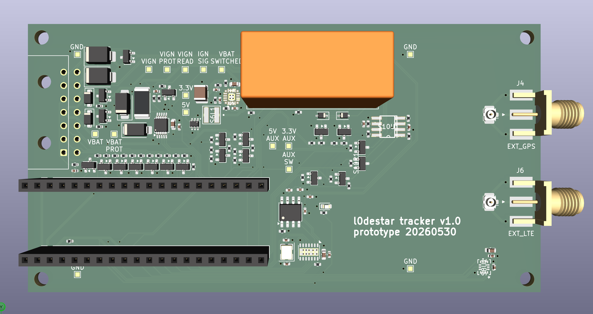
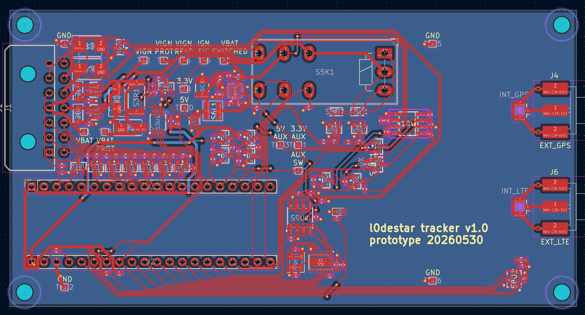

# l0destar v1.0 prototype

## Overview

This is l0destar v1.0, a prototype PCB design for the tracker. It has pin
headers to accept a Makerdiary nRF9151 Connect Kit which provides the nRF9151
SIP.

## Important note

This has not been fabbed or tested at all in PCB form, anything you do with this
design is entirely at your own risk!

## Features

- Two 12V inputs, 12v permanent live and the ignition signal
- Reverse polarity/TVS protection
- Latching relay so it can programmatically switch its own power source between
12v permanent live and the ignition signal
- INA228 for vehicle voltage monitoring
- Voltage divider for ignition presence sensing
- Buck converter 12V to 5V to feed the SIP
- Auxillary 3.3V and 5V power rails that can be turned off to save power
- ASM330LHHXG1TR 6-axis IMU gyro/accelerometer
- CAN interface
- ISO-9141 (K-line) interface
- Six general-purpose digital GPIO pins (0-36V)

This is still very much a work-in-progress. Most of the circuits have been
tested in isolation on a breadboard with throughhole equivalent parts but
there's a still more testing to be done before I'm ready to have it fabbed.

Fabrication of this is going to be quite expensive due to the accelerometer
which is apparently tricky to place.

