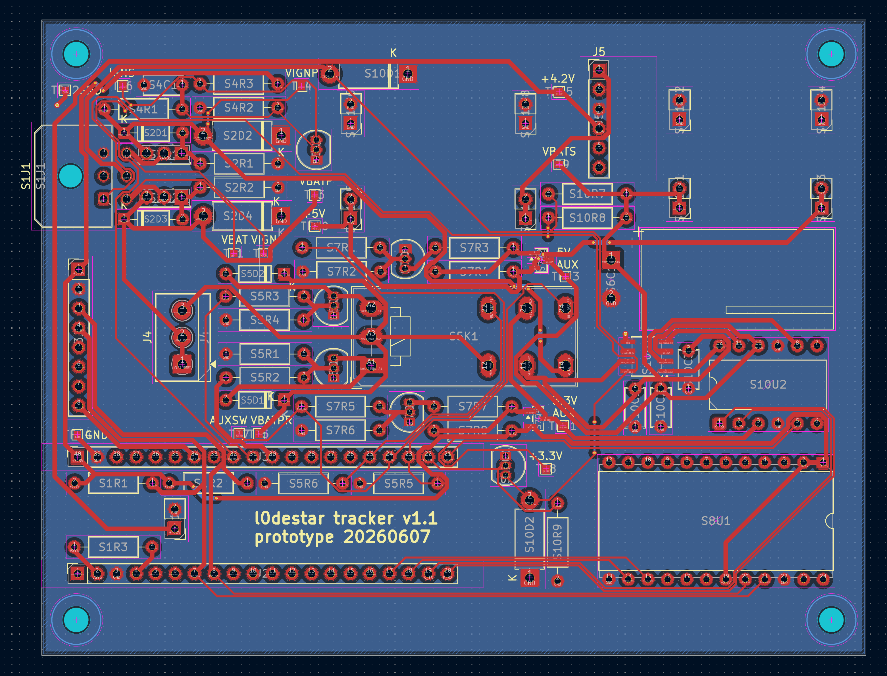
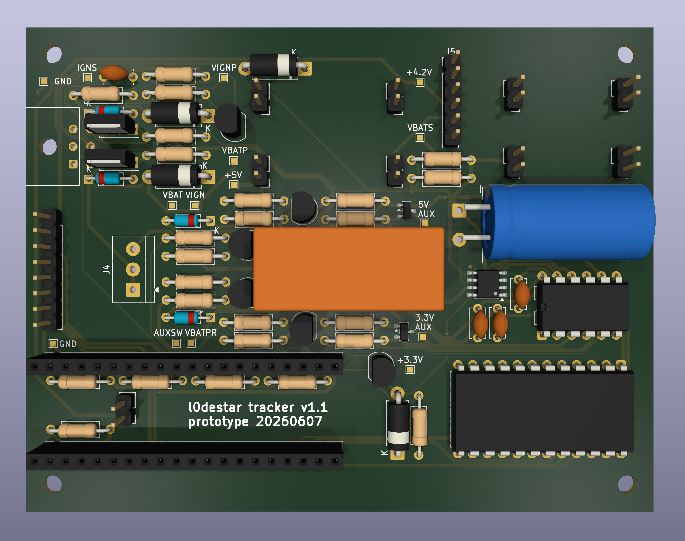

# l0destar v1.1 prototype - ISO-9141 version

## Overview

NOTE: THIS HAS NOT BEEN TESTED, USE AT YOUR OWN RISK

This is a prototype l0destar vehicle tracker PCB designed to be hand-solderable.
It makes use of the [Makerdiary nRF9151 Connect Kit](https://makerdiary.com/products/nrf9151-connectkit) to provide the LTE and GPS
functions.

Although not yet tested (waiting for the Connect Kit to be back in stock) in
theory this should be viable to hand-build and run in a vehicle. It still needs
an enclosure which I will design once I've assembled the PCB so I can measure
the clearances exactly.

It features:

 - 4.2V buck converter to power the Connect Kit via the battery connector
 - 12V live and 12V ignition inputs with TVS and reverse polarity protection
 - Programmatic relay switching to switch the power supply between 12V live and
   12V ignition
 - INA228 voltage reading
 - L9637D (K-line)
 - 5V buck to power the L9637D
 - Auxillary 3.3V and 5V power rails that can be turned off to save power
 - ASM330LHHXG1TR 6-axis IMU gyro/accelerometer
 - 2200uF bulk cap on the 12V supply to keep it alive during turnover

## Power supply

The Connect Kit can be powered through VBUS which would be much simpler as it
can take 5V, but then you have to disconnect the power before connecting a USB
cable. Same for the Nordic dev board - they both explicitly say not to connect
powered USB and VBUS at the same time. Because the intention is to install this
in a vehicle for testing the pragmatic decision was taken to power it with a
4.2V buck feeding the battery connector. With this power connection we can
connect USB-C at any time to update the firmware without needing to disconnect
power.

## Parts list

| Part                                                                                   | Quantity |
|----------------------------------------------------------------------------------------|----------|
| [4.2v buck converter](https://amzn.to/4v81hYl)                                         | 1        |
| [RT424F12 12V bistable relay](https://amzn.to/4egbXN5)                                 | 1        |
| [STEVAL-MKI212V1 accelerometer eval board](https://www.st.com/en/evaluation-tools/steval-mki212v1.html) | 1 |
| [L9637D](https://amzn.to/3QFI7Ka)                                                      | 1        |
| [INA228 breakout](https://amzn.to/4efyaed)                                             | 1        |
| [5V buck converter](https://amzn.to/4uwe5Gy)                                           | 1        |
| [Level shifter](https://amzn.to/4apB7I4)                                               | 1        |
| [Pin headers](https://amzn.to/3Qm8qoH)                                                 | Various  |
| [510R resistor](https://amzn.to/4gc8ZvK)                                               | 2        |
| [4.7K resistor](https://amzn.to/4gc8ZvK)                                               | 2        |
| [10K resistor](https://amzn.to/4gc8ZvK)                                                | 11       |
| [56K resistor](https://amzn.to/4gc8ZvK)                                                | 2        |
| [100K resistor](https://amzn.to/4gc8ZvK)                                               | 7        |
| [MOSFET - ZVN4206A](https://amzn.to/3S775mb)                                           | 4        |
| [TVS Diode - P6KE24CA](https://amzn.to/4aLxvAd)                                        | 4        |
| [MOSFET - DMG3415U](https://amzn.to/4uvGYCY)                                           | 2        |
| [100nF ceramic capacitor](https://amzn.to/4xpB60v)                                     | 3        |
| [10uF ceramic capacitor](https://amzn.to/4xpB60v)                                      | 1        |
| [Diode - 1N4148](https://amzn.to/4vPo4bi)                                              | 2        |
| [MOSFET - FQU11P06](https://amzn.to/3S4pRuA)                                           | 2        |
| [Zener Diode - BZX-C15](https://amzn.to/43ye1ex)                                       | 2        |
| [2200uF 25V capacitor](https://amzn.to/43wyrEU)                                        | 1        |
| [Molex 43045-0600 6-pin receptacle](https://uk.farnell.com/molex/43045-0600/conn-r-a-hdr-6pos-2row-3mm-th/dp/1012252) | 1 |

## Tools and accessories

- [Dupont connectors and pins](https://amzn.to/444K71B)
- [Crimp tool for Dupont terminals](https://amzn.to/4xraxZ0)
- [Ribbon cable](https://amzn.to/3PXOW9R)
- [Klein 2100-5 scissors](https://amzn.to/4vEJpnA)
- [PCB header pins](https://amzn.to/43xhjPk)

## Notes

- If you don't care about ISO-9141 this can be omitted (I will post a CAN
  version of this board soon)
- The breakouts can either be soldered directly or mounted on PCB pin headers, I
  would suggest the latter for ease of re-use
- Never plug or unplug anything into the Nordic dev board while anything is
  powered (I killed at least one dev board this way)
- This PCB has not been tested or validated at all yet, I would strongly
  recommend carefully testing it (ideally with an oscilloscope) before
  connecting it to the dev board

