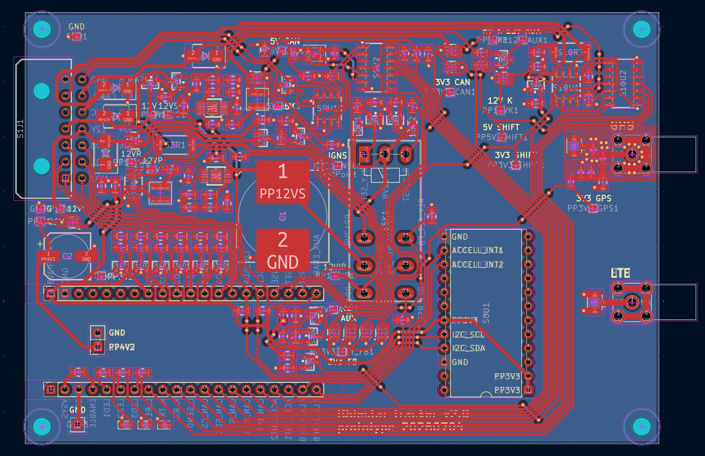
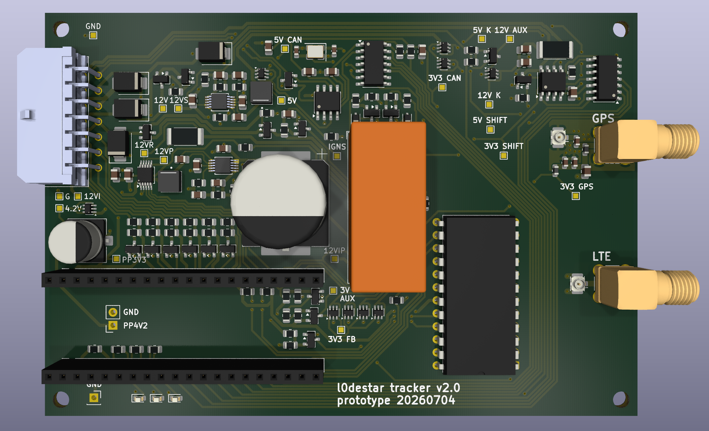

# l0destar v2.0 prototype

## Overview

NOTE: THIS HAS NOT BEEN TESTED, USE AT YOUR OWN RISK

This is a prototype l0destar vehicle tracker PCB designed to be hand-solderable.
It makes use of the [Makerdiary nRF9151 Connect Kit](https://makerdiary.com/products/nrf9151-connectkit) to provide the LTE and GPS
functions.

Features:

 - 12V live and 12V ignition inputs with TVS and reverse polarity protection
 - Ignition presence sensing
 - Programmatic relay switching to switch the power supply between 12V live and
   12V ignition
 - INA228 voltage reading
 - CAN interface
 - ISO-9141 interface
 - Dual buck converters with high efficiency
 - Auxillary 3.3V, 5V and 12V power rails that can be turned off to save power
 - ASM330LHHXG1TR 6-axis IMU gyro/accelerometer
 - 2200uF bulk cap on the 12V supply to keep it alive during turnover
 - Six general-purpose digital AIO pins capable of handling 0-30V

## Power supply

The Connect Kit can be powered through VBUS which would be much simpler as it
can take 5V, but then you have to disconnect the power before connecting a USB
cable. Same for the Nordic dev board - they both explicitly say not to connect
powered USB and VBUS at the same time. Because the intention is to install this
in a vehicle for testing the pragmatic decision was taken to power it with a
4.2V buck feeding the battery connector. With this power connection we can
connect USB-C at any time to update the firmware without needing to disconnect
power.

## Parts list

| Part | Description | Quantity |
|------|-------------|----------|
| [Makerdiary nRF9151 Connect Kit](https://makerdiary.com/products/nrf9151-connectkit) | MCU and GSM/GPS | 1 |
| [Molex
43045-1400](https://uk.farnell.com/molex/43045-1400/conn-r-a-pcb-hdr-14pos-2row-3mm/dp/9732985) | Main connector | 1 |
| [20-pin pcb header](https://amzn.to/44hTFGN) | Makerdiary board connector | 2 |
| [U.FL-R-SMT(01) RF COAXIAL, U.FL, STRAIGHT JACK, 50O](https://uk.farnell.com/3908021) | u.FL connectors | 2 |
| [SMA-J-P-H-RA-TH1 RF COAXIAL, SMA JACK, 50 OHM](https://uk.farnell.com/2856817) | through-hole SMA connectors | 2 |

### Resistors

| Part | Description | Quantity |
|------|-------------|----------|
| [3521510RFT RES, 510R, 1%, 2W, 2512](https://uk.farnell.com/2117495) | >= 1W K-line pullup resistor | 1 |
| 0805 1K resistor | 1% 0805 | 3 |
| 0805 4.7K resistor | 1% 0805 | 2 |
| 0805 10K resistor | 1% 0805 | 20 |
| 0805 18.2K resistor | 1% 0805 | 2 |
| 0805 56K resistor | 1% 0805 | 2 |
| 0805 100K resistor | 1% 0805 | 15 |
| 0805 187K resistor | 1% 0805 | 1 |
| 0805 226K resistor | 1% 0805 | 1 |
| 0805 1M resistor | 1% 0805 | 2 |
| [MCLRP12JTWSR050 CURRENT SENSE RES](https://uk.farnell.com/2828382) | 15Mohm current-sensing resistor | 1 |

### Capacitors

| Part | Description | Quantity |
|------|-------------|----------|
| 0805 10pF | 0603 10pF ceramic cap | 2 |
| 0603 27pF | 0603 27pF ceramic cap | 2 |
| 0603 100pF | 0603 100pF ceramic cap | 2 |
| 0805 4.7nF | 0805 4.7nF ceramic cap | 2 |
| 0603 10nF | 0603 10nF ceramic cap | 1 |
| 0805 100nF | 0805 100nF ceramic cap | 9 |
| 0805 1uF | 0805 1uF ceramic cap | 4 |
| 0805 4.7uF | 0805 4.7uF ceramic cap | 2 |
| 0805 10uF | 0805 10uF ceramic cap | 2 |
| 0805 22uF | 0805 22uF ceramic cap | 2 |
| 220uF | 220uF SMD capacitor | 1 |
| [EEEFK1E222AM 2200uF SMD 25V capacitor](https://uk.farnell.com/panasonic/eeefk1e222am/cap-2200-f-25v-radial-smd/dp/2326204) 2200uF | 1 |

### LEDs

| Part | Description | Quantity |
|------|-------------|----------|
| 0603 LED | 0603 status LED | 3 |

| Part | Description | Quantity |
|------|-------------|----------|

### Diodes

| Part | Description | Quantity |
|------|-------------|----------|
| 1N4148W | 1N4148W diode | 2 |

### TVS diodes

| Part | Description | Quantity |
|------|-------------|----------|
| SMBJ30A | SMBJ30A TVS diode | 6 |

### Zener diodes

| Part | Description | Quantity |
|------|-------------|----------|
| BZX84C15 | BZX84C15 zener diode | 2 |

### Shottky diodes

| Part | Description | Quantity |
|------|-------------|----------|
| BAT54S | BAT54S shottky diode | 6 |

### MOSFETs

| Part | Description | Quantity |
|------|-------------|----------|
| A03407A | A03407A P-channel MOSFET | 2 |
| 2N7002 | 2N7002 N-channel MOSFET | 6 |
| DMG3415U | DMG3415U P-channel MOSFET | 2 |

### Crystal

| Part | Description | Quantity |
|------|-------------|----------|
| [ABM8G-40.000MHZ-18-D2Y-T](https://uk.farnell.com/abracon/abm8g-40-000mhz-18-d2y-t/crystal-40mhz-18pf-3-2mm-x-2-5mm/dp/3819752)
| 40MHz crystal (CAN interface) | 1 |

### Inductors

| Part | Description | Quantity |
|------|-------------|----------|
| [XFL4020-222ME](https://uk.farnell.com/coilcraft/xfl4020-222mec/inductor-2-2uh-8a-20-pwr-38mhz/dp/2289216) | Power inductor, buck converter | 2 |
| [0603HP-68NXGLU](https://uk.farnell.com/coilcraft/0603hp-68nxglu/inductor-68nh-2-2ghz-rf-smd/dp/2286163) | Wirewound inductor, antenna, 47-100 nH, SRF > 2 GHz | 1 |

### Ferrite beads

| Part | Description | Quantity |
|------|-------------|----------|
| [BLM18KG601SN1D](https://uk.farnell.com/murata/blm18kg601sn1d/ferrite-bead-0603-600r-1-3a/dp/1781094) | Ferrite bead 600R | 1 |

### ICs

| Part | Description | Quantity |
|------|-------------|----------|
| [INA228](https://www.aliexpress.com/item/1005005873662957.html) | INA228, voltage reading | 1 |
| [RT424F12](https://uk.farnell.com/schrack-te-connectivity/rt424f12/relay-dpdt-250vac-8a/dp/1175085) | 12V bistable relay | 1 |
| [LM66100](https://www.aliexpress.com/item/1005008565117953.html) | LM66100, ideal diode | 9 |
| [LT8609AIMSE](https://www.aliexpress.com/item/1005008917068578.html) | LT8609, buck converter | 2 |
| [STEVAL-MKI212V1](https://www.st.com/en/evaluation-tools/steval-mki212v1.html) | ASM330LHHX accelerometer breakout module | 1 |
| [TJA1051T-3](https://uk.farnell.com/nxp/tja1051t-3-1j/can-fd-transceiver-5mbps-soic/dp/2574963) | TJA1051T-3, CAN interface | 1 |
| [NUP2105L](https://uk.farnell.com/diotec/nup2105l/tvs-diode-bidir-44v-sot-23-350w/dp/4574509) | NUP2105L, CAN protector | 1 |
| [MCP2518FD](https://uk.farnell.com/microchip/mcp2518fdt-e-sl/can-controller-aec-q100-40to125deg/dp/3796956) | MCP2518FD, CAN FD controller | 1 |
| [TXS0104ED](https://uk.farnell.com/texas-instruments/txs0104edr/volt-level-translator-4-bit-soic/dp/3120986) | TXS0104ED, level shifter | 1 |
| [L9637D](https://uk.farnell.com/stmicroelectronics/e-l9637d/monolithic-bus-driver-40-to-150deg/dp/3129892) | L9637D ISO-9141 K-line interface | 1 |

## Notes

- If you don't care about CAN the CAN components and crystal can be omited
- If you don't care about the K-line / ISO-9141 interface the chip for it can be omited
- The breakouts can either be soldered directly or mounted on PCB pin headers, I
  would suggest the latter for ease of re-use
- Never plug or unplug anything into the Nordic dev board while anything is
  powered (I killed at least one dev board this way)
- This PCB has not been tested or validated at all yet, I would strongly
  recommend carefully testing it (ideally with an oscilloscope) before
  connecting it to the dev board

