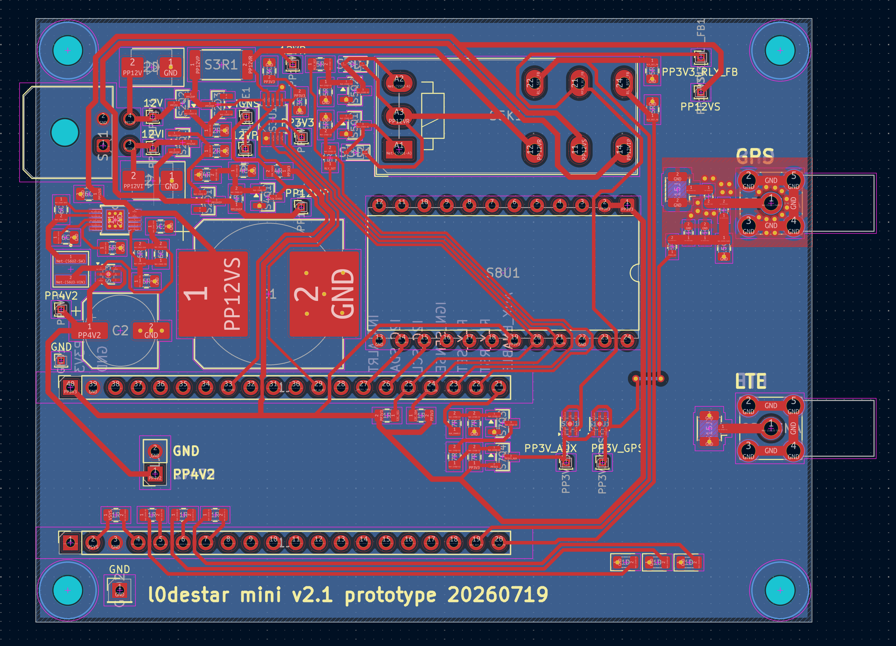
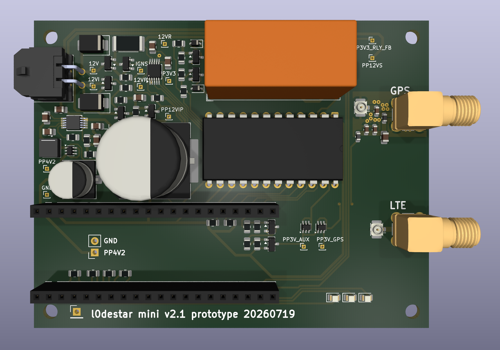
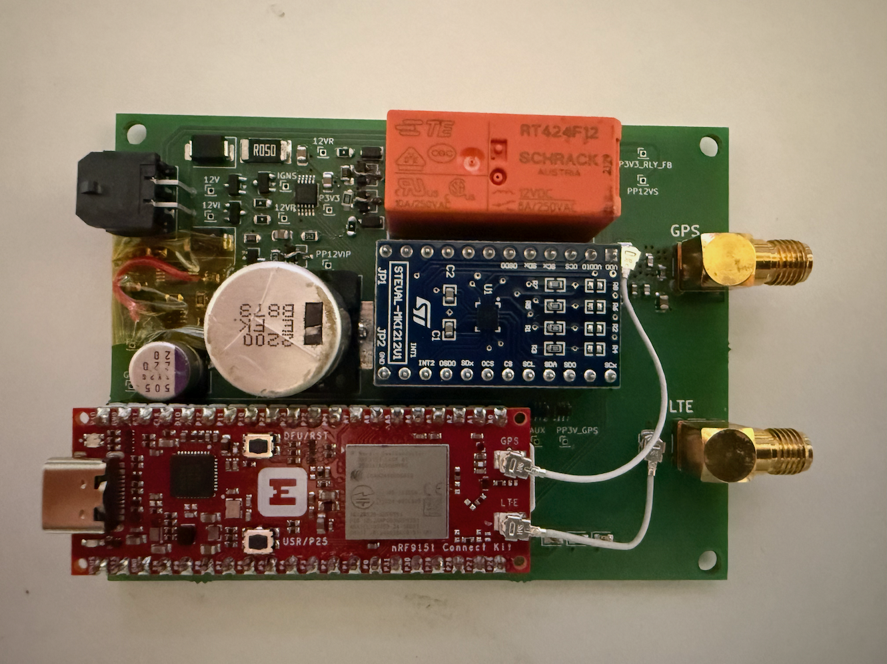

# l0destar v2.1 mini prototype

## Overview

This is a prototype l0destar vehicle tracker PCB designed to be hand-solderable.
It makes use of the [Makerdiary nRF9151 Connect Kit](https://makerdiary.com/products/nrf9151-connectkit) to provide the LTE and GPS
functions.

This is the same as the regular [l0destar v2.1](https://github.com/m4rkw/l0destar/tree/master/hardware/prototype2.1) prototype but with the CAN
interface, ISO-9141 interface and general-purpose AIO pins on the main connector
removed in favour of a smaller footprint and simpler construction.

Features:

 - 12V live and 12V ignition inputs with TVS and reverse polarity protection
 - Ignition presence sensing
 - Programmatic relay switching to switch the power supply between 12V live and
   12V ignition
 - INA228 voltage reading
 - High efficiency buck converter
 - Auxillary 3.3V power rail that can be turned off to save power
 - ASM330LHHXG1TR 6-axis IMU gyro/accelerometer
 - 2200uF bulk cap on the 12V supply to keep it alive during turnover

## Status

This board has been fully tested on a bench and seems to perform well. It hasn't
been tested in a live vehicle yet. Quiescent current when asleep with the
auxillary rail powered down and the accerometer armed was measured at around 1mA.
The wire shown in the photo below near the buck converter is because an earlier
version of this prototype missed a connection so I had to run a jumper to make
it work. It's not necessary with this version, all of the earlier issues have
been fixed.

## Power supply

The Connect Kit can be powered through VBUS which would be much simpler as it
can take 5V, but then you have to disconnect the power before connecting a USB
cable. Same for the Nordic dev board - they both explicitly say not to connect
powered USB and VBUS at the same time. Because the intention is to install this
in a vehicle for testing the pragmatic decision was taken to power it with a
4.2V buck feeding the battery connector. With this power connection we can
connect USB-C at any time to update the firmware without needing to disconnect
power.

## Parts list

| Part | Description | Quantity |
|------|-------------|----------|
| [Makerdiary nRF9151 Connect Kit](https://makerdiary.com/products/nrf9151-connectkit) | MCU and GSM/GPS | 1 |
| [Molex 43045-0401](https://uk.farnell.com/molex/43045-0401/conn-r-a-pcb-hdr-4pos-2row-3mm/dp/1704306) | Main connector | 1 |
| [20-pin pcb header](https://amzn.to/44hTFGN) | Makerdiary board connector | 2 |
| [U.FL-R-SMT(01) RF COAXIAL, U.FL, STRAIGHT JACK, 50O](https://uk.farnell.com/3908021) | u.FL connectors | 2 |
| [SMA-J-P-H-RA-TH1 RF COAXIAL, SMA JACK, 50 OHM](https://uk.farnell.com/2856817) | through-hole SMA connectors | 2 |
| 0805 4.7K resistor | 1% 0805 | 2 |
| 0805 10K resistor | 1% 0805 | 8 |
| 0805 18.2K resistor | 1% 0805 | 1 |
| 0805 56K resistor | 1% 0805 | 2 |
| 0805 100K resistor | 1% 0805 | 6 |
| 0805 226K resistor | 1% 0805 | 1 |
| 0805 1M resistor | 1% 0805 | 1 |
| [MCLRP12JTWSR050 CURRENT SENSE RES](https://uk.farnell.com/2828382) | 15Mohm current-sensing resistor | 1 |
| 0805 10pF | 0603 10pF ceramic cap | 1 |
| 0603 100pF | 0603 100pF ceramic cap | 2 |
| 0603 10nF | 0603 10nF ceramic cap | 1 |
| 0805 100nF | 0805 100nF ceramic cap | 3 |
| 0805 1uF | 0805 1uF ceramic cap | 3 |
| 0805 4.7uF | 0805 4.7uF ceramic cap | 1 |
| 0805 22uF | 0805 22uF ceramic cap | 1 |
| 220uF | 220uF SMD capacitor | 1 |
| [EEEFK1E222AM 2200uF SMD 25V capacitor](https://uk.farnell.com/panasonic/eeefk1e222am/cap-2200-f-25v-radial-smd/dp/2326204) 2200uF | 1 |
| 0603 LED | 0603 status LED | 5 |
| 1N4148W | 1N4148W diode | 2 |
| SMBJ30A | SMBJ30A TVS diode | 2 |
| BZX84C15 | BZX84C15 zener diode | 2 |
| A03407A | A03407A P-channel MOSFET | 2 |
| 2N7002 | 2N7002 N-channel MOSFET | 4 |
| DMG3415U | DMG3415U P-channel MOSFET | 1 |
| [XFL4020-222ME](https://uk.farnell.com/coilcraft/xfl4020-222mec/inductor-2-2uh-8a-20-pwr-38mhz/dp/2289216) | Power inductor, buck converter | 1 |
| [0603HP-68NXGLU](https://uk.farnell.com/coilcraft/0603hp-68nxglu/inductor-68nh-2-2ghz-rf-smd/dp/2286163) | Wirewound inductor, antenna, 47-100 nH, SRF > 2 GHz | 1 |
| [BLM18KG601SN1D](https://uk.farnell.com/murata/blm18kg601sn1d/ferrite-bead-0603-600r-1-3a/dp/1781094) | Ferrite bead 600R | 1 |
| [INA228](https://www.aliexpress.com/item/1005005873662957.html) | INA228, voltage reading | 1 |
| [RT424F12](https://uk.farnell.com/schrack-te-connectivity/rt424f12/relay-dpdt-250vac-8a/dp/1175085) | 12V bistable relay | 1 |
| [LM66100](https://www.aliexpress.com/item/1005008565117953.html) | LM66100, ideal diode | 3 |
| [LT8609AIMSE](https://www.aliexpress.com/item/1005008917068578.html) | LT8609, buck converter | 1 |
| [STEVAL-MKI212V1](https://www.st.com/en/evaluation-tools/steval-mki212v1.html) | ASM330LHHX accelerometer breakout module | 1 |

## Notes

- The breakouts can either be soldered directly or mounted on PCB pin headers, I
  would suggest the latter for ease of re-use
- Never plug or unplug anything into the Nordic dev board while anything is
  powered (I killed at least one dev board this way)

